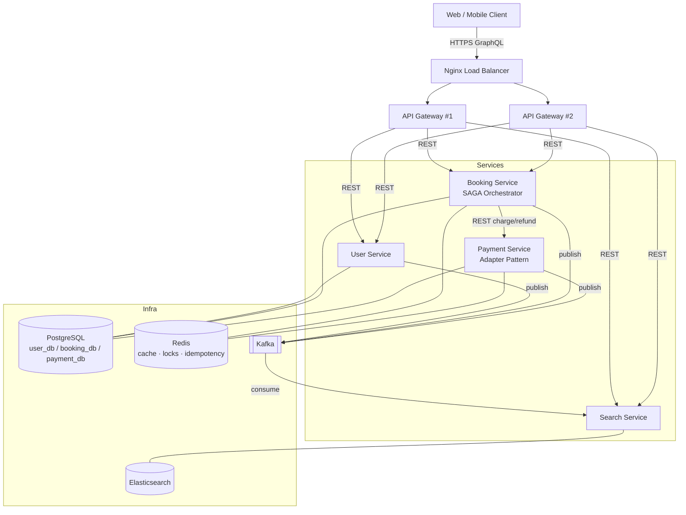
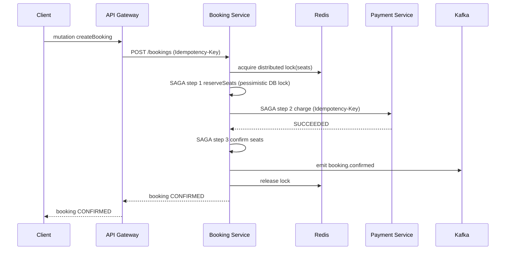

# High Level Design (HLD) — E-Commerce / Event Booking Platform

## 1. Goal & Scope

A horizontally scalable, fault-tolerant backend for an event/ticket booking
e-commerce platform. Users browse a catalog, search products, and book seats
for events. Bookings involve money, so the system must guarantee **no double
booking** and **no double charge**, even under high concurrency and partial
failures.

## 2. Architecture Style

- **Microservices**, one bounded context per service, **database-per-service**.
- **Synchronous** request/response for user-facing reads & the booking command
  path (low latency, immediate feedback).
- **Asynchronous** events over **Kafka** for cross-service side effects
  (search indexing, notifications, analytics) — loose coupling + resilience.
- **API Gateway** exposes a single **GraphQL** API; clients never call services
  directly.
- **Nginx** load balancer fronts multiple gateway replicas.

## 3. Component Diagram

## 4. Services & Responsibilities

| Service          | Port | DB           | Responsibility                                            |
| ---------------- | ---- | ------------ | --------------------------------------------------------- |
| api-gateway      | 3000 | —            | GraphQL entry point, auth, request fan-out, rate limiting |
| user-service     | 3001 | `user_db`    | Accounts, registration, profile                           |
| booking-service  | 3002 | `booking_db` | Seat inventory, locking, **booking SAGA orchestrator**    |
| payment-service  | 3003 | `payment_db` | Charge/refund via **pluggable gateways (Adapter)**        |
| search-service   | 3004 | Elasticsearch| Fuzzy search + autocomplete (CQRS read model)             |

## 5. Cross-Cutting Concerns

- **Scalability**: stateless services (state in Redis/DB), DB-per-service,
  Kafka partitioning by aggregate id, gateway replicas behind nginx.
- **Reliability**: retries with backoff, Kafka at-least-once + consumer groups,
  dead-letter topic, health checks, graceful shutdown, idempotency everywhere.
- **Consistency**: strong consistency inside a service (Postgres ACID);
  eventual consistency across services via Kafka; **SAGA** for the multi-service
  booking transaction.
- **Observability**: structured logs + request timing interceptor (extend with
  OpenTelemetry tracing using the `correlationId` already on every event).

## 6. Key Flows

### 6.1 Booking (happy path)

### 6.2 Booking (payment fails → compensation)

If `charge` fails, the SAGA compensates in reverse: refund (if any) → release
seats → mark booking `FAILED` → emit `booking.cancelled`. Seats return to
`AVAILABLE`; no money is captured.

## 7. Technology Choices

- **NestJS + TypeScript** — opinionated DI, modules, microservice transports.
- **Prisma** — type-safe DB access, migrations, raw SQL for `FOR UPDATE`.
- **Kafka (KRaft)** — durable, partitioned event log.
- **Redis** — cache-aside, distributed locks, idempotency store.
- **Elasticsearch** — fuzzy/typo-tolerant search + edge-ngram autocomplete.
- **GraphQL (Apollo)** — flexible client API at the edge.

See [LLD.md](LLD.md) for implementation-level detail.
