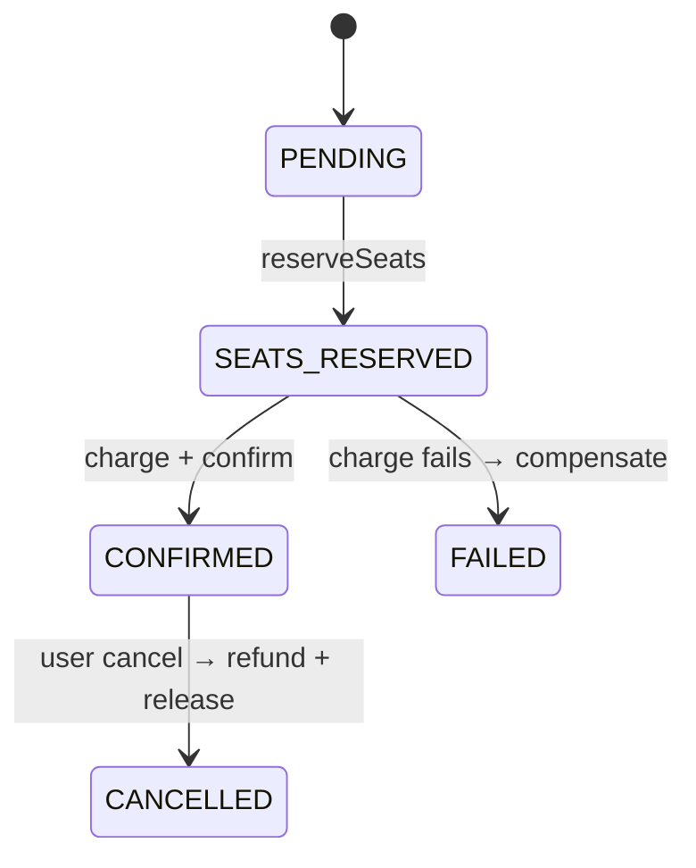
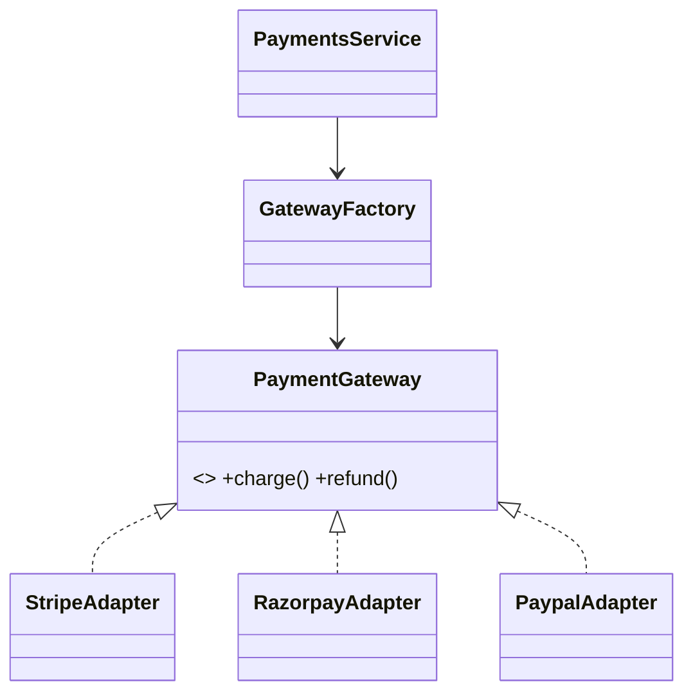

# Low Level Design (LLD) — Implementation Patterns

This document maps each requested engineering concept to the exact code that
implements it.

---

## 1. Concurrent Seat Booking & Locking Strategies

Problem: N users race for the same seat. Exactly one must win.

We layer **three** strategies (defense in depth):

| # | Strategy             | Where                                                              | Purpose                                            |
| - | -------------------- | ----------------------------------------------------------------- | -------------------------------------------------- |
| 1 | Distributed lock     | `libs/common/src/locking/lock.service.ts`                         | Cheap cross-process gate before touching the DB    |
| 2 | Pessimistic DB lock  | `apps/booking-service/src/booking/seat.repository.ts` (`reservePessimistic`) | `SELECT ... FOR UPDATE`, source of truth |
| 3 | Optimistic (version) | `seat.repository.ts` (`reserveOptimistic`)                        | CAS on `version` column, retry on conflict         |

### Distributed lock (Redis)

```
SET lock:<key> <token> PX <ttl> NX     # atomic acquire
EVAL <cas-del-script>                    # release only if we still own it
```

- TTL prevents deadlocks if a holder crashes.
- Lua CAS release prevents deleting a lock we no longer own.
- Bounded retries + jitter avoid thundering herd.

### Pessimistic lock

Inside a `Serializable` transaction we `SELECT ... FOR UPDATE` the seat rows;
competing transactions **block** until we commit. We then verify `AVAILABLE`
and flip to `HELD`. This is the correctness backstop.

### Optimistic lock

`UPDATE seats SET status='HELD', version=version+1 WHERE id=? AND version=? AND status='AVAILABLE'`.
If `count !== 1`, someone changed the row first → conflict. Best for
low-contention inventory (fewer locks held).

### Hold expiry

`heldUntil` lets abandoned holds auto-expire so seats never get stuck (a
background sweeper — not included — would release expired holds).

---

## 2. Distributed Transactions — SAGA Pattern

Code: `libs/common/src/saga/*` + `apps/booking-service/src/booking/booking.service.ts`

Orchestration SAGA with explicit compensations:

| Step          | Forward action                | Compensation         |
| ------------- | ----------------------------- | -------------------- |
| reserveSeats  | hold seats (pessimistic lock) | release seats        |
| charge        | payment-service charge        | refund payment       |
| confirmSeats  | seats → BOOKED                | (terminal, none)     |

On any step failure the orchestrator runs the compensations of completed steps
in **reverse order**, leaving the system in a consistent state. Booking ends
`CONFIRMED` or `FAILED`; seats are never half-booked, money never half-captured.



---

## 3. Idempotency

Code: `libs/common/src/idempotency/*` + DB unique constraint on
`payments.idempotencyKey`.

Two enforcement layers:

1. **Edge (Redis)** — `IdempotencyInterceptor` reads the `Idempotency-Key`
   header. First call → `SET NX` claim → run handler → store `COMPLETED`
   response. Replays return the stored response; in-progress replays get `409`.
2. **Durable (DB)** — `payment.idempotencyKey` is `@unique`; even if Redis is
   flushed, a duplicate charge insert is rejected and we return the original.

Booking sends a stable key (`pay-<bookingId>`) to payment-service, so SAGA
retries never double-charge.

---

## 4. Asynchronous Communication — Kafka

Code: `libs/common/src/kafka/*`, each service's `connectMicroservice` +
`@EventPattern` consumers.

- **Topics & events** centralized in `topics.ts` / `events.ts` (the event
  contract).
- **Partition key = aggregate id** (e.g. `bookingId`) → per-aggregate ordering.
- **Idempotent producer** for safe retries.
- **Consumer groups** (one per service) → at-least-once delivery + horizontal
  scaling of consumers across partitions.
- **DLQ topic** (`ecom.dlq`) for poison messages (wire a global RpcException
  filter to route failures there).

CQRS: writes happen in booking/catalog services; `search-service` consumes
`catalog.product-upserted` and materializes an Elasticsearch read model.

---

## 5. Fuzzy Search & Autocomplete — Elasticsearch

Code: `apps/search-service/src/search/elasticsearch.service.ts`

- **Fuzzy**: `multi_match` with `fuzziness: AUTO` (Levenshtein) over
  `name^3, description, tags`.
- **Autocomplete**: custom `edge_ngram` analyzer at index time + `standard`
  `search_analyzer` at query time (so the query isn't itself ngram-exploded).
- Index/mapping is created on boot (`onModuleInit`).

---

## 6. Multiple Payment Gateways — Adapter Pattern

Code: `apps/payment-service/src/gateways/*`

- `PaymentGateway` interface = the common contract.
- `StripeAdapter`, `RazorpayAdapter`, `PaypalAdapter` wrap provider SDKs.
- `GatewayFactory` resolves the adapter by name at runtime.
- `PaymentsService` depends only on the interface → adding a provider never
  touches business logic (Open/Closed Principle).



---

## 7. API Gateway

Code: `apps/api-gateway/*`

- Single **GraphQL** schema (code-first) for all clients.
- Resolvers delegate to services via a resilient `HttpClientService`
  (timeout + retry + error mapping).
- Generates and forwards `Idempotency-Key` on mutations.
- Stateless → replicated behind nginx.

---

## 8. Load Balancing

Code: `nginx/nginx.conf`, `docker-compose.yml` (`api-gateway` `replicas: 2`).

- Nginx `upstream` with `least_conn`, `max_fails`/`fail_timeout` for passive
  health checks, and `proxy_next_upstream` to retry the next replica on 5xx.
- Docker DNS resolves `api-gateway` to all replica IPs.

---

## 9. Graceful Shutdown

Code: `libs/common/src/shutdown/graceful-shutdown.service.ts` + `dumb-init` in
Dockerfiles.

On `SIGTERM`/`SIGINT`:

1. `app.close()` stops accepting new connections.
2. Nest lifecycle hooks run → Kafka/Redis/Prisma disconnect, consumers drain.
3. Process exits 0. A 15s watchdog force-exits if drain hangs.

`dumb-init` is PID 1 in the container so signals actually reach Node.

---

## 10. Fault Tolerance & Reliability

| Concern              | Mechanism                                                        |
| -------------------- | --------------------------------------------------------------- |
| Transient HTTP fail  | Retry w/ backoff in `HttpClientService` / `PaymentClient`       |
| Upstream down        | Timeout + `503` mapping; nginx retries next replica             |
| Duplicate processing | Idempotency (Redis + DB)                                        |
| Partial failure      | SAGA compensation                                               |
| Poison messages      | Kafka DLQ topic                                                 |
| Crash recovery       | Kafka consumer groups re-deliver; hold expiry frees seats       |
| Liveness/readiness   | `/health` per service + docker `healthcheck`                    |
| Signal handling      | Graceful shutdown + `dumb-init`                                  |

---

## 11. Scalable Database Design

- **Database-per-service** (`user_db`, `booking_db`, `payment_db`) → independent
  scaling, no cross-service joins, clear ownership.
- **Indexes** on hot paths: `seats(inventoryId, status)`, `bookings(userId)`,
  `bookings(status)`, `payments(bookingId)`.
- **Optimistic concurrency** via `version` column.
- **Unique constraints** enforce invariants (`seats(inventoryId,label)`,
  `payments.idempotencyKey`).
- Scale-out notes: read replicas for read-heavy services, table partitioning of
  `bookings`/`payments` by time, connection pooling (PgBouncer).

---

## 12. Real-World Practices Checklist

- DTO validation (`class-validator`) at the boundary, `whitelist: true`.
- Uniform error envelope (`AllExceptionsFilter`).
- Config via env + `@nestjs/config`, secrets never hard-coded.
- Multi-stage Docker builds, `--omit=dev` runtime, non-root friendly base.
- `correlationId` on every event for distributed tracing.
- Clear layering: controller → service → repository/gateway.
