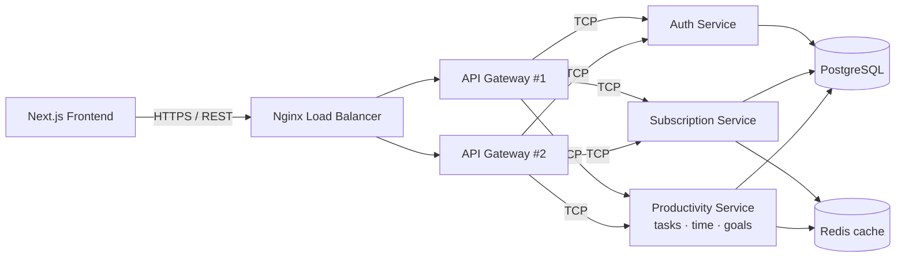

# TimeTracker

A production-style **time tracking & focus** platform. Users sign up, buy a
subscription plan, and manage a dashboard with **tasks**, **time tracking**,
**goals**, **streaks** and a **consistency score** to help them stay focused.

```
timetracker/
├── backend/     # NestJS monorepo — API gateway + TCP microservices
└── frontend/    # Next.js 15 + Tailwind + TypeScript
```

---

## Architecture



- **API Gateway** — the only HTTP surface. Validates JWTs, enforces roles &
  rate limits, exposes Swagger, and forwards typed messages to services over
  **TCP**.
- **Microservices** — `auth`, `subscription`, `productivity`. Each is a TCP
  Nest microservice with its own controllers/services, sharing one Postgres
  database via a Prisma library.
- **Nginx** load-balances two gateway replicas (`least_conn`) with edge rate
  limiting and a `/health` probe.
- **Redis** caches plan listings, time summaries and the consistency report.

### Backend stack

NestJS · Microservices (TCP) · API Gateway · Nginx load balancer · Docker &
Docker Compose · Prisma · PostgreSQL · Redis · DTOs (class-validator) · JWT
auth (access + rotating refresh) · role-based authorization · global
guards/filters/interceptors · REST · Swagger.

### Frontend stack

Next.js 15 (App Router) · React 19 · TypeScript · Tailwind CSS v4 · TanStack
Query · Axios client with automatic token refresh.

---

## Backend

### Folder structure

```
backend/
├── apps/
│   ├── api-gateway/            # REST + Swagger, TCP client proxies
│   ├── auth-service/           # register / login / refresh / profile
│   ├── subscription-service/   # plans, subscribe, cancel (Redis cached)
│   └── productivity-service/   # tasks · time-tracking · goals
├── libs/
│   ├── common/                 # guards, decorators, filters, utils, patterns
│   └── prisma/                 # Prisma schema, service, seed
├── nginx/nginx.conf
├── Dockerfile
└── docker-compose.yml
```

### Run with Docker (recommended)

```bash
cd backend
docker compose up --build
```

This starts Postgres, Redis, the three microservices, **two** gateway replicas,
and Nginx. Once up:

- API via load balancer: `http://localhost:8080/api/v1`
- API direct (gateway #1 is also published): `http://localhost:3000/api/v1`
- Swagger: `http://localhost:3000/docs`
- Health: `http://localhost:8080/health`

The one-shot `migrate` service pushes the Prisma schema and seeds plans.

### Run locally (without Docker)

```bash
cd backend
cp .env.example .env
npm install
npx prisma generate --schema=libs/prisma/src/schema.prisma
npm run prisma:migrate          # create tables
npm run prisma:seed             # seed subscription plans

# in separate terminals:
npm run start:auth
npm run start:subscription
npm run start:productivity
npm run start:gateway
```

### Key API routes (all under `/api/v1`)

| Area          | Endpoints                                                              |
| ------------- | --------------------------------------------------------------------- |
| Auth          | `POST /auth/register` · `/auth/login` · `/auth/refresh` · `/auth/logout` · `GET/PATCH /auth/me` |
| Subscriptions | `GET /subscriptions/plans` · `POST /subscriptions` · `GET /subscriptions/me` · `DELETE /subscriptions` |
| Tasks         | `POST/GET /tasks` · `GET/PATCH/DELETE /tasks/:id`                      |
| Time tracking | `POST /time-entries/start|stop` · `GET /time-entries/active|summary` · `POST/GET /time-entries` |
| Goals         | `POST/GET /goals` · `GET /goals/consistency` · `POST /goals/:id/progress` |

Authentication uses a short-lived **access token** (Bearer header) and a
rotating **refresh token** stored as an httpOnly cookie and hashed in the DB.

---

## Frontend

```bash
cd frontend
cp .env.example .env.local       # point NEXT_PUBLIC_API_URL at the gateway
npm install
npm run dev                      # http://localhost:3001
```

Pages: marketing redirect → `/login` · `/register` · `/dashboard` (overview,
tasks, goals & focus, billing). The dashboard shows the live focus timer, a
weekly focus chart, streaks and the consistency score.

---

## Notes

- Secrets in `.env.example` / `docker-compose.yml` are for local development —
  replace them before deploying.
- The shared Prisma database keeps the demo cohesive; splitting to a
  database-per-service is a natural next step.
