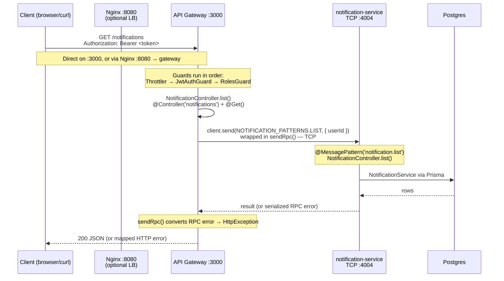
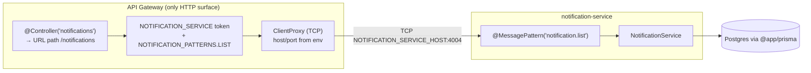

# Adding a New Microservice to the TimeTracker Backend

This guide lists the **manual steps** to add a brand-new TCP microservice to the
NestJS monorepo, wire it into the API gateway, and run it locally + in Docker.

Throughout the guide the running example is a new service called
**`notification-service`** listening on **TCP port `4004`** and exposed on the
gateway under the route **`/notifications`**. Replace these names/ports with your
own service.

> Architecture recap: every service is a **TCP microservice**
> (`@nestjs/microservices`, `Transport.TCP`). The **API gateway** is the only
> HTTP surface — it holds a `ClientProxy` per service and forwards requests with
> `client.send(PATTERN, payload)` wrapped in `sendRpc()`. All services share one
> Postgres DB via `@app/prisma` and shared code via `@app/common`.

---

## Naming & port conventions

| Thing | Existing example | Your new value |
| --- | --- | --- |
| App folder | `apps/subscription-service` | `apps/notification-service` |
| Root module file / class | `app.module.ts` / `AppModule` | `notification-service.module.ts` / `NotificationServiceModule` |
| TCP port | `4002` | `4004` |
| Service token | `SUBSCRIPTION_SERVICE` | `NOTIFICATION_SERVICE` |
| Env host/port | `SUBSCRIPTION_SERVICE_HOST/PORT` | `NOTIFICATION_SERVICE_HOST/PORT` |
| Message patterns | `SUBSCRIPTION_PATTERNS` | `NOTIFICATION_PATTERNS` |
| Gateway route | `/subscriptions` | `/notifications` |

The next free TCP port after `productivity-service` (4003) is **4004**.

---

## Request flow — how `GET http://localhost:3000/notifications` is served

You never configure the URL `/notifications` anywhere in routing config, env, or
Nginx. The path comes **only** from the `@Controller('notifications')` decorator
on the gateway controller (Step 5b). Everything else is wiring that maps that
HTTP route to a TCP message pattern handled by the new service.



**How the pieces connect the URL to the service:**



| Layer | What defines it | Step |
| --- | --- | --- |
| URL path `/notifications` | `@Controller('notifications')` in the gateway | 5b |
| Which service to call | `NOTIFICATION_SERVICE` token → `ClientProxy` | 2a, 5a |
| Which handler runs | `NOTIFICATION_PATTERNS.LIST` ↔ `@MessagePattern` | 2b, 1g, 5b |
| Where the service lives | `NOTIFICATION_SERVICE_HOST/PORT` env | 7 |

> `:3000` hits the gateway directly (handy for Swagger `/docs`). `:8080` hits
> Nginx, which load-balances the two gateway replicas. Both reach the same
> `/notifications` route — no Nginx change is needed for a new service.

---


## Step 1 — Scaffold the app (one command)

Use the repo helper script instead of hand-creating files. From `backend/`:

```powershell
npm run new:service notification-service
```

This wraps the Nest CLI (see [scripts/new-service.mjs](../scripts/new-service.mjs))
and does everything in one shot:

- runs `nest g app notification-service`, which creates
  `apps/notification-service/` and **registers the project in `nest-cli.json`**
  (so you can skip Step 3 below),
- deletes the root-level `notification-service.controller.ts` / `.spec.ts` /
  `.service.ts` boilerplate the app schematic generates,
- runs `nest g module/controller/service notification --project
  notification-service`, creating the `notification/` feature folder and
  auto-importing `NotificationModule` into the root module.

The feature-folder name is derived by dropping the trailing `-service`
(`report-service` → `report`).

> ⚠️ The CLI names the **root module** `notification-service.module.ts` with the
> class `NotificationServiceModule` — there is **no** `app.module.ts`. This guide
> keeps that generated root module and wires the `notification/` feature folder
> into it.

After the command finishes, your folder looks like this (edit the files to match
the contents shown below):

```
apps/notification-service/
  tsconfig.app.json                 # generated — verify outDir (1a)
  test/                             # generated e2e — leave or delete
  src/
    main.ts                         # generated — REPLACE with TCP bootstrap (1b)
    notification-service.module.ts  # generated ROOT module — REPLACE (1c)
    notification/
      notification.controller.ts    # from CLI — REPLACE body (1g)
      notification.module.ts        # from CLI — REPLACE body (1d)
      notification.service.ts       # from CLI — REPLACE body (1f)
      notification.types.ts         # create manually (1e)
```

<details>
<summary>Prefer the raw Nest CLI commands instead of the npm script?</summary>

```powershell
npx nest g app notification-service
Remove-Item apps/notification-service/src/notification-service.controller.ts
Remove-Item apps/notification-service/src/notification-service.controller.spec.ts
Remove-Item apps/notification-service/src/notification-service.service.ts
npx nest g module notification --project notification-service
npx nest g controller notification --project notification-service --no-spec
npx nest g service notification --project notification-service --no-spec
```

</details>

### 1a. Verify `apps/notification-service/tsconfig.app.json`

The CLI generates this; confirm the `outDir` points at the service:

```json
{
  "extends": "../../tsconfig.json",
  "compilerOptions": {
    "outDir": "../../dist/apps/notification-service"
  },
  "include": ["src/**/*"],
  "exclude": ["node_modules", "dist", "**/*.spec.ts"]
}
```


### 1b. Replace `apps/notification-service/src/main.ts`

```ts
import 'dotenv/config';
import { Logger, ValidationPipe } from '@nestjs/common';
import { NestFactory } from '@nestjs/core';
import { MicroserviceOptions, Transport } from '@nestjs/microservices';
import { MicroserviceExceptionFilter } from '@app/common';
import { NotificationServiceModule } from './notification-service.module';

async function bootstrap(): Promise<void> {
  const port = parseInt(process.env.NOTIFICATION_SERVICE_PORT ?? '4004', 10);

  const app = await NestFactory.createMicroservice<MicroserviceOptions>(
    NotificationServiceModule,
    {
      transport: Transport.TCP,
      options: { host: '0.0.0.0', port },
    },
  );

  app.useGlobalPipes(
    new ValidationPipe({
      transform: true,
      whitelist: true,
      forbidNonWhitelisted: true,
    }),
  );
  app.useGlobalFilters(new MicroserviceExceptionFilter());

  await app.listen();
  Logger.log(`Notification service listening on TCP port ${port}`, 'Bootstrap');
}

void bootstrap();
```

### 1c. Replace the root module `apps/notification-service/src/notification-service.module.ts`

Include `CacheModule` only if the service needs Redis caching (copy from
`subscription-service`). Minimal version — note the class stays
`NotificationServiceModule` (the name the CLI generated) and it imports the
`notification/` feature module, **not** the root controller/service you deleted:

```ts
import { Module } from '@nestjs/common';
import { ConfigModule } from '@nestjs/config';
import { PrismaModule } from '@app/prisma';
import { NotificationModule } from './notification/notification.module';

@Module({
  imports: [
    ConfigModule.forRoot({ isGlobal: true }),
    PrismaModule,
    NotificationModule,
  ],
})
export class NotificationServiceModule {}
```

### 1d. `apps/notification-service/src/notification/notification.module.ts` (CLI-generated — replace body)

```ts
import { Module } from '@nestjs/common';
import { NotificationController } from './notification.controller';
import { NotificationService } from './notification.service';

@Module({
  controllers: [NotificationController],
  providers: [NotificationService],
})
export class NotificationModule {}
```

### 1e. Create `apps/notification-service/src/notification/notification.types.ts`

```ts
export interface ListNotificationsPayload {
  userId: string;
}

export interface CreateNotificationPayload {
  userId: string;
  title: string;
  body: string;
}
```

### 1f. `apps/notification-service/src/notification/notification.service.ts` (CLI-generated — replace body)

```ts
import { Injectable } from '@nestjs/common';
import { PrismaService } from '@app/prisma';
import {
  CreateNotificationPayload,
  ListNotificationsPayload,
} from './notification.types';

@Injectable()
export class NotificationService {
  constructor(private readonly prisma: PrismaService) {}

  async list({ userId }: ListNotificationsPayload) {
    // Replace with real Prisma queries once you add a model (see Step 6).
    return { userId, notifications: [] };
  }

  async create(payload: CreateNotificationPayload) {
    return { ...payload, id: 'stub', createdAt: new Date().toISOString() };
  }
}
```

### 1g. `apps/notification-service/src/notification/notification.controller.ts` (CLI-generated — replace body)

```ts
import { Controller } from '@nestjs/common';
import { MessagePattern, Payload } from '@nestjs/microservices';
import { NOTIFICATION_PATTERNS } from '@app/common';
import { NotificationService } from './notification.service';
import {
  CreateNotificationPayload,
  ListNotificationsPayload,
} from './notification.types';

@Controller()
export class NotificationController {
  constructor(private readonly notificationService: NotificationService) {}

  @MessagePattern(NOTIFICATION_PATTERNS.LIST)
  list(@Payload() payload: ListNotificationsPayload) {
    return this.notificationService.list(payload);
  }

  @MessagePattern(NOTIFICATION_PATTERNS.CREATE)
  create(@Payload() payload: CreateNotificationPayload) {
    return this.notificationService.create(payload);
  }
}
```

---

## Step 2 — Register shared constants in `@app/common`

### 2a. Add the injection token — `libs/common/src/constants/services.ts`

```ts
export const AUTH_SERVICE = 'AUTH_SERVICE';
export const SUBSCRIPTION_SERVICE = 'SUBSCRIPTION_SERVICE';
export const PRODUCTIVITY_SERVICE = 'PRODUCTIVITY_SERVICE';
export const NOTIFICATION_SERVICE = 'NOTIFICATION_SERVICE'; // <-- add
```

### 2b. Add the message patterns — `libs/common/src/constants/patterns.ts`

```ts
export const NOTIFICATION_PATTERNS = {
  LIST: 'notification.list',
  CREATE: 'notification.create',
} as const;
```

> `libs/common/src/index.ts` already does `export * from './constants'`, so the
> new token and patterns are automatically available as `@app/common` imports.
> No change needed there.

---

## Step 3 — Verify `nest-cli.json` (already done by the CLI)

`npx nest generate app` in **Step 1** already added the project entry. Just
confirm it exists under `projects` in `nest-cli.json`:

```json
"notification-service": {
  "type": "application",
  "root": "apps/notification-service",
  "entryFile": "main",
  "sourceRoot": "apps/notification-service/src",
  "compilerOptions": {
    "tsConfigPath": "apps/notification-service/tsconfig.app.json"
  }
}
```

> If you created the folder manually instead of using the CLI, add this entry
> yourself.

---

## Step 4 — Add npm scripts in `package.json`

Add build/start scripts and extend the `build` script chain:

```jsonc
"build": "nest build api-gateway && nest build auth-service && nest build subscription-service && nest build productivity-service && nest build notification-service",
"start:notification": "nest start notification-service --watch",
"start:prod:notification": "node dist/apps/notification-service/main"
```

---

## Step 5 — Wire the service into the API gateway

### 5a. Add the client proxy — `apps/api-gateway/src/clients/clients.module.ts`

Import the token and add a new entry to `ClientsModule.registerAsync([...])`:

```ts
import {
  AUTH_SERVICE,
  NOTIFICATION_SERVICE, // <-- add
  PRODUCTIVITY_SERVICE,
  SUBSCRIPTION_SERVICE,
} from '@app/common';

// ...inside registerAsync([...]) add:
{
  name: NOTIFICATION_SERVICE,
  imports: [ConfigModule],
  inject: [ConfigService],
  useFactory: (config: ConfigService) => ({
    transport: Transport.TCP,
    options: {
      host: config.get<string>('NOTIFICATION_SERVICE_HOST', 'localhost'),
      port: config.get<number>('NOTIFICATION_SERVICE_PORT', 4004),
    },
  }),
},
```

### 5b. Create the gateway HTTP module

```
apps/api-gateway/src/modules/notification/
  dto/notification.dto.ts
  notification.controller.ts
  notification.module.ts
```

**`dto/notification.dto.ts`**

```ts
import { ApiProperty } from '@nestjs/swagger';
import { IsString, MinLength } from 'class-validator';

export class CreateNotificationDto {
  @ApiProperty()
  @IsString()
  @MinLength(1)
  title!: string;

  @ApiProperty()
  @IsString()
  @MinLength(1)
  body!: string;
}
```

**`notification.controller.ts`**

```ts
import { Body, Controller, Get, Inject, Post } from '@nestjs/common';
import { ClientProxy } from '@nestjs/microservices';
import { ApiBearerAuth, ApiOperation, ApiTags } from '@nestjs/swagger';
import {
  CurrentUser,
  NOTIFICATION_PATTERNS,
  NOTIFICATION_SERVICE,
  sendRpc,
} from '@app/common';
import { CreateNotificationDto } from './dto/notification.dto';

@ApiTags('notifications')
@ApiBearerAuth()
@Controller('notifications')
export class NotificationController {
  constructor(
    @Inject(NOTIFICATION_SERVICE) private readonly client: ClientProxy,
  ) {}

  @Get()
  @ApiOperation({ summary: 'List my notifications' })
  list(@CurrentUser('id') userId: string) {
    return sendRpc(this.client.send(NOTIFICATION_PATTERNS.LIST, { userId }));
  }

  @Post()
  @ApiOperation({ summary: 'Create a notification' })
  create(
    @CurrentUser('id') userId: string,
    @Body() dto: CreateNotificationDto,
  ) {
    return sendRpc(
      this.client.send(NOTIFICATION_PATTERNS.CREATE, { userId, ...dto }),
    );
  }
}
```

> Note: the gateway `ValidationPipe` uses `forbidNonWhitelisted: true`, so the
> controller spreads the DTO and adds `userId` explicitly before sending —
> never forward the raw request object.

**`notification.module.ts`**

```ts
import { Module } from '@nestjs/common';
import { NotificationController } from './notification.controller';

@Module({ controllers: [NotificationController] })
export class NotificationModule {}
```

### 5c. Register the gateway module — `apps/api-gateway/src/app.module.ts`

```ts
import { NotificationModule } from './modules/notification/notification.module';

// ...add NotificationModule to the imports array
imports: [
  // ...existing modules
  NotificationModule,
],
```

---

## Step 6 — (Optional) Add a Prisma model

If the service needs its own table, edit `libs/prisma/src/schema.prisma`, add the
model, then regenerate + migrate. Because the corporate TLS proxy blocks the
Prisma engine download via `npx`, use the local binary:

```powershell
$env:NODE_TLS_REJECT_UNAUTHORIZED=0
.\node_modules\.bin\prisma generate --schema=libs/prisma/src/schema.prisma
.\node_modules\.bin\prisma migrate dev --schema=libs/prisma/src/schema.prisma --name add_notification
```

---

## Step 7 — Add environment variables

### 7a. `.env` and `.env.example`

```dotenv
NOTIFICATION_SERVICE_HOST=localhost
NOTIFICATION_SERVICE_PORT=4004
```

### 7b. `docker-compose.yml` — extend the shared env anchor

Add the two vars to the `x-backend-env: &backend-env` block:

```yaml
NOTIFICATION_SERVICE_HOST: notification-service
NOTIFICATION_SERVICE_PORT: 4004
```

---

## Step 8 — Add the Docker service

In `docker-compose.yml`, add a new service (mirror `subscription-service`).
Note the **deeply nested dist path** produced by the monorepo build —
`dist/apps/<app>/apps/<app>/src/main`:

```yaml
  notification-service:
    build:
      context: .
      dockerfile: Dockerfile
    environment:
      <<: *backend-env
    command: node dist/apps/notification-service/apps/notification-service/src/main
    depends_on:
      postgres:
        condition: service_healthy
      redis:
        condition: service_healthy
      migrate:
        condition: service_completed_successfully
```

Then add `notification-service` to the `depends_on` list of **both**
`api-gateway-1` and `api-gateway-2`:

```yaml
    depends_on:
      - auth-service
      - subscription-service
      - productivity-service
      - notification-service
```

> No Nginx change is required — Nginx only load-balances the gateway replicas,
> which already reach the new service internally over TCP.

---

## Step 9 — Build & verify

### Local (two terminals)

```powershell
# terminal 1 — the new service
npm run start:notification

# terminal 2 — the gateway (already running the others)
npm run start:gateway
```

Then hit the gateway:

```powershell
# Swagger UI should now show the "notifications" tag
# http://localhost:3000/docs

# Example (needs a Bearer token from /auth/login)
curl http://localhost:3000/notifications -H "Authorization: Bearer <token>"
```

### Full stack via Docker

```powershell
docker compose up --build
```

Verify:
- `GET http://localhost:8080/health` → `200` (through Nginx)
- `http://localhost:3000/docs` shows the new `notifications` endpoints
- New endpoints respond through the gateway

### Type-check the whole backend

```powershell
npm run build
```

If you hit **TS4053** ("return type has or is using private name"), export any
interface used as a public return type (e.g. `PaginatedNotifications`) from the
service `.types.ts` file.

---

## Checklist

- [ ] Scaffolded with `npm run new:service notification-service` (creates app + `notification/` feature folder, deletes root controller/service, registers in `nest-cli.json`)
- [ ] `main.ts` replaced with TCP bootstrap (imports `NotificationServiceModule`); root `notification-service.module.ts` replaced
- [ ] Token added to `libs/common/src/constants/services.ts`
- [ ] Patterns added to `libs/common/src/constants/patterns.ts`
- [ ] `nest-cli.json` project entry present (auto-added by the CLI)
- [ ] Scripts added to `package.json` (incl. `build` chain)
- [ ] Client proxy added in `apps/api-gateway/src/clients/clients.module.ts`
- [ ] Gateway HTTP module + controller + DTO created
- [ ] Gateway module registered in `apps/api-gateway/src/app.module.ts`
- [ ] (Optional) Prisma model + migration
- [ ] Env vars added to `.env`, `.env.example`, and compose `x-backend-env`
- [ ] Docker service added + gateway `depends_on` updated
- [ ] `npm run build` passes; endpoints verified locally and in Docker
```
