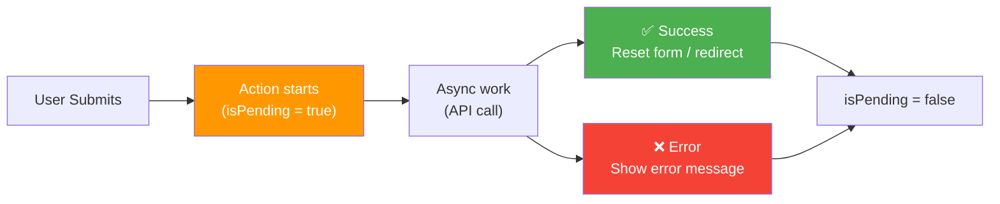
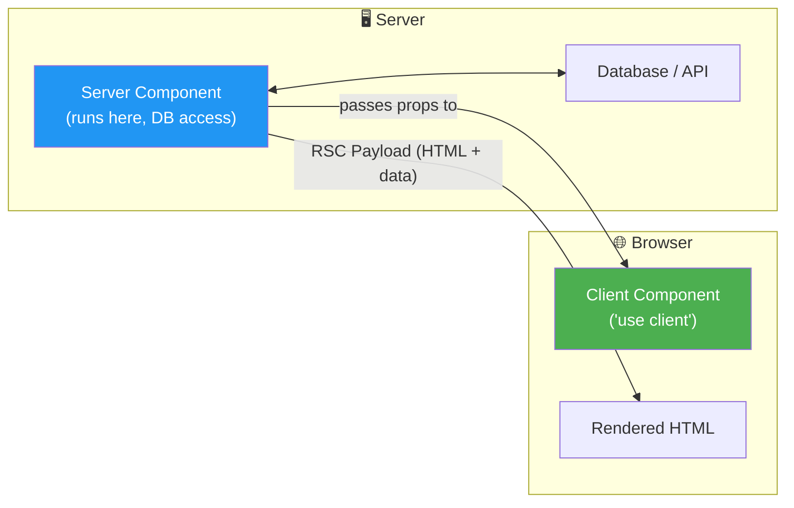
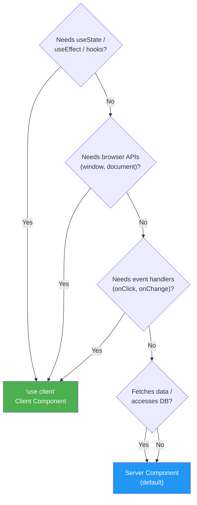

# React 19 — New & Advanced Features

> React 19 (stable release: **December 2024**) is the biggest update since Hooks. It introduces **Actions**, **Server Components**, **new hooks**, **improved APIs**, and removes legacy patterns.

---

## 📚 Table of Contents

1. [What's New in React 19 — Overview](#1-whats-new-in-react-19--overview)
2. [Actions — Async Transitions](#2-actions--async-transitions)
3. [useActionState Hook](#3-useactionstate-hook)
4. [useFormStatus Hook](#4-useformstatus-hook)
5. [useOptimistic Hook](#5-useoptimistic-hook)
6. [use() — New API](#6-use--new-api)
7. [React Server Components (RSC)](#7-react-server-components-rsc)
8. [Server Actions](#8-server-actions)
9. [ref as a Prop (No More forwardRef)](#9-ref-as-a-prop-no-more-forwardref)
10. [Context as a Provider](#10-context-as-a-provider)
11. [useDeferredValue — Initial Value](#11-usedeferredvalue--initial-value)
12. [Document Metadata — Built-in Support](#12-document-metadata--built-in-support)
13. [Stylesheet & Script Loading](#13-stylesheet--script-loading)
14. [Improved Error Reporting](#14-improved-error-reporting)
15. [Custom Elements Support](#15-custom-elements-support)
16. [Removed & Deprecated APIs](#16-removed--deprecated-apis)
17. [React 19 Migration Guide](#17-react-19-migration-guide)

---

```mermaid
mindmap
  root((React 19))
    Actions
      useActionState
      useFormStatus
      useOptimistic
      Async Transitions
    Server
      React Server Components
      Server Actions
      use() API
    Ref Improvements
      ref as prop
      No forwardRef
      Ref cleanup
    New APIs
      Context as Provider
      Document Metadata
      Stylesheet Loading
      Script Loading
    Removed
      Legacy Context
      propTypes
      defaultProps on FC
      ReactDOM.render
```

---

# 1. What's New in React 19 — Overview

## Key Themes

| Theme | What Changed |
|---|---|
| **Actions** | Async form handling built into React — no more manual `isLoading`/`error` state |
| **Server Components** | Components that run only on the server — zero JS sent to client |
| **Server Actions** | Call server-side functions directly from client components |
| **New Hooks** | `useActionState`, `useFormStatus`, `useOptimistic` |
| **`use()` API** | Read Promises and Context inside render |
| **Ref as prop** | Pass `ref` like any other prop — `forwardRef` is gone |
| **Document APIs** | Manage `<title>`, `<meta>`, `<link>` directly in components |
| **Better errors** | Deduplicated, more helpful hydration errors |

## Install / Upgrade

```bash
# New project
npx create-react-app@latest my-app
# or with Vite
npm create vite@latest my-app -- --template react

# Upgrade existing project
npm install react@19 react-dom@19

# With TypeScript
npm install react@19 react-dom@19 @types/react@19 @types/react-dom@19
```

---

# 2. Actions — Async Transitions

> **Actions** are the central concept in React 19. An Action is any **async function passed to a transition**. React automatically manages the **pending state, errors, and optimistic updates** for you — eliminating the boilerplate of manually tracking `isLoading`, `error`, and success states.

## The Problem React 19 Solves

```jsx
// ❌ React 18 — manual state management for every async operation
function UpdateName() {
    const [name,      setName]      = useState('');
    const [error,     setError]     = useState(null);
    const [isPending, setIsPending] = useState(false);

    const handleSubmit = async () => {
        setIsPending(true);
        setError(null);
        try {
            await updateName(name);
        } catch (err) {
            setError(err.message);
        } finally {
            setIsPending(false);
        }
    };

    return (
        <div>
            <input value={name} onChange={e => setName(e.target.value)} />
            <button onClick={handleSubmit} disabled={isPending}>
                {isPending ? 'Saving...' : 'Save'}
            </button>
            {error && <p>{error}</p>}
        </div>
    );
}
```

```jsx
// ✅ React 19 — Actions handle all of that automatically
import { useTransition } from 'react';

function UpdateName() {
    const [name,      setName]      = useState('');
    const [error,     setError]     = useState(null);
    const [isPending, startTransition] = useTransition();

    const handleSubmit = () => {
        startTransition(async () => {  // ← async function = "Action"
            const error = await updateName(name);
            if (error) {
                setError(error);
                return;
            }
            redirect('/profile');
        });
    };

    return (
        <div>
            <input value={name} onChange={e => setName(e.target.value)} />
            <button onClick={handleSubmit} disabled={isPending}>
                {isPending ? 'Saving...' : 'Save'}
            </button>
            {error && <p>{error}</p>}
        </div>
    );
}
```

## React 19 Action Rules

- By convention, functions that use async transitions are called **"Actions"**
- Actions automatically manage: **pending state** → **optimistic updates** → **error reset** → **form reset**
- Actions can be passed to `<form action={...}>` natively



---

# 3. useActionState Hook

> **`useActionState`** is a new hook that takes an **Action function** and returns `[state, dispatch, isPending]`. It's the cleanest way to handle form submissions with async logic in React 19.

## Syntax

```javascript
const [state, dispatch, isPending] = useActionState(actionFn, initialState, permalink?);
//      ↑        ↑           ↑
//   current   call to    whether action
//   state     trigger    is running
//             action
```

```jsx
import { useActionState } from 'react';

// ── Basic Example: Update Name ────────────────────────────────
async function updateNameAction(previousState, formData) {
    // formData is a FormData object (from form submission)
    const name = formData.get('name');

    if (name.length < 2) {
        return { error: 'Name must be at least 2 characters', name };
    }

    try {
        await api.updateUser({ name });
        return { success: true, name };
    } catch (err) {
        return { error: err.message, name };
    }
}

function UpdateNameForm() {
    const [state, dispatch, isPending] = useActionState(
        updateNameAction,
        { error: null, success: false, name: '' } // initial state
    );

    return (
        <form action={dispatch}>  {/* ← form action = dispatch */}
            <input
                name="name"          // formData.get('name') reads this
                defaultValue={state.name}
                placeholder="Enter your name"
            />
            <button type="submit" disabled={isPending}>
                {isPending ? 'Updating...' : 'Update Name'}
            </button>

            {state.error   && <p style={{ color: 'red' }}>❌ {state.error}</p>}
            {state.success && <p style={{ color: 'green' }}>✅ Name updated!</p>}
        </form>
    );
}

// ── Real-World Example: Login Form ───────────────────────────
async function loginAction(prev, formData) {
    const email    = formData.get('email');
    const password = formData.get('password');

    const result = await auth.login({ email, password });

    if (!result.ok) {
        return { error: result.error, email }; // keep email, clear password
    }

    // Redirect on success
    window.location.href = '/dashboard';
    return { error: null };
}

function LoginForm() {
    const [state, dispatch, isPending] = useActionState(loginAction, { error: null, email: '' });

    return (
        <form action={dispatch}>
            <label>
                Email
                <input name="email" type="email" defaultValue={state.email} required />
            </label>
            <label>
                Password
                <input name="password" type="password" required />
            </label>

            {state.error && <div className="error">{state.error}</div>}

            <button type="submit" disabled={isPending}>
                {isPending ? 'Signing in...' : 'Sign In'}
            </button>
        </form>
    );
}

// ── Counter with useActionState ───────────────────────────────
async function counterAction(count, formData) {
    const intent = formData.get('intent');
    await delay(500); // simulate async
    if (intent === 'increment') return count + 1;
    if (intent === 'decrement') return count - 1;
    return 0;
}

function AsyncCounter() {
    const [count, dispatch, isPending] = useActionState(counterAction, 0);

    return (
        <form action={dispatch}>
            <p>Count: {count}</p>
            <button name="intent" value="decrement" disabled={isPending}>-</button>
            <button name="intent" value="increment" disabled={isPending}>+</button>
            <button name="intent" value="reset"     disabled={isPending}>Reset</button>
            {isPending && <span>Processing...</span>}
        </form>
    );
}
```

---

# 4. useFormStatus Hook

> **`useFormStatus`** gives any child component access to the **status of its parent `<form>`** — whether it's submitting, what data was submitted. It must be used inside a component that is a **child of a `<form>`**.

## Syntax

```javascript
const { pending, data, method, action } = useFormStatus();
//       ↑        ↑      ↑        ↑
//    is form   FormData  'get'  action fn
//    pending?  submitted  'post'  reference
```

```jsx
import { useFormStatus } from 'react-dom';

// ── Submit Button that knows its form's status ────────────────
function SubmitButton({ label = 'Submit', pendingLabel = 'Submitting...' }) {
    const { pending } = useFormStatus(); // reads parent form's state

    return (
        <button type="submit" disabled={pending}>
            {pending ? (
                <>
                    <span className="spinner" />
                    {pendingLabel}
                </>
            ) : label}
        </button>
    );
}

// ── Form Input that disables itself while submitting ──────────
function FormInput({ name, label, type = 'text', ...props }) {
    const { pending } = useFormStatus();

    return (
        <div className="form-field">
            <label htmlFor={name}>{label}</label>
            <input
                id={name}
                name={name}
                type={type}
                disabled={pending}  // ← auto-disable during submission
                {...props}
            />
        </div>
    );
}

// ── Full form using reusable components ──────────────────────
async function signupAction(prev, formData) {
    const data = {
        name:  formData.get('name'),
        email: formData.get('email'),
    };
    return await api.signup(data);
}

function SignupForm() {
    const [state, dispatch] = useActionState(signupAction, null);

    return (
        <form action={dispatch}>
            <FormInput name="name"  label="Full Name" />
            <FormInput name="email" label="Email" type="email" />
            <SubmitButton label="Create Account" pendingLabel="Creating..." />
            {state?.error && <p>{state.error}</p>}
        </form>
    );
}

// ── Show what data is being submitted ────────────────────────
function FormDebug() {
    const { pending, data } = useFormStatus();
    if (!pending || !data) return null;

    return (
        <div className="debug-panel">
            <p>Submitting: {data.get('email')}</p>
        </div>
    );
}
```

> 💡 `useFormStatus` must be in a **child component** of the form — not in the same component that renders `<form>`. This is what makes it powerful: deeply nested components can know about the form without prop drilling.

---

# 5. useOptimistic Hook

> **`useOptimistic`** lets you **instantly show a temporary "optimistic" state** while an async operation is in progress. The UI updates immediately (feels fast), and if the server confirms success it stays; if it fails, it automatically reverts to the real state.

## Syntax

```javascript
const [optimisticValue, addOptimistic] = useOptimistic(state, updateFn);
//          ↑                ↑                ↑              ↑
//     what to render    call to update   real state    merge function
//     (real or temp)    optimistically   from server
```

```jsx
import { useOptimistic, useActionState } from 'react';

// ── Like Button — optimistic toggle ──────────────────────────
function LikeButton({ postId, initialLiked, initialCount }) {
    const [liked,  setLiked]  = useState(initialLiked);
    const [count,  setCount]  = useState(initialCount);
    const [pending, startTransition] = useTransition();

    const [optimisticLiked, setOptimisticLiked] = useOptimistic(liked);

    const handleLike = () => {
        startTransition(async () => {
            setOptimisticLiked(!liked); // instant UI update

            try {
                const result = await api.toggleLike(postId);
                setLiked(result.liked);   // update real state
                setCount(result.count);
            } catch {
                // useOptimistic auto-reverts to `liked` on error
            }
        });
    };

    return (
        <button onClick={handleLike} disabled={pending}>
            {optimisticLiked ? '❤️' : '🤍'} {count}
        </button>
    );
}

// ── Todo List — Optimistic Add ────────────────────────────────
async function addTodoAction(prev, formData) {
    const text = formData.get('text');
    const newTodo = await api.createTodo({ text }); // real API call
    return [...prev, newTodo];
}

function TodoApp() {
    const [todos, dispatch, isPending] = useActionState(addTodoAction, []);

    const [optimisticTodos, addOptimisticTodo] = useOptimistic(
        todos,
        (currentTodos, newText) => [
            ...currentTodos,
            { id: `temp-${Date.now()}`, text: newText, pending: true } // temp item
        ]
    );

    const handleSubmit = async (formData) => {
        const text = formData.get('text');
        addOptimisticTodo(text); // instantly adds temp item to UI
        await dispatch(formData); // real server call
    };

    return (
        <div>
            <ul>
                {optimisticTodos.map(todo => (
                    <li
                        key={todo.id}
                        style={{ opacity: todo.pending ? 0.5 : 1 }}
                    >
                        {todo.text}
                        {todo.pending && ' (saving...)'}
                    </li>
                ))}
            </ul>

            <form action={handleSubmit}>
                <input name="text" placeholder="New todo" required />
                <button type="submit" disabled={isPending}>Add</button>
            </form>
        </div>
    );
}

// ── Message Send — Chat Optimistic ───────────────────────────
function ChatWindow({ conversationId }) {
    const [messages, setMessages] = useState([]);

    const [optimisticMessages, addOptimisticMessage] = useOptimistic(
        messages,
        (current, newMessage) => [...current, { ...newMessage, sending: true }]
    );

    const sendMessage = async (formData) => {
        const text = formData.get('message');
        const tempMsg = { id: Date.now(), text, sender: 'me' };

        addOptimisticMessage(tempMsg); // show immediately

        const saved = await api.sendMessage(conversationId, text);
        setMessages(prev => [...prev, saved]); // replace with real message
    };

    return (
        <div>
            <div className="messages">
                {optimisticMessages.map(msg => (
                    <div key={msg.id} style={{ opacity: msg.sending ? 0.6 : 1 }}>
                        {msg.text}
                        {msg.sending && ' ✓'}
                    </div>
                ))}
            </div>
            <form action={sendMessage}>
                <input name="message" />
                <button type="submit">Send</button>
            </form>
        </div>
    );
}
```

---

# 6. use() — New API

> **`use()`** is a new React API that lets you **read the value of a Promise or Context inside render** — including conditionally (unlike hooks). It suspends the component while waiting for a Promise to resolve.

## Syntax

```javascript
const value = use(PromiseOrContext);
```

```jsx
import { use, Suspense, createContext } from 'react';

// ── use() with a Promise ─────────────────────────────────────
// The promise is created outside the component (in parent or a cache)
function UserProfile({ userPromise }) {
    const user = use(userPromise); // suspends until resolved
    return <div>{user.name}</div>;
}

function App() {
    // Create promise outside render to avoid re-creating on every render
    const userPromise = fetchUser(1);

    return (
        <Suspense fallback={<p>Loading user...</p>}>
            <ErrorBoundary fallback={<p>Failed to load user</p>}>
                <UserProfile userPromise={userPromise} />
            </ErrorBoundary>
        </Suspense>
    );
}

// ── use() vs useContext() ────────────────────────────────────
const ThemeContext = createContext('light');

// Old way — useContext cannot be conditional
function OldHeader({ showTheme }) {
    const theme = useContext(ThemeContext); // always called at top level
    if (!showTheme) return <header>Header</header>;
    return <header style={{ background: theme === 'dark' ? '#333' : '#fff' }}>Header</header>;
}

// New way — use() CAN be conditional
function NewHeader({ showTheme }) {
    if (!showTheme) return <header>Header</header>;
    const theme = use(ThemeContext); // ✅ called conditionally!
    return <header style={{ background: theme === 'dark' ? '#333' : '#fff' }}>Header</header>;
}

// ── use() with fetch + cache ─────────────────────────────────
// React 19 + Next.js cache() pattern
import { cache } from 'react';

const getUser = cache(async (id) => {
    const res = await fetch(`/api/users/${id}`);
    return res.json();
});

function UserCard({ id }) {
    const user = use(getUser(id)); // suspends, then renders
    return <div>{user.name} — {user.email}</div>;
}

// ── use() with error handling ────────────────────────────────
function SafeUserProfile({ userPromise }) {
    // Must wrap with ErrorBoundary to handle rejections
    const user = use(userPromise);
    return <p>{user.name}</p>;
}

function App() {
    const [id, setId] = useState(1);
    // ⚠️ Create promise OUTSIDE render — don't write `use(fetch('/api'))` inline
    const [promise, setPromise] = useState(() => getUser(id));

    return (
        <Suspense fallback={<Spinner />}>
            <ErrorBoundary key={id} fallback={<p>Error loading</p>}>
                <SafeUserProfile userPromise={promise} />
            </ErrorBoundary>
        </Suspense>
    );
}
```

## use() vs useContext vs useEffect+fetch

| | `useContext` | `useEffect` + fetch | `use()` |
|---|---|---|---|
| **Reads context?** | ✅ | ❌ | ✅ |
| **Reads promises?** | ❌ | Indirectly | ✅ |
| **Conditional?** | ❌ | ❌ | ✅ |
| **Suspends?** | ❌ | ❌ | ✅ |
| **Server Components?** | Limited | ❌ | ✅ |

---

# 7. React Server Components (RSC)

> **React Server Components (RSC)** are components that run **exclusively on the server** — they have direct access to databases, file systems, and APIs, but send **zero JavaScript** to the client. The result is pure HTML streamed to the browser.



## Server Component Rules

```jsx
// ── Server Component (default in Next.js App Router) ─────────
// app/users/page.jsx
import { db } from '@/lib/db';

// ✅ CAN DO:
// - Direct database queries
// - Read filesystem
// - Access env variables (secrets)
// - Import heavy server-only packages
// - async/await at top level

// ❌ CANNOT DO:
// - useState / useEffect / other hooks
// - Event handlers (onClick, onChange)
// - Browser-only APIs (window, document)

async function UsersPage() {
    // Direct DB access — no API layer needed
    const users = await db.user.findMany({
        where: { active: true },
        select: { id: true, name: true, email: true }
    });

    return (
        <main>
            <h1>Users ({users.length})</h1>
            {users.map(user => (
                // Can render both server and client components
                <UserRow key={user.id} user={user} />
            ))}
            <AddUserButton /> {/* client component for interactivity */}
        </main>
    );
}

export default UsersPage;

// ── Client Component — needs interactivity ───────────────────
// components/AddUserButton.jsx
'use client'; // ← directive makes this a Client Component

import { useState } from 'react';

function AddUserButton() {
    const [isOpen, setIsOpen] = useState(false);

    return (
        <>
            <button onClick={() => setIsOpen(true)}>Add User</button>
            {isOpen && <AddUserModal onClose={() => setIsOpen(false)} />}
        </>
    );
}

// ── Passing Server Data to Client Components ─────────────────
// ✅ Allowed — pass serializable props
<ClientChart data={serverData} /> // data = plain objects/arrays

// ❌ Not allowed — can't pass functions or class instances
<ClientComponent handler={serverFn} /> // Error!
```

## Server vs Client Component Decision



| Feature | Server Component | Client Component |
|---|---|---|
| **Directive** | none (default) | `'use client'` at top |
| **Hooks** | ❌ | ✅ |
| **Event handlers** | ❌ | ✅ |
| **DB / filesystem** | ✅ | ❌ |
| **Secret env vars** | ✅ | ❌ (exposed!) |
| **Bundle size** | Zero JS sent | Included in JS bundle |
| **Caching** | Built-in (Next.js) | Manual |

---

# 8. Server Actions

> **Server Actions** are **async functions that run on the server** but can be called directly from client components — like calling a server function as if it were local. They replace the traditional API route + fetch pattern.

```jsx
// ── Define Server Action ─────────────────────────────────────
// app/actions.js
'use server'; // ← marks all exports as Server Actions

import { revalidatePath } from 'next/cache';
import { redirect } from 'next/navigation';
import { db } from '@/lib/db';

export async function createUser(formData) {
    const name  = formData.get('name');
    const email = formData.get('email');

    // Input validation
    if (!name || !email) {
        return { error: 'Name and email are required' };
    }

    // Direct DB access — runs on server!
    const user = await db.user.create({
        data: { name, email }
    });

    revalidatePath('/users'); // revalidate Next.js cache
    return { success: true, user };
}

export async function deleteUser(userId) {
    await db.user.delete({ where: { id: userId } });
    revalidatePath('/users');
}

export async function updateProfile(prevState, formData) {
    const name = formData.get('name');
    const bio  = formData.get('bio');

    const session = await getServerSession(); // server-only
    if (!session) redirect('/login');

    await db.user.update({
        where: { id: session.userId },
        data: { name, bio }
    });

    return { success: true };
}

// ── Use Server Action in a form ──────────────────────────────
// app/users/new/page.jsx — Server Component
import { createUser } from '../actions';

export default function NewUserPage() {
    return (
        // Pass Server Action directly to form action
        <form action={createUser}>
            <input name="name"  placeholder="Name"  required />
            <input name="email" placeholder="Email" required />
            <button type="submit">Create User</button>
        </form>
    );
}

// ── Use Server Action in a Client Component ──────────────────
'use client';
import { createUser } from '../actions';
import { useActionState } from 'react';

function CreateUserForm() {
    const [state, dispatch, isPending] = useActionState(createUser, null);

    return (
        <form action={dispatch}>
            <input name="name"  required />
            <input name="email" required />
            <button type="submit" disabled={isPending}>
                {isPending ? 'Creating...' : 'Create'}
            </button>
            {state?.error   && <p className="error">{state.error}</p>}
            {state?.success && <p className="success">User created!</p>}
        </form>
    );
}

// ── Inline Server Action ─────────────────────────────────────
// Can define Server Action inline in a Server Component
async function ProductPage({ params }) {
    const product = await db.product.findUnique({ where: { id: params.id } });

    // Inline Server Action
    async function addToCart(formData) {
        'use server';
        const qty = formData.get('quantity');
        await db.cart.upsert({ /* ... */ });
        revalidatePath('/cart');
    }

    return (
        <div>
            <h1>{product.name}</h1>
            <form action={addToCart}>
                <input name="quantity" type="number" defaultValue={1} />
                <button type="submit">Add to Cart</button>
            </form>
        </div>
    );
}
```

---

# 9. ref as a Prop (No More forwardRef)

> In React 19, **`ref` can be passed as a regular prop** to function components — no more wrapping with `React.forwardRef`. The `forwardRef` API still works but is now unnecessary and will be deprecated.

```jsx
// ── React 18 — forwardRef required ──────────────────────────
const Input18 = React.forwardRef(function Input({ label, ...props }, ref) {
    return (
        <div>
            <label>{label}</label>
            <input ref={ref} {...props} />
        </div>
    );
});

// Usage
const inputRef = useRef(null);
<Input18 ref={inputRef} label="Name" />

// ── React 19 — ref is just a prop ───────────────────────────
function Input({ label, ref, ...props }) { // ← ref in props directly!
    return (
        <div>
            <label>{label}</label>
            <input ref={ref} {...props} />
        </div>
    );
}

// Usage — identical API, no forwardRef wrapper needed
const inputRef = useRef(null);
<Input ref={inputRef} label="Name" />

// ── Ref Cleanup Function (NEW in React 19) ───────────────────
function AttachRef() {
    return (
        <div
            ref={(node) => {
                // Setup when element mounts
                if (node) {
                    node.addEventListener('click', handleClick);
                    console.log('Element mounted:', node);
                }

                // ✅ React 19: return a cleanup function instead of handling null
                return () => {
                    node.removeEventListener('click', handleClick);
                    console.log('Element unmounted');
                };
            }}
        >
            Click me
        </div>
    );
}

// ── Before React 19 — had to handle null case ────────────────
<div ref={(node) => {
    if (node) {
        // setup
    } else {
        // cleanup (node is null on unmount)
    }
}} />

// ── After React 19 — clean return pattern ───────────────────
<div ref={(node) => {
    const sub = subscribe(node);
    return () => sub.unsubscribe(); // cleanup function
}} />
```

---

# 10. Context as a Provider

> In React 19, you can use **`<Context>` directly as a provider** instead of `<Context.Provider>`. The `.Provider` wrapper is still supported but considered legacy.

```jsx
import { createContext, use } from 'react';

const ThemeContext = createContext('light');

// ── React 18 — required .Provider ───────────────────────────
function App18() {
    return (
        <ThemeContext.Provider value="dark">
            <Page />
        </ThemeContext.Provider>
    );
}

// ── React 19 — Context itself is the provider ────────────────
function App19() {
    return (
        <ThemeContext value="dark">  {/* ← No .Provider needed! */}
            <Page />
        </ThemeContext>
    );
}

// ── Full example with state ───────────────────────────────────
const UserContext = createContext(null);

function UserProvider({ children }) {
    const [user, setUser] = useState(null);

    return (
        <UserContext value={{ user, setUser }}>  {/* React 19 style */}
            {children}
        </UserContext>
    );
}

// Consuming — use() or useContext() both work
function UserBadge() {
    const { user } = use(UserContext);         // React 19 style
    // or: const { user } = useContext(UserContext); // still works
    return <span>{user?.name}</span>;
}
```

---

# 11. useDeferredValue — Initial Value

> React 19 adds an **`initialValue`** parameter to `useDeferredValue`. On the first render, the deferred value starts as `initialValue` (no stale render), then updates to the actual value in a deferred render.

```jsx
import { useDeferredValue, useState, memo } from 'react';

// ── React 18 — first render shows stale "" value ─────────────
function Search18({ query }) {
    const deferredQuery = useDeferredValue(query);
    // First render: deferredQuery = "" (stale), causes double render
    return <Results query={deferredQuery} />;
}

// ── React 19 — provide initial value ─────────────────────────
function Search19({ query }) {
    const deferredQuery = useDeferredValue(query, query); // ← initialValue = query
    // First render: deferredQuery = query (no stale render)
    return <Results query={deferredQuery} />;
}

// ── Practical: Search with skeleton state ────────────────────
function ProductSearch() {
    const [search, setSearch] = useState('');
    const deferredSearch = useDeferredValue(search, ''); // starts as ''

    const isStale = search !== deferredSearch; // true while deferred is behind

    return (
        <div>
            <input
                value={search}
                onChange={e => setSearch(e.target.value)}
                placeholder="Search products..."
            />
            <div style={{ opacity: isStale ? 0.5 : 1 }}>
                {isStale && <p>Updating results...</p>}
                <ProductList query={deferredSearch} />
            </div>
        </div>
    );
}
```

---

# 12. Document Metadata — Built-in Support

> React 19 provides **first-class support for `<title>`, `<meta>`, and `<link>` tags** directly inside any component. React automatically **hoists them to `<head>`** — no need for `react-helmet` or `next/head`.

```jsx
// ── Basic usage — works in any component ─────────────────────
function ProductPage({ product }) {
    return (
        <article>
            {/* React hoists these to <head> automatically */}
            <title>{product.name} | My Store</title>
            <meta name="description" content={product.description} />
            <meta property="og:title"       content={product.name} />
            <meta property="og:image"       content={product.imageUrl} />
            <meta property="og:description" content={product.description} />
            <link rel="canonical" href={`https://mystore.com/products/${product.slug}`} />

            {/* Regular page content below */}
            <h1>{product.name}</h1>
            <p>{product.description}</p>
        </article>
    );
}

// ── Nested routes — innermost title wins ─────────────────────
function App() {
    return (
        <>
            <title>My Store</title>           {/* default title */}
            <Routes>
                <Route path="/" element={<Home />} />
                <Route path="/products" element={<Products />} />
                {/* Products component can override <title> */}
            </Routes>
        </>
    );
}

// ── Dynamic metadata based on state ─────────────────────────
function ShoppingCart({ items }) {
    const count = items.length;
    return (
        <>
            <title>{count > 0 ? `(${count}) ` : ''}Shopping Cart | My Store</title>
            <div>Cart: {count} items</div>
        </>
    );
}

// ── Before React 19 — needed react-helmet ───────────────────
import { Helmet } from 'react-helmet-async';

function OldProductPage({ product }) {
    return (
        <>
            <Helmet>
                <title>{product.name}</title>
                <meta name="description" content={product.description} />
            </Helmet>
            <h1>{product.name}</h1>
        </>
    );
}
// ← No longer needed in React 19!
```

---

# 13. Stylesheet & Script Loading

> React 19 adds **built-in resource loading** with automatic **deduplication** and **ordering guarantees**. Stylesheets can declare precedence; scripts load once even if multiple components request them.

```jsx
// ── Stylesheets with precedence ──────────────────────────────
function ComponentA() {
    return (
        <>
            {/* React deduplicates — only loads once even if used in multiple components */}
            <link rel="stylesheet" href="/styles/base.css"      precedence="default" />
            <link rel="stylesheet" href="/styles/component-a.css" precedence="high" />
            <div>Component A</div>
        </>
    );
}

function ComponentB() {
    return (
        <>
            <link rel="stylesheet" href="/styles/base.css" precedence="default" />
            {/* base.css already requested by ComponentA — React won't load it twice */}
            <link rel="stylesheet" href="/styles/component-b.css" precedence="high" />
            <div>Component B</div>
        </>
    );
}

// ── Script loading ───────────────────────────────────────────
function Analytics() {
    return (
        <>
            {/* async script — loads without blocking */}
            <script async src="https://analytics.example.com/script.js" />
            <div>Analytics component</div>
        </>
    );
}

// ── Preloading resources ─────────────────────────────────────
import { prefetchDNS, preconnect, preload, preinit } from 'react-dom';

function AppShell() {
    // DNS prefetch — resolve DNS early
    prefetchDNS('https://api.example.com');

    // Preconnect — full connection handshake
    preconnect('https://fonts.googleapis.com');

    // Preload — fetch resource, don't execute yet
    preload('https://fonts.gstatic.com/font.woff2', { as: 'font' });

    // Preinit — fetch AND execute (for scripts/stylesheets)
    preinit('https://example.com/critical.css', { as: 'style' });

    return <div>App</div>;
}
```

---

# 14. Improved Error Reporting

> React 19 significantly improves how errors are displayed and reported. Hydration errors now show **a diff of what the server sent vs what the client expected**, instead of cryptic mismatched content messages.

```jsx
// ── Error handling hooks ─────────────────────────────────────
// New options for createRoot
const root = ReactDOM.createRoot(document.getElementById('root'), {
    // Called for recoverable errors (component errors caught by boundaries)
    onRecoverableError(error, errorInfo) {
        console.error('Recoverable error:', error);
        Sentry.captureException(error, { extra: errorInfo });
    },

    // Called for uncaught errors (will crash the app)
    onUncaughtError(error, errorInfo) {
        console.error('Uncaught error:', error);
        Sentry.captureException(error, { extra: errorInfo });
        showGlobalErrorPage();
    },

    // Called for caught errors (ErrorBoundary or try/catch)
    onCaughtError(error, errorInfo) {
        console.warn('Caught error:', error);
    }
});

root.render(<App />);

// ── Error.cause — better error chaining ─────────────────────
async function fetchUser(id) {
    try {
        const res = await fetch(`/api/users/${id}`);
        return await res.json();
    } catch (err) {
        throw new Error('Failed to load user', {
            cause: err // React 19 surfaces this in dev tools
        });
    }
}

// ── Hydration error improvement ──────────────────────────────
// React 18 error message:
// "Warning: Text content did not match. Server: "Monday" Client: "Tuesday""

// React 19 error message shows FULL diff:
// "Hydration failed because the server rendered HTML didn't match the client.
//  Server: <div class="date">Monday</div>
//  Client: <div class="date">Tuesday</div>
//  Difference: text content: "Monday" → "Tuesday"
//  Fix: ensure the Date component renders the same on server and client."
```

---

# 15. Custom Elements Support

> React 19 adds **full support for Web Components / Custom Elements** — custom HTML elements defined with the Web Components standard. React now correctly handles properties vs attributes and events for custom elements.

```jsx
// ── React 18 had issues — couldn't pass objects as props ─────
// React 18: <my-component data={obj} /> → data="[object Object]" (wrong!)
// React 19: <my-component data={obj} /> → passes as property ✅

// ── React 19 — correct property/attribute handling ───────────
function App() {
    const user = { name: 'Hitesh', role: 'admin' };

    return (
        <div>
            {/* Custom element with object prop — React 19 passes as property */}
            <user-card
                user={user}           // object → property (not attribute)
                theme="dark"          // string → attribute
                count={42}            // number → property
                active={true}         // boolean → property
                onUserClick={handleClick} // event handler
            />

            {/* Works with shadow DOM components */}
            <my-date-picker
                value={selectedDate}
                onChange={handleDateChange}
                min="2024-01-01"
            />
        </div>
    );
}

// ── Interoperability with Web Components ─────────────────────
// Custom element definition (outside React)
class UserCard extends HTMLElement {
    set user(value) {
        this._user = value;
        this.render();
    }
    connectedCallback() {
        this.render();
    }
    render() {
        this.innerHTML = `<div>${this._user?.name ?? 'Loading...'}</div>`;
    }
}
customElements.define('user-card', UserCard);
```

---

# 16. Removed & Deprecated APIs

> React 19 removes APIs that have been deprecated since React 16-18. Upgrade before migrating.

## Removed APIs

| Removed API | React 19 Replacement |
|---|---|
| `ReactDOM.render()` | `ReactDOM.createRoot().render()` |
| `ReactDOM.hydrate()` | `ReactDOM.hydrateRoot()` |
| `React.render()` | `createRoot` |
| `unmountComponentAtNode()` | `root.unmount()` |
| `findDOMNode()` | `ref` callbacks |
| Legacy Context API (`childContextTypes`, `getChildContext`) | `createContext()` + `useContext()` |
| `propTypes` (removed from React package) | TypeScript or `prop-types` package |
| `defaultProps` on function components | Default parameter values |
| String refs (`ref="myRef"`) | `useRef()` |
| `React.createFactory()` | JSX or `React.createElement()` |

```jsx
// ── ReactDOM.render → createRoot ────────────────────────────
// ❌ React 18 (deprecated)
ReactDOM.render(<App />, document.getElementById('root'));

// ✅ React 19
const root = ReactDOM.createRoot(document.getElementById('root'));
root.render(<App />);

// ── defaultProps on Function Components ─────────────────────
// ❌ Removed in React 19
function Button({ label }) { return <button>{label}</button>; }
Button.defaultProps = { label: 'Click me' };

// ✅ Use default parameters
function Button({ label = 'Click me' }) { return <button>{label}</button>; }

// ── propTypes ────────────────────────────────────────────────
// ❌ react package no longer includes propTypes
import PropTypes from 'prop-types'; // ← install separately if needed
// ✅ Use TypeScript instead
interface ButtonProps { label: string; onClick: () => void; }
function Button({ label, onClick }: ButtonProps) { ... }

// ── String refs ──────────────────────────────────────────────
// ❌ Removed
class OldInput extends Component {
    handleClick() { this.refs.myInput.focus(); }
    render() { return <input ref="myInput" />; }
}

// ✅ useRef
function NewInput() {
    const inputRef = useRef(null);
    return <input ref={inputRef} />;
}
```

---

# 17. React 19 Migration Guide

## Step-by-step upgrade

```bash
# 1. Upgrade packages
npm install react@19 react-dom@19

# 2. If using TypeScript
npm install --save-dev @types/react@19 @types/react-dom@19

# 3. Run the React 19 codemod (auto-fixes common issues)
npx codemod@latest react/19/migration-recipe

# 4. Check for peer dependency issues
npm ls react
```

## Common Fixes

```jsx
// ── Fix 1: Replace ReactDOM.render ──────────────────────────
// Before
import ReactDOM from 'react-dom';
ReactDOM.render(<App />, document.getElementById('root'));

// After
import { createRoot } from 'react-dom/client';
const root = createRoot(document.getElementById('root'));
root.render(<App />);

// ── Fix 2: Remove forwardRef ─────────────────────────────────
// Before
const Input = React.forwardRef((props, ref) => <input {...props} ref={ref} />);

// After
function Input({ ref, ...props }) { return <input {...props} ref={ref} />; }

// ── Fix 3: Replace useActionState import ─────────────────────
// Before (React 18 with Canary)
import { useFormState } from 'react-dom'; // old name

// After (React 19)
import { useActionState } from 'react';   // renamed + moved to react

// ── Fix 4: Remove defaultProps from function components ──────
function Btn({ label }) { return <button>{label}</button>; }
Btn.defaultProps = { label: 'OK' }; // ← remove this

function Btn({ label = 'OK' }) { return <button>{label}</button>; } // ← use this

// ── Fix 5: Context provider syntax ──────────────────────────
// Before — still works but legacy
<MyContext.Provider value={val}>{children}</MyContext.Provider>

// After — preferred
<MyContext value={val}>{children}</MyContext>
```

## React 19 Feature Compatibility

| Feature | CRA | Vite + React | Next.js 14+ | Remix |
|---|---|---|---|---|
| `useActionState` | ✅ | ✅ | ✅ | ✅ |
| `useFormStatus` | ✅ | ✅ | ✅ | ✅ |
| `useOptimistic` | ✅ | ✅ | ✅ | ✅ |
| `use()` | ✅ | ✅ | ✅ | ✅ |
| Server Components | ❌ | ❌ | ✅ | ✅ |
| Server Actions | ❌ | ❌ | ✅ | ✅ |
| Document Metadata | ✅ | ✅ | ✅ | ✅ |
| ref as prop | ✅ | ✅ | ✅ | ✅ |

> 💡 **Server Components and Server Actions** require a framework (Next.js App Router, Remix) — they can't be used in plain React apps (CRA/Vite) because they need a server runtime.

---

## Quick Reference Cheat Sheet

| React 19 Feature | One-line Summary |
|---|---|
| **Actions** | Async functions in transitions — auto pending/error management |
| **`useActionState`** | `[state, dispatch, isPending] = useActionState(fn, init)` |
| **`useFormStatus`** | Read parent form's `{ pending, data }` from any child |
| **`useOptimistic`** | Instantly show temp UI, auto-revert if server fails |
| **`use()`** | Read Promises/Context in render, conditionally |
| **Server Components** | Zero-JS components that run only on server |
| **Server Actions** | Call server functions directly from client, marked `'use server'` |
| **ref as prop** | `function Comp({ ref }) {}` — no `forwardRef` needed |
| **Context as Provider** | `<Context value={v}>` — no `.Provider` needed |
| **Document Metadata** | `<title>`, `<meta>`, `<link>` in any component → auto-hoisted to `<head>` |
| **Stylesheet loading** | `<link rel="stylesheet" precedence="high">` — deduplicated |
| **Hydration errors** | Full server/client diff shown in error message |

---

*Based on the official React 19 release notes — [react.dev/blog/2024/12/05/react-19](https://react.dev/blog/2024/12/05/react-19)*
