# React JS — Advanced Concepts Guide

---

## 📚 Table of Contents

1. [Controlled vs Uncontrolled Components](#1-controlled-vs-uncontrolled-components)
2. [Hooks in Detail — useMemo & useCallback](#2-hooks-in-detail--usememo--usecallback)
3. [useRef Hook](#3-useref-hook)
4. [componentWillUnmount in Function Components](#4-componentwillunmount-in-function-components)
5. [Higher-Order Components (HOC)](#5-higher-order-components-hoc)
6. [Pure Component & React.memo](#6-pure-component--reactmemo)
7. [Reconciliation](#7-reconciliation)
8. [Portals](#8-portals)
9. [Context API](#9-context-api)
10. [Prop Drilling & How to Overcome It](#10-prop-drilling--how-to-overcome-it)
11. [Server-Side Rendering (SSR)](#11-server-side-rendering-ssr)
12. [React.StrictMode](#12-reactstrictmode)
13. [Redux — Core Concepts](#13-redux--core-concepts)
14. [Redux — Middleware](#14-redux--middleware)
15. [Redux Data Flow](#15-redux-data-flow)
16. [Redux Thunk](#16-redux-thunk)
17. [Redux Saga](#17-redux-saga)
18. [React vs Angular](#18-react-vs-angular)
19. [Optimizing React Apps](#19-optimizing-react-apps)
20. [useReducer Hook](#20-usereducer-hook)
21. [Custom Hooks](#21-custom-hooks)
22. [Error Boundaries](#22-error-boundaries)
23. [Suspense & React.lazy](#23-suspense--reactlazy)
24. [React 18 — Concurrent Features](#24-react-18--concurrent-features)
25. [Forms — React Hook Form](#25-forms--best-practices--react-hook-form)
26. [Compound Components & Render Props](#26-component-patterns--compound-components--render-props)
27. [Accessibility (a11y) in React](#27-accessibility-a11y-in-react)
28. [Testing React Components](#28-testing-react-components)

---

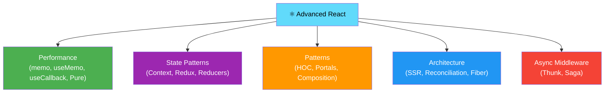

---

# 1. Controlled vs Uncontrolled Components

## Controlled Component

> A **Controlled Component** is a form element whose value is **controlled by React state**. The React component is the **single source of truth** for the input value. Every keystroke updates state, and the state value drives what the input shows.

```jsx
import React, { useState } from 'react';

function ControlledForm() {
    const [name,  setName]  = useState("");
    const [email, setEmail] = useState("");
    const [errors, setErrors] = useState({});

    const validate = () => {
        const e = {};
        if (!name.trim())         e.name  = "Name is required";
        if (!email.includes("@")) e.email = "Valid email required";
        return e;
    };

    const handleSubmit = (e) => {
        e.preventDefault();
        const errs = validate();
        if (Object.keys(errs).length > 0) {
            setErrors(errs);
            return;
        }
        console.log("Submitting:", { name, email });
    };

    return (
        <form onSubmit={handleSubmit}>
            <input
                value={name}                           // ← React controls value
                onChange={e => setName(e.target.value)} // ← React updates state
                placeholder="Name"
            />
            {errors.name && <span>{errors.name}</span>}

            <input
                value={email}
                onChange={e => setEmail(e.target.value)}
                placeholder="Email"
            />
            {errors.email && <span>{errors.email}</span>}
            <button type="submit">Submit</button>
        </form>
    );
}
```

## Uncontrolled Component

> An **Uncontrolled Component** manages its own state internally via the **DOM itself**. You access the current value using a **`ref`** only when you need it (e.g., on submit), rather than on every keystroke.

```jsx
import React, { useRef } from 'react';

function UncontrolledForm() {
    const nameRef  = useRef(null);
    const emailRef = useRef(null);
    const fileRef  = useRef(null);

    const handleSubmit = (e) => {
        e.preventDefault();
        console.log("Name:",  nameRef.current.value);   // ← read from DOM on submit
        console.log("Email:", emailRef.current.value);
        console.log("File:",  fileRef.current.files[0]); // ← file inputs must be uncontrolled
    };

    return (
        <form onSubmit={handleSubmit}>
            <input ref={nameRef}  defaultValue="Hitesh" placeholder="Name" />
            <input ref={emailRef} type="email" placeholder="Email" />
            <input ref={fileRef}  type="file" />  {/* file inputs are always uncontrolled */}
            <button type="submit">Submit</button>
        </form>
    );
}
```

## Comparison Table

| Feature | Controlled | Uncontrolled |
|---|---|---|
| **Truth source** | React state | DOM |
| **Value access** | `value` prop + `onChange` | `ref.current.value` |
| **Real-time validation** | ✅ Easy | ❌ Complex |
| **Instant feedback** | ✅ Every keystroke | ❌ Only on demand |
| **Programmatic reset** | `setState("")` | `ref.current.value = ""` |
| **File inputs** | ❌ Not possible | ✅ Required |
| **React recommendation** | ✅ Preferred | Use for simple/file inputs |

---

# 2. Hooks in Detail — useMemo & useCallback

## useMemo

> **`useMemo`** memoizes the **result (return value)** of an expensive computation. The computation only re-runs when the specified dependencies change. Between re-renders, it returns the cached result instantly.

```jsx
import React, { useState, useMemo } from 'react';

function ProductList({ products, searchTerm, minPrice }) {

    // ❌ Without useMemo — runs on EVERY render, even unrelated ones
    // const filtered = products.filter(p => p.name.includes(searchTerm) && p.price >= minPrice);

    // ✅ With useMemo — only recalculates when products, searchTerm, or minPrice change
    const filteredProducts = useMemo(() => {
        console.log("🔄 Recalculating filtered products...");
        return products
            .filter(p =>
                p.name.toLowerCase().includes(searchTerm.toLowerCase()) &&
                p.price >= minPrice
            )
            .sort((a, b) => a.price - b.price);
    }, [products, searchTerm, minPrice]); // dependencies

    // Memoized derived data
    const totalValue = useMemo(() => {
        return filteredProducts.reduce((sum, p) => sum + p.price, 0);
    }, [filteredProducts]);

    return (
        <div>
            <p>Found {filteredProducts.length} products | Total: ${totalValue}</p>
            {filteredProducts.map(p => <div key={p.id}>{p.name} — ${p.price}</div>)}
        </div>
    );
}
```

## useCallback

> **`useCallback`** memoizes a **function itself** (not its return value). It returns the same function reference between renders, as long as its dependencies don't change. This is important because every render creates new function instances, which causes child components to re-render even if props haven't "logically" changed.

```jsx
import React, { useState, useCallback, memo } from 'react';

// Child component — only re-renders if props change (because of memo)
const ExpensiveButton = memo(({ onClick, label }) => {
    console.log(`Rendering button: ${label}`);
    return <button onClick={onClick}>{label}</button>;
});

function Parent() {
    const [count, setCount] = useState(0);
    const [name,  setName]  = useState("Hitesh");

    // ❌ Without useCallback — new function created every render
    // → ExpensiveButton re-renders even when count changes (unrelated)
    // const handleSave = () => { console.log("Saving..."); };

    // ✅ With useCallback — same function reference while 'name' doesn't change
    const handleSave = useCallback(() => {
        console.log("Saving...", name);
    }, [name]); // only recreate when name changes

    const handleDelete = useCallback(() => {
        console.log("Deleting...");
    }, []); // empty deps — never recreates

    return (
        <div>
            <p>Count: {count}</p>
            <button onClick={() => setCount(c => c + 1)}>+1 (unrelated)</button>
            <input value={name} onChange={e => setName(e.target.value)} />

            {/* These buttons won't re-render when count changes */}
            <ExpensiveButton onClick={handleSave}   label="Save" />
            <ExpensiveButton onClick={handleDelete} label="Delete" />
        </div>
    );
}
```

## useMemo vs useCallback

| Hook | Memoizes | Returns | Use When |
|---|---|---|---|
| `useMemo` | **Computed value** | Result of function | Expensive calculations, derived data |
| `useCallback` | **Function itself** | The function | Passing callbacks to memoized children |

```jsx
// Relationship — useCallback(fn, deps) ≡ useMemo(() => fn, deps)
const memoizedValue = useMemo(() => computeExpensiveValue(a, b), [a, b]);
const memoizedFn    = useCallback(() => doSomething(a, b), [a, b]);
// memoizedFn equivalent:
const memoizedFn2   = useMemo(() => () => doSomething(a, b), [a, b]);
```

> ⚠️ **Don't over-memoize!** Both hooks have a cost (memory + comparison). Only use them when profiling shows a real performance problem, or when passing stable references to `React.memo`-wrapped children.

---

# 3. useRef Hook

> **`useRef`** returns a mutable object `{ current: initialValue }` that **persists across renders** and does **NOT cause re-renders** when changed. It has two main use cases:

## Use Case 1: Access DOM Elements Directly

```jsx
import React, { useRef, useEffect } from 'react';

function VideoPlayer({ src }) {
    const videoRef = useRef(null);

    // Access DOM node after mount
    const play  = () => videoRef.current.play();
    const pause = () => videoRef.current.pause();

    useEffect(() => {
        videoRef.current.playbackRate = 1.5; // speed up on mount
    }, []);

    return (
        <div>
            <video ref={videoRef} src={src} />
            <button onClick={play}>▶ Play</button>
            <button onClick={pause}>⏸ Pause</button>
        </div>
    );
}

// Auto-focus an input on mount
function SearchBar() {
    const inputRef = useRef(null);

    useEffect(() => {
        inputRef.current.focus(); // focus on mount — like autofocus
    }, []);

    return <input ref={inputRef} placeholder="Search..." />;
}
```

## Use Case 2: Persist Mutable Values Without Re-rendering

```jsx
import React, { useState, useRef, useEffect } from 'react';

function Timer() {
    const [seconds, setSeconds] = useState(0);
    const intervalRef = useRef(null); // store timer ID — doesn't need to trigger re-render

    const start = () => {
        intervalRef.current = setInterval(() => {
            setSeconds(s => s + 1);
        }, 1000);
    };

    const stop = () => {
        clearInterval(intervalRef.current);
    };

    return (
        <div>
            <p>Time: {seconds}s</p>
            <button onClick={start}>Start</button>
            <button onClick={stop}>Stop</button>
        </div>
    );
}

// Track previous value
function PreviousValueTracker({ value }) {
    const prevValueRef = useRef(value);

    useEffect(() => {
        prevValueRef.current = value; // update AFTER render
    });

    return (
        <div>
            <p>Current:  {value}</p>
            <p>Previous: {prevValueRef.current}</p>
        </div>
    );
}

// Count renders without triggering them
function RenderCounter() {
    const renderCount = useRef(0);
    const [state, setState] = useState(0);

    renderCount.current += 1; // won't cause infinite loop (ref doesn't trigger render)

    return (
        <div>
            <p>Renders: {renderCount.current}</p>
            <button onClick={() => setState(s => s + 1)}>Update</button>
        </div>
    );
}
```

## useRef vs useState

| Feature | useRef | useState |
|---|---|---|
| Causes re-render on change? | ❌ No | ✅ Yes |
| Value persists across renders? | ✅ Yes | ✅ Yes |
| Use for DOM access? | ✅ Yes | ❌ No |
| Use for UI-driving data? | ❌ No | ✅ Yes |

---

# 4. componentWillUnmount in Function Components

> In **class components**, `componentWillUnmount()` runs cleanup (clear timers, cancel subscriptions) before a component is removed from the DOM.
>
> In **function components**, you replicate this by **returning a cleanup function** from `useEffect`.

```jsx
import React, { useState, useEffect } from 'react';

function AnalyticsDashboard() {
    const [data, setData] = useState(null);

    useEffect(() => {
        // ── SETUP (componentDidMount equivalent) ─────────────
        console.log("Component mounted — setting up resources");

        // 1. Start a timer
        const timerId = setInterval(() => {
            setData(prev => ({ ...prev, tick: Date.now() }));
        }, 5000);

        // 2. Subscribe to WebSocket
        const ws = new WebSocket('wss://api.example.com/live');
        ws.onmessage = (event) => setData(JSON.parse(event.data));

        // 3. Add event listener
        const handleResize = () => setData(prev => ({ ...prev, width: window.innerWidth }));
        window.addEventListener('resize', handleResize);

        // 4. Abort controller for fetch
        const controller = new AbortController();
        fetch('/api/dashboard', { signal: controller.signal })
            .then(res => res.json())
            .then(setData)
            .catch(err => {
                if (err.name !== 'AbortError') console.error(err);
            });

        // ── CLEANUP (componentWillUnmount equivalent) ─────────
        return () => {
            console.log("Component unmounting — cleaning up resources");

            clearInterval(timerId);              // 1. clear timer
            ws.close();                          // 2. close WebSocket
            window.removeEventListener('resize', handleResize); // 3. remove listener
            controller.abort();                  // 4. cancel in-flight fetch
        };
    }, []); // [] → runs setup once on mount, cleanup once on unmount

    return <div>Dashboard: {JSON.stringify(data)}</div>;
}

// Parent toggles the component in/out
function App() {
    const [show, setShow] = useState(true);
    return (
        <div>
            <button onClick={() => setShow(s => !s)}>
                {show ? "Unmount" : "Mount"} Dashboard
            </button>
            {show && <AnalyticsDashboard />} {/* cleanup runs when show = false */}
        </div>
    );
}
```

## Cleanup Timing

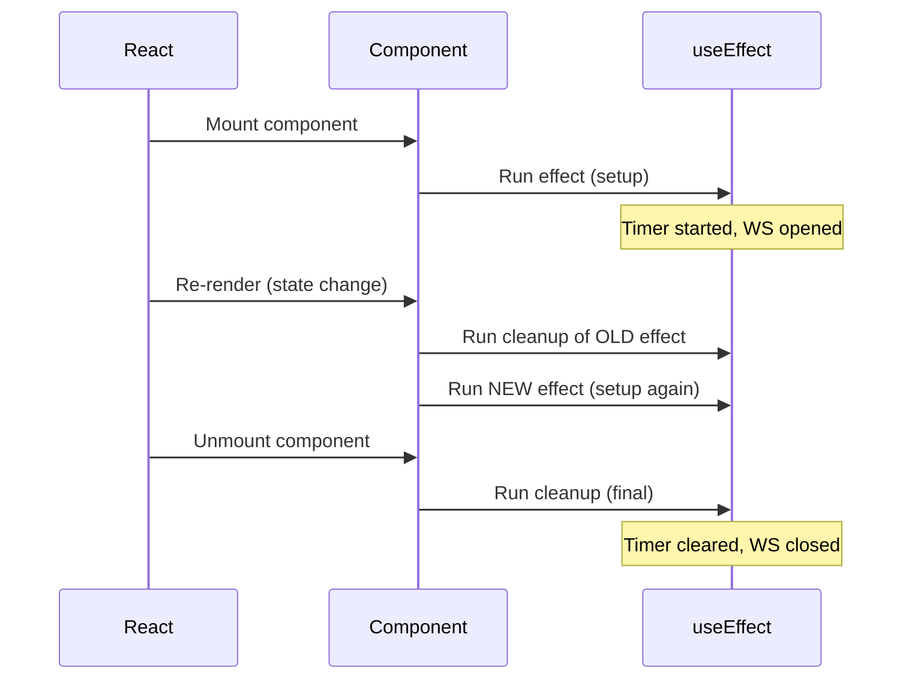

---

# 5. Higher-Order Components (HOC)

> A **Higher-Order Component (HOC)** is a **function that takes a component and returns a new enhanced component**. HOCs are a pattern (not an API) used to **reuse component logic** — like adding authentication checks, loading states, or logging to multiple components without repeating code.

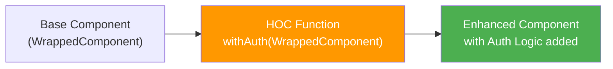

```jsx
import React from 'react';

// ── HOC 1: Authentication Guard ──────────────────────────────
function withAuth(WrappedComponent) {
    // Return a new component
    return function AuthenticatedComponent(props) {
        const isAuthenticated = localStorage.getItem("token");

        if (!isAuthenticated) {
            return <div>🔒 Please log in to access this page.</div>;
        }

        // Pass through all original props
        return <WrappedComponent {...props} />;
    };
}

// Usage
function Dashboard({ username }) {
    return <h1>Welcome, {username}! 🎉</h1>;
}
const ProtectedDashboard = withAuth(Dashboard);
// <ProtectedDashboard username="Hitesh" />

// ── HOC 2: Loading Spinner ───────────────────────────────────
function withLoader(WrappedComponent, loadingMessage = "Loading...") {
    return function LoadingComponent({ isLoading, ...rest }) {
        if (isLoading) {
            return (
                <div style={{ textAlign: "center", padding: "2rem" }}>
                    <div className="spinner" />
                    <p>{loadingMessage}</p>
                </div>
            );
        }
        return <WrappedComponent {...rest} />;
    };
}

// Usage
const UserListWithLoader = withLoader(UserList, "Fetching users...");
// <UserListWithLoader isLoading={true} users={[]} />

// ── HOC 3: Error Boundary HOC ────────────────────────────────
function withErrorBoundary(WrappedComponent) {
    return class extends React.Component {
        constructor(props) {
            super(props);
            this.state = { hasError: false, error: null };
        }

        static getDerivedStateFromError(error) {
            return { hasError: true, error };
        }

        componentDidCatch(error, info) {
            console.error("Caught error:", error, info);
        }

        render() {
            if (this.state.hasError) {
                return <div>Something went wrong: {this.state.error?.message}</div>;
            }
            return <WrappedComponent {...this.props} />;
        }
    };
}

// ── HOC 4: Analytics Logger ──────────────────────────────────
function withAnalytics(WrappedComponent, eventName) {
    return function TrackedComponent(props) {
        React.useEffect(() => {
            analytics.track(`${eventName}_viewed`, { timestamp: Date.now() });
        }, []);

        const handleClick = React.useCallback((e) => {
            analytics.track(`${eventName}_clicked`, { target: e.target.id });
            props.onClick?.(e); // call original onClick if provided
        }, [props.onClick]);

        return <WrappedComponent {...props} onClick={handleClick} />;
    };
}
```

> 💡 **HOCs vs Hooks**: Custom Hooks have largely replaced HOCs in modern React for logic reuse. But HOCs still shine for wrapping entire component trees (error boundaries, theming, route guards).

---

# 6. Pure Component & React.memo

## PureComponent (Class)

> A **`PureComponent`** is like `React.Component` but automatically implements **`shouldComponentUpdate`** with a **shallow comparison** of props and state. If neither has changed (shallowly), the component skips re-rendering.

```jsx
import React, { PureComponent, Component } from 'react';

// Regular Component — re-renders every time parent renders
class RegularChild extends Component {
    render() {
        console.log("RegularChild rendered");
        return <div>{this.props.name}</div>;
    }
}

// PureComponent — skips re-render if props/state shallowly unchanged
class PureChild extends PureComponent {
    render() {
        console.log("PureChild rendered");
        return <div>{this.props.name}</div>;
    }
}

class Parent extends Component {
    state = { count: 0, name: "Hitesh" };

    render() {
        return (
            <div>
                <button onClick={() => this.setState({ count: this.state.count + 1 })}>
                    Count: {this.state.count}
                </button>
                {/* RegularChild re-renders on every count change */}
                <RegularChild name={this.state.name} />

                {/* PureChild skips re-render when name hasn't changed */}
                <PureChild name={this.state.name} />
            </div>
        );
    }
}
```

## React.memo (Function Components)

> **`React.memo`** is the function component equivalent of `PureComponent`. It wraps a component and memoizes the rendered output — if props haven't changed (shallow comparison), React reuses the last render.

```jsx
import React, { memo, useState, useCallback } from 'react';

// ── Basic memo ───────────────────────────────────────────────
const ExpensiveList = memo(function ExpensiveList({ items }) {
    console.log("ExpensiveList rendered");
    return (
        <ul>
            {items.map(item => <li key={item.id}>{item.name}</li>)}
        </ul>
    );
});

// ── Custom comparison function ────────────────────────────────
const UserCard = memo(
    function UserCard({ user }) {
        return <div>{user.name} — {user.email}</div>;
    },
    // Only re-render when user.id changes (ignore other user property changes)
    (prevProps, nextProps) => prevProps.user.id === nextProps.user.id
);

// ── Practical example ────────────────────────────────────────
function TodoApp() {
    const [todos,   setTodos]   = useState([{ id: 1, text: "Learn React", done: false }]);
    const [filter,  setFilter]  = useState("all");
    const [counter, setCounter] = useState(0);

    // Without useCallback, TodoItem would re-render on every counter change
    const toggleTodo = useCallback((id) => {
        setTodos(prev => prev.map(t => t.id === id ? {...t, done: !t.done} : t));
    }, []);

    return (
        <div>
            <button onClick={() => setCounter(c => c + 1)}>Counter: {counter}</button>
            {todos.map(todo => (
                // TodoItem won't re-render when counter changes (memo + useCallback combo)
                <TodoItem key={todo.id} todo={todo} onToggle={toggleTodo} />
            ))}
        </div>
    );
}

const TodoItem = memo(({ todo, onToggle }) => {
    console.log(`TodoItem ${todo.id} rendered`);
    return (
        <div onClick={() => onToggle(todo.id)}
             style={{ textDecoration: todo.done ? "line-through" : "none" }}>
            {todo.text}
        </div>
    );
});
```

> ⚠️ **Shallow comparison caveat**: `PureComponent` and `React.memo` do **shallow** comparison. For objects and arrays, only the **reference** is compared — not deep contents. Always create new object/array references when updating state.

---

# 7. Reconciliation

> **Reconciliation** is the algorithm React uses to determine **what changed** in the Virtual DOM and **what minimum updates** to make to the Real DOM. React's reconciliation engine is called **Fiber** (introduced in React 16).

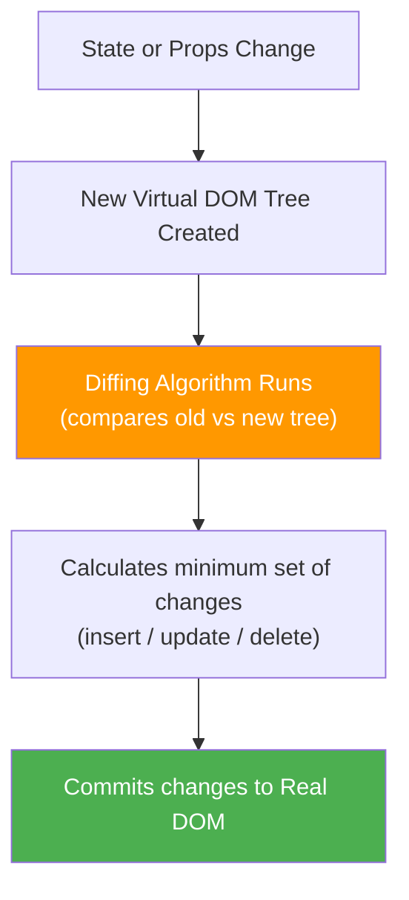

## Diffing Rules

### Rule 1: Different Element Types → Destroy & Rebuild

```jsx
// Old tree         // New tree — different type!
<div>              <span>       ← React destroys entire <div> subtree
  <Counter />        <Counter /> ← and rebuilds from scratch
</div>             </span>
```

### Rule 2: Same Element Type → Update Attributes

```jsx
// Old             // New
<div className="old" title="t1">
                  <div className="new" title="t1">
// React keeps the DOM node, only updates className
```

### Rule 3: Keys — Critical for Lists

```jsx
// ❌ Without keys — React matches by position
// Old: [A, B, C]   New: [X, A, B, C]
// React thinks A changed → B changed → C changed → X is new
// → 3 updates + 1 insert = expensive!

// ✅ With stable keys — React tracks by identity
// Old: [id:1→A, id:2→B, id:3→C]   New: [id:4→X, id:1→A, id:2→B, id:3→C]
// React inserts id:4→X, moves others untouched
// → 1 insert only = efficient!

// ✅ Correct
{todos.map(todo => <TodoItem key={todo.id} todo={todo} />)}

// ❌ Wrong — array index as key causes bugs when reordering/filtering
{todos.map((todo, index) => <TodoItem key={index} todo={todo} />)}
```

## React Fiber

> **React Fiber** is the complete rewrite of React's reconciliation algorithm. It breaks rendering work into small units that can be **paused, resumed, and prioritized** — enabling features like Concurrent Mode, Suspense, and `useTransition`.

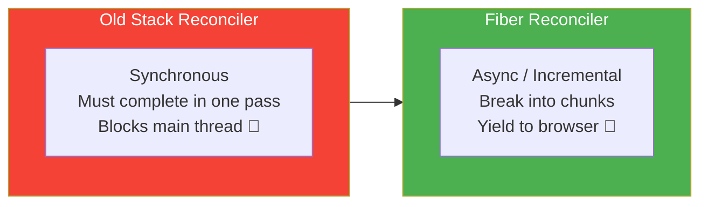

---

# 8. Portals

> A **Portal** lets you render a child component into a different DOM node than the parent component's DOM tree — while still behaving like it's part of the React component tree (events still bubble up through React's virtual tree).

## When to Use Portals

- **Modals / Dialogs** — must render above everything (z-index issues with overflow:hidden)
- **Tooltips / Popovers** — need to escape clipped containers
- **Notification toasts** — fixed position, outside main app root

```html
<!-- public/index.html -->
<body>
    <div id="root"></div>
    <div id="modal-root"></div>   <!-- Portal target -->
    <div id="toast-root"></div>
</body>
```

```jsx
import React, { useState } from 'react';
import ReactDOM from 'react-dom';

// ── Basic Portal ─────────────────────────────────────────────
function Modal({ isOpen, onClose, title, children }) {
    if (!isOpen) return null;

    return ReactDOM.createPortal(
        // JSX to render
        <div className="modal-overlay" onClick={onClose}>
            <div className="modal-content" onClick={e => e.stopPropagation()}>
                <header>
                    <h2>{title}</h2>
                    <button onClick={onClose}>✕</button>
                </header>
                <div className="modal-body">{children}</div>
            </div>
        </div>,
        // Where to render it (outside #root, in #modal-root)
        document.getElementById('modal-root')
    );
}

// ── Usage ────────────────────────────────────────────────────
function App() {
    const [isOpen, setIsOpen] = useState(false);

    return (
        <div style={{ overflow: "hidden" }}> {/* overflow:hidden won't clip modal */}
            <button onClick={() => setIsOpen(true)}>Open Modal</button>

            <Modal
                isOpen={isOpen}
                onClose={() => setIsOpen(false)}
                title="Confirm Action"
            >
                <p>Are you sure you want to delete this item?</p>
                <button onClick={() => { setIsOpen(false); handleDelete(); }}>
                    Delete
                </button>
            </Modal>
        </div>
    );
}

// ── Toast Notification via Portal ────────────────────────────
function Toast({ message, type = "success", onClose }) {
    React.useEffect(() => {
        const timer = setTimeout(onClose, 3000);
        return () => clearTimeout(timer);
    }, [onClose]);

    return ReactDOM.createPortal(
        <div className={`toast toast--${type}`}>
            {message}
            <button onClick={onClose}>✕</button>
        </div>,
        document.getElementById('toast-root')
    );
}
```

---

# 9. Context API

> **Context API** provides a way to **share data globally** across the component tree **without manually passing props at every level**. It solves the prop drilling problem for data that many components need (e.g., theme, language, authenticated user).

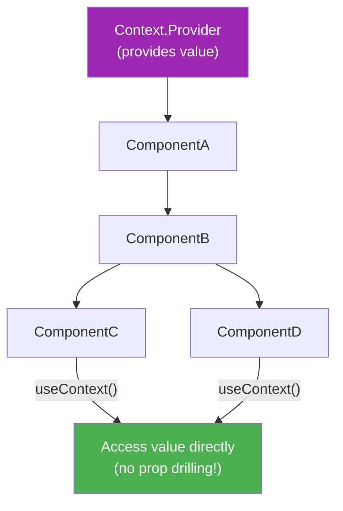

```jsx
import React, { createContext, useContext, useState, useCallback } from 'react';

// ── 1. Create Context ────────────────────────────────────────
const ThemeContext = createContext({
    theme: 'light',
    toggleTheme: () => {}
});

// ── 2. Create Provider Component ────────────────────────────
export function ThemeProvider({ children }) {
    const [theme, setTheme] = useState('light');

    const toggleTheme = useCallback(() => {
        setTheme(prev => prev === 'light' ? 'dark' : 'light');
    }, []);

    const value = { theme, toggleTheme };

    return (
        <ThemeContext.Provider value={value}>
            {children}
        </ThemeContext.Provider>
    );
}

// ── 3. Custom Hook for clean access ─────────────────────────
export function useTheme() {
    const context = useContext(ThemeContext);
    if (!context) throw new Error("useTheme must be used inside ThemeProvider");
    return context;
}

// ── 4. Wrap app ──────────────────────────────────────────────
function App() {
    return (
        <ThemeProvider>
            <Layout />
        </ThemeProvider>
    );
}

// ── 5. Consume anywhere in tree ──────────────────────────────
function Header() {
    const { theme, toggleTheme } = useTheme(); // no prop drilling!
    return (
        <header style={{ background: theme === 'dark' ? '#333' : '#fff' }}>
            <button onClick={toggleTheme}>Switch to {theme === 'dark' ? 'Light' : 'Dark'}</button>
        </header>
    );
}

function Article() {
    const { theme } = useTheme();
    return (
        <article style={{ color: theme === 'dark' ? '#fff' : '#000' }}>
            Content here...
        </article>
    );
}
```

> 💡 **Context is not a state management library** — it doesn't batch updates or optimize re-renders. Every component consuming a context re-renders when the context value changes. For complex global state, use **Redux** or **Zustand** instead.

---

# 10. Prop Drilling & How to Overcome It

> **Prop drilling** is the problem of passing props through multiple intermediate components that don't use them — only to reach a deeply nested component that does.

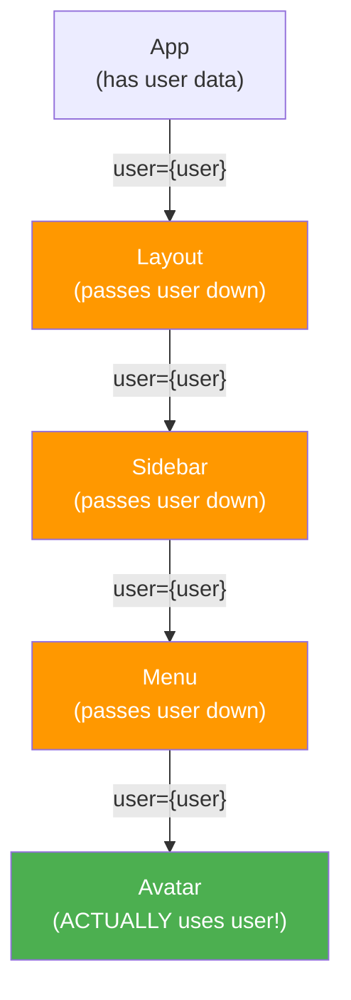

```jsx
// ❌ Prop Drilling Problem — user flows through 3 unneeded levels
function App() {
    const user = { name: "Hitesh", avatar: "..." };
    return <Layout user={user} />;
}
function Layout({ user })  { return <Sidebar user={user} />; }
function Sidebar({ user }) { return <Menu user={user} />; }
function Menu({ user })    { return <Avatar user={user} />; }
function Avatar({ user })  { return ; } // ← actually needed here
```

## Solutions

### Solution 1: Context API

```jsx
const UserContext = createContext(null);

function App() {
    const user = { name: "Hitesh", avatar: "..." };
    return (
        <UserContext.Provider value={user}>
            <Layout />  {/* no user prop! */}
        </UserContext.Provider>
    );
}

function Avatar() {
    const user = useContext(UserContext); // access directly
    return ;
}
```

### Solution 2: Component Composition (Slot Pattern)

```jsx
// Pass components as props/children instead of data
function App() {
    const user = { name: "Hitesh", avatar: "..." };
    return (
        <Layout sidebar={<Sidebar avatar={<Avatar user={user} />} />} />
    );
}
// Layout and Sidebar don't need to know about user at all!
function Layout({ sidebar }) { return <div>{sidebar}</div>; }
function Sidebar({ avatar }) { return <nav>{avatar}</nav>; }
```

### Solution 3: Redux / Zustand

```jsx
// Global store — any component can access user without drilling
function Avatar() {
    const user = useSelector(state => state.auth.user);
    return ;
}
```

---

# 11. Server-Side Rendering (SSR)

> **Server-Side Rendering (SSR)** means the React component tree is rendered to **HTML on the server** and sent to the client as fully-formed HTML. The browser displays content immediately — then React **"hydrates"** the static HTML (attaches event handlers) to make it interactive.

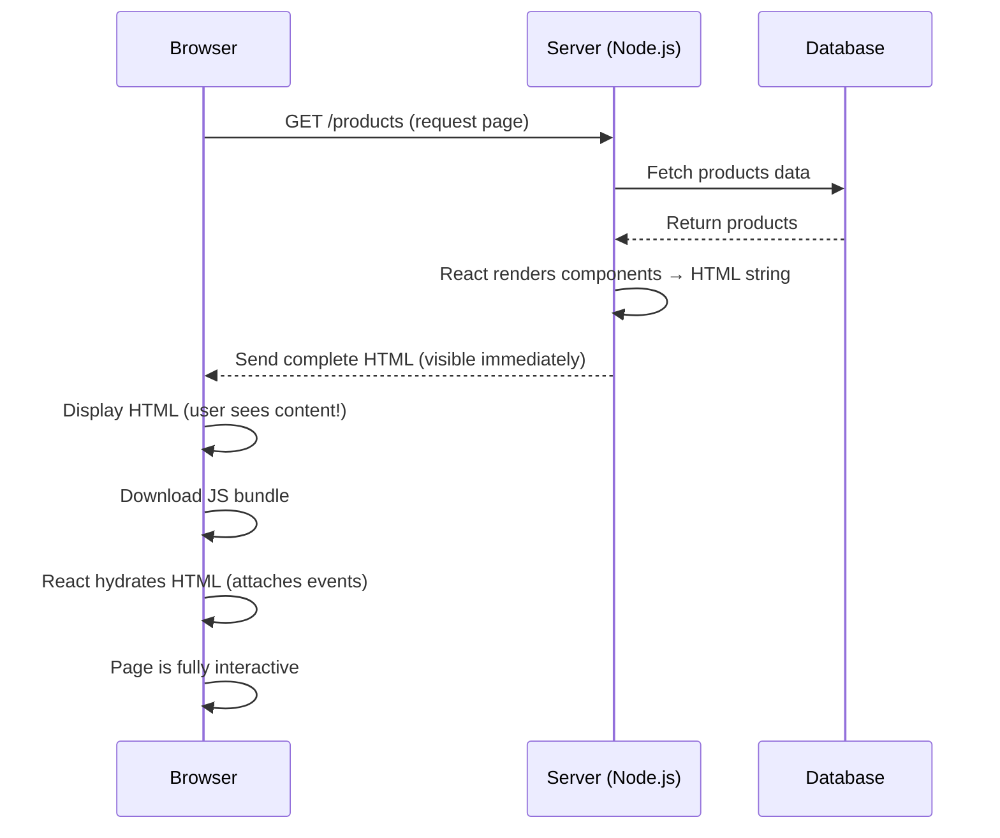

## CSR vs SSR vs SSG

| Feature | CSR (Create React App) | SSR (Next.js) | SSG (Static) |
|---|---|---|---|
| **Render location** | Browser | Server | Build time |
| **Initial load** | Blank page, then JS fills it | Full HTML immediately | Pre-built HTML |
| **SEO** | ❌ Poor (empty HTML) | ✅ Excellent | ✅ Excellent |
| **Time to first content** | Slow | Fast | Fastest |
| **Data freshness** | Always fresh | Per request | Stale until rebuild |
| **Hosting cost** | Cheap (static) | More expensive (Node server) | Cheapest |
| **Best for** | Dashboards, apps behind login | SEO pages, e-commerce | Blogs, docs |

## SSR with Next.js

```jsx
// pages/products.jsx (Next.js)

// Runs on server for EVERY request — can access DB, auth, cookies
export async function getServerSideProps(context) {
    const { req, res, params, query } = context;
    const products = await db.product.findMany({ where: { published: true } });

    return {
        props: { products } // passed to component as props
    };
}

function ProductsPage({ products }) { // receives server-fetched data
    return (
        <div>
            <h1>Products ({products.length})</h1>
            {products.map(p => <div key={p.id}>{p.name}</div>)}
        </div>
    );
}

export default ProductsPage;
```

---

# 12. React.StrictMode

> **`React.StrictMode`** is a development tool that helps identify potential problems in your app. It **does not affect production builds** — it only adds behavior during development.

## What StrictMode Does

1. **Double-invokes certain functions** (render, useState initializer, function body) to detect side effects in unexpected places
2. **Warns about deprecated APIs** (legacy context API, `findDOMNode`, `componentWillMount`)
3. **Warns about unsafe lifecycle usage** in class components

```jsx
import React from 'react';
import ReactDOM from 'react-dom/client';
import App from './App';

const root = ReactDOM.createRoot(document.getElementById('root'));
root.render(
    <React.StrictMode>
        <App />
    </React.StrictMode>
);

// ── What double-invoke catches ────────────────────────────────
function BadComponent() {
    // ❌ Side effect in render body — StrictMode will catch this
    // because it will render twice in dev and the side effect runs twice
    localStorage.setItem('key', 'value'); // ← BUG: runs in render!

    const [state, setState] = useState(() => {
        // ❌ This initializer runs twice in StrictMode — if it has side effects, they show up
        fetch('/api/init'); // ← BUG: network call in state initializer!
        return 0;
    });

    return <div>{state}</div>;
}

function GoodComponent() {
    const [state, setState] = useState(0);

    // ✅ Side effects go in useEffect
    useEffect(() => {
        localStorage.setItem('key', 'value');
    }, []);

    return <div>{state}</div>;
}
```

> 💡 **React 18 + StrictMode**: In React 18 development mode, `useEffect` also runs **twice** (mount → unmount → mount) to ensure effects are properly cleaned up. This is intentional — it catches cleanup bugs.

---

# 13. Redux — Core Concepts

> **Redux** is a **predictable state management library** for JavaScript applications. It provides a **single global store** that holds all application state, with strict rules about how state can be updated.

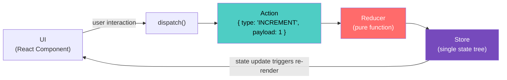

## The Three Principles of Redux

1. **Single Source of Truth** — all state lives in one store object
2. **State is Read-Only** — you can only change state by dispatching an action
3. **Changes are made with Pure Functions** — reducers are pure functions

## Store

> The **Store** is the single JavaScript object that holds the **entire application state tree**. It is created once with `createStore(reducer)` or Redux Toolkit's `configureStore()`.

```javascript
import { configureStore } from '@reduxjs/toolkit';
import counterReducer from './counterSlice';
import userReducer    from './userSlice';

const store = configureStore({
    reducer: {
        counter: counterReducer,
        user:    userReducer,
    }
});

console.log(store.getState()); // { counter: {...}, user: {...} }
store.dispatch({ type: 'counter/increment' });
store.subscribe(() => console.log("State changed:", store.getState()));

export default store;
```

## Action

> An **Action** is a plain JavaScript object that describes **what happened**. It must have a `type` property (string) and optionally a `payload` (data).

```javascript
// Action objects
const incrementAction  = { type: 'counter/increment' };
const addTodoAction    = { type: 'todos/add',    payload: { id: 1, text: "Learn Redux" } };
const deleteUserAction = { type: 'users/delete', payload: 42 }; // payload = userId

// Action creators (functions that return action objects)
const increment  = ()     => ({ type: 'counter/increment' });
const addTodo    = (text) => ({ type: 'todos/add',    payload: { id: Date.now(), text } });
const deleteUser = (id)   => ({ type: 'users/delete', payload: id });
```

## Reducer

> A **Reducer** is a **pure function** that takes the current state and an action, and returns the **new state**. It must never mutate the old state — always return a new object.

```javascript
// Counter reducer
const initialState = { count: 0, step: 1 };

function counterReducer(state = initialState, action) {
    switch (action.type) {
        case 'counter/increment':
            return { ...state, count: state.count + state.step };    // ✅ new object

        case 'counter/decrement':
            return { ...state, count: state.count - state.step };

        case 'counter/reset':
            return { ...state, count: 0 };

        case 'counter/setStep':
            return { ...state, step: action.payload };

        default:
            return state; // always return current state for unknown actions
    }
}

// Modern approach with Redux Toolkit (Immer handles immutability)
import { createSlice } from '@reduxjs/toolkit';

const counterSlice = createSlice({
    name: 'counter',
    initialState: { count: 0, step: 1 },
    reducers: {
        increment: (state) => { state.count += state.step; },   // ✅ looks mutable but isn't!
        decrement: (state) => { state.count -= state.step; },
        reset:     (state) => { state.count = 0; },
        setStep:   (state, action) => { state.step = action.payload; }
    }
});

export const { increment, decrement, reset, setStep } = counterSlice.actions;
export default counterSlice.reducer;
```

## Using Redux in React Components

```jsx
import { useSelector, useDispatch } from 'react-redux';
import { increment, decrement, setStep } from './counterSlice';

function Counter() {
    // Read from store
    const count = useSelector(state => state.counter.count);
    const step  = useSelector(state => state.counter.step);

    // Get dispatch function
    const dispatch = useDispatch();

    return (
        <div>
            <h1>Count: {count}</h1>
            <label>
                Step:
                <input
                    type="number"
                    value={step}
                    onChange={e => dispatch(setStep(Number(e.target.value)))}
                />
            </label>
            <button onClick={() => dispatch(increment())}>+ {step}</button>
            <button onClick={() => dispatch(decrement())}>- {step}</button>
        </div>
    );
}
```

---

# 14. Redux — Middleware

> **Middleware** in Redux is a function that intercepts **every dispatched action** before it reaches the reducer. It can inspect, modify, log, delay, or even cancel actions. Middleware enables **async operations** (which reducers can't handle — they're pure/sync).

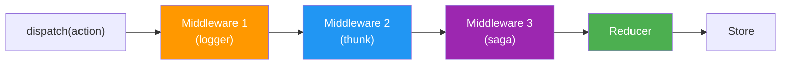

```javascript
// Middleware signature
const myMiddleware = store => next => action => {
    //                ↑         ↑        ↑
    //           access      call next  the action
    //           store       middleware  dispatched

    console.log("Before:", store.getState());
    const result = next(action); // pass to next middleware / reducer
    console.log("After:", store.getState());
    return result;
};

// ── Logger middleware ─────────────────────────────────────────
const loggerMiddleware = store => next => action => {
    console.group(action.type);
    console.log("Dispatching:", action);
    const result = next(action);
    console.log("Next State:", store.getState());
    console.groupEnd();
    return result;
};

// ── Apply middleware ─────────────────────────────────────────
import { configureStore } from '@reduxjs/toolkit';

const store = configureStore({
    reducer: rootReducer,
    middleware: (getDefaultMiddleware) =>
        getDefaultMiddleware()
            .concat(loggerMiddleware)
            .concat(analyticsMiddleware)
});
// Note: Redux Toolkit already includes redux-thunk by default
```

---

# 15. Redux Data Flow

> Redux follows a **strict unidirectional (one-way) data flow**. Understanding this flow is essential to working with Redux effectively.

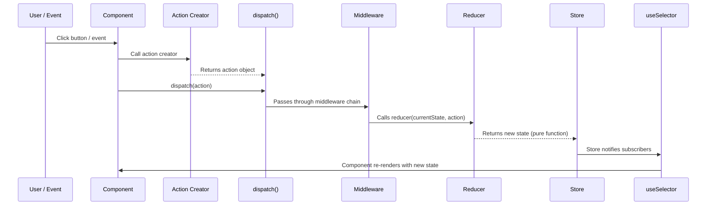

```jsx
// Full data flow example
// 1. User clicks a button
// 2. Component dispatches an action
// 3. Middleware (thunk) handles async
// 4. Reducer processes the action
// 5. Store updates
// 6. Component re-renders via useSelector

// === userSlice.js ===
const userSlice = createSlice({
    name: 'user',
    initialState: { data: null, loading: false, error: null },
    reducers: {
        fetchStart:   (state)          => { state.loading = true; state.error = null; },
        fetchSuccess: (state, action)  => { state.loading = false; state.data = action.payload; },
        fetchError:   (state, action)  => { state.loading = false; state.error = action.payload; }
    }
});

// Thunk action — async operation (Step 3: middleware handles this)
export const fetchUser = (userId) => async (dispatch) => {
    dispatch(fetchStart());
    try {
        const response = await fetch(`/api/users/${userId}`);
        const data     = await response.json();
        dispatch(fetchSuccess(data));
    } catch (error) {
        dispatch(fetchError(error.message));
    }
};

// === UserProfile.jsx ===
function UserProfile({ userId }) {
    const dispatch = useDispatch();
    const { data: user, loading, error } = useSelector(state => state.user);

    useEffect(() => {
        dispatch(fetchUser(userId)); // Step 2: dispatch thunk
    }, [userId, dispatch]);

    if (loading) return <p>Loading...</p>;
    if (error)   return <p>Error: {error}</p>;
    return <div>{user?.name}</div>; // Step 6: re-renders with new state
}
```

---

# 16. Redux Thunk

> **Redux Thunk** is a middleware that allows you to write **action creators that return a function** instead of an action object. That inner function receives `dispatch` and `getState`, enabling **async logic** (API calls, setTimeout) before dispatching real actions.

> "Thunk" is a programming term for a function that wraps an expression to delay evaluation.

```javascript
// Without thunk — action creators must return plain objects (synchronous only)
const setUser = (user) => ({ type: 'SET_USER', payload: user }); // ✅ plain object

// With thunk — action creators can return a function (async allowed)
const fetchUser = (userId) => async (dispatch, getState) => {
    // You can use getState to access current state
    const currentUser = getState().user.data;
    if (currentUser?.id === userId) return; // skip if already loaded

    dispatch({ type: 'user/fetchStart' });

    try {
        const res  = await fetch(`/api/users/${userId}`);
        const user = await res.json();
        dispatch({ type: 'user/fetchSuccess', payload: user });
    } catch (err) {
        dispatch({ type: 'user/fetchError', payload: err.message });
    }
};

// Usage in component
const dispatch = useDispatch();
dispatch(fetchUser(42)); // thunk middleware detects it's a function, calls it
```

```javascript
// Redux Toolkit — createAsyncThunk (cleaner pattern)
import { createAsyncThunk, createSlice } from '@reduxjs/toolkit';

// Automatically dispatches pending/fulfilled/rejected actions
export const fetchUser = createAsyncThunk(
    'user/fetchById',
    async (userId, { getState, rejectWithValue }) => {
        try {
            const response = await fetch(`/api/users/${userId}`);
            if (!response.ok) throw new Error("Failed to fetch");
            return await response.json(); // this becomes action.payload on success
        } catch (error) {
            return rejectWithValue(error.message); // custom rejection
        }
    }
);

const userSlice = createSlice({
    name: 'user',
    initialState: { data: null, loading: false, error: null },
    reducers: {},
    extraReducers: (builder) => {
        builder
            .addCase(fetchUser.pending,   (state)         => { state.loading = true; })
            .addCase(fetchUser.fulfilled, (state, action) => {
                state.loading = false;
                state.data    = action.payload;
            })
            .addCase(fetchUser.rejected,  (state, action) => {
                state.loading = false;
                state.error   = action.payload;
            });
    }
});
```

---

# 17. Redux Saga

> **Redux Saga** is a middleware library that handles **complex async flows** using ES6 **Generator functions**. It listens for dispatched actions and runs side effects in "sagas" — long-running background processes that are easy to test and cancel.

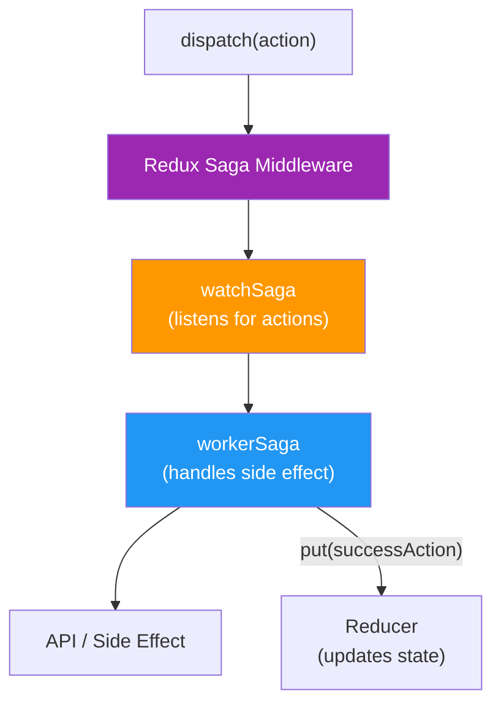

```javascript
import { call, put, takeEvery, takeLatest, select, delay } from 'redux-saga/effects';

// ── Worker Saga — handles one fetch ─────────────────────────
function* fetchUserSaga(action) {
    try {
        yield put({ type: 'user/fetchStart' }); // dispatch action

        // call() — calls a function and waits for it (pausable, testable)
        const user = yield call(fetch, `/api/users/${action.payload}`);
        const data = yield call([user, 'json']);

        yield put({ type: 'user/fetchSuccess', payload: data }); // dispatch success

    } catch (error) {
        yield put({ type: 'user/fetchError', payload: error.message });
    }
}

// ── Watcher Saga — listens for actions ─────────────────────
function* watchUserSagas() {
    // takeEvery — handles every dispatch (allows concurrent)
    yield takeEvery('user/fetchRequest', fetchUserSaga);

    // takeLatest — cancels previous, only keeps latest (e.g., for search)
    yield takeLatest('search/query', searchSaga);
}

// ── Root Saga ────────────────────────────────────────────────
export function* rootSaga() {
    yield all([
        watchUserSagas(),
        watchProductSagas(),
        watchAuthSagas(),
    ]);
}

// Advanced effects
function* advancedSaga() {
    const state = yield select(state => state.user); // read from store
    yield delay(1000);                               // pause 1 second
    const [users, products] = yield all([           // parallel calls
        call(fetchUsers),
        call(fetchProducts),
    ]);
}
```

## Redux Thunk vs Redux Saga

| Feature | Redux Thunk | Redux Saga |
|---|---|---|
| **Concept** | Functions returning functions | Generator-based background processes |
| **Complexity** | Simple, low learning curve | Complex, requires Generator knowledge |
| **Bundle size** | Tiny (~1KB) | Larger (~14KB) |
| **Testing** | Harder (must mock API calls) | Easy (yield effects are testable values) |
| **Cancellation** | Hard to implement | Built-in (`takeLatest`) |
| **Race conditions** | Handle manually | `race()` and `takeLatest()` built-in |
| **Complex flows** | Gets messy | Clean, readable |
| **Parallel effects** | `Promise.all()` | `yield all([...])` |
| **Real-time / channels** | Very difficult | `eventChannel` — built-in |
| **Best for** | Simple async (CRUD apps) | Complex flows (real-time, multi-step) |

---

# 18. React vs Angular

> Both React and Angular are used to build single-page applications (SPAs), but they differ fundamentally in philosophy and scope.

| Feature | React JS | Angular |
|---|---|---|
| **Type** | UI Library | Full Framework |
| **Developed by** | Meta (Facebook) | Google |
| **Language** | JavaScript (+ JSX) | TypeScript (primary) |
| **Architecture** | Component-based | MVC / MVVM |
| **Data binding** | One-way (↓) | Two-way (↕) |
| **DOM** | Virtual DOM | Real DOM + Change Detection |
| **State management** | External (Redux, Zustand, Context) | Built-in services + RxJS |
| **Routing** | External (React Router) | Built-in `@angular/router` |
| **HTTP** | External (fetch, axios) | Built-in `HttpClient` |
| **Forms** | Controlled/Uncontrolled | Reactive Forms / Template Forms |
| **Learning curve** | Moderate | Steep |
| **Performance** | Fast (Virtual DOM) | Fast (Ivy engine) |
| **Mobile** | React Native | Ionic (separate) |
| **Bundle size** | Smaller | Larger (more built-in) |
| **Flexibility** | High — pick your tools | Lower — opinionated |
| **Best for** | Small-large flexible apps | Enterprise, large teams |

```jsx
// React — JSX, declarative
function UserList({ users }) {
    return (
        <ul>
            {users.map(user => <li key={user.id}>{user.name}</li>)}
        </ul>
    );
}
```

```typescript
// Angular — templates with directives
@Component({
    template: `
        <ul>
            <li *ngFor="let user of users">{{ user.name }}</li>
        </ul>
    `
})
class UserListComponent {
    @Input() users: User[];
}
```

---

# 19. Optimizing React Apps

> React is fast out-of-the-box, but poorly written code can cause unnecessary re-renders, large bundle sizes, and slow interactions. These are the most impactful optimizations.

## 1. Memoization — Prevent Unnecessary Re-renders

```jsx
// React.memo — skip re-render if props unchanged
const ExpensiveComponent = React.memo(({ data }) => {
    return <div>{data.map(/* heavy render */})</div>;
});

// useMemo — cache expensive calculation
const sortedData = useMemo(() => {
    return data.sort((a, b) => b.score - a.score);
}, [data]);

// useCallback — stable function references
const handleClick = useCallback(() => {
    dispatch(someAction(id));
}, [id, dispatch]);
```

## 2. Code Splitting — Reduce Initial Bundle

```jsx
import React, { lazy, Suspense } from 'react';

// Lazy load routes — only download chunk when route is visited
const Dashboard = lazy(() => import('./Dashboard'));
const Reports   = lazy(() => import('./Reports'));
const Settings  = lazy(() => import('./Settings'));

function App() {
    return (
        <Suspense fallback={<div>Loading page...</div>}>
            <Routes>
                <Route path="/dashboard" element={<Dashboard />} />
                <Route path="/reports"   element={<Reports />} />
                <Route path="/settings"  element={<Settings />} />
            </Routes>
        </Suspense>
    );
}
```

## 3. Virtualize Long Lists

```jsx
// react-window — renders only visible rows (huge lists)
import { FixedSizeList } from 'react-window';

function VirtualList({ items }) {
    const Row = ({ index, style }) => (
        <div style={style}>{items[index].name}</div>
    );

    return (
        <FixedSizeList
            height={600}
            itemCount={items.length}
            itemSize={50}
            width="100%"
        >
            {Row}
        </FixedSizeList>
    );
    // Renders 1,000,000 items with the performance of 12
}
```

## 4. useTransition — Keep UI Responsive

```jsx
import { useState, useTransition } from 'react';

function SearchPage() {
    const [query,   setQuery]   = useState('');
    const [results, setResults] = useState([]);
    const [isPending, startTransition] = useTransition();

    const handleSearch = (value) => {
        setQuery(value); // urgent — update input immediately

        startTransition(() => {
            // non-urgent — can be interrupted by urgent updates
            const filtered = hugeDataset.filter(item => item.includes(value));
            setResults(filtered);
        });
    };

    return (
        <div>
            <input value={query} onChange={e => handleSearch(e.target.value)} />
            {isPending && <p>Updating results...</p>}
            <ResultsList items={results} />
        </div>
    );
}
```

## 5. Image Optimization

```jsx
// Lazy load images — don't load until visible in viewport


// Use next/image in Next.js — automatic optimization
import Image from 'next/image';
<Image src="/photo.jpg" width={800} height={600} alt="Photo" priority={false} />
```

## 6. Avoid Inline Objects & Functions in JSX

```jsx
// ❌ Creates new object/function on every render
<Component style={{ margin: 10 }} onClick={() => doThing(id)} />

// ✅ Define outside or memoize
const STYLE = { margin: 10 }; // module-level constant
const handleClick = useCallback(() => doThing(id), [id]);
<Component style={STYLE} onClick={handleClick} />
```

## Optimization Checklist

| Technique | When to Use | Tool |
|---|---|---|
| `React.memo` | Pure display components | Built-in |
| `useMemo` | Expensive calculations | Built-in |
| `useCallback` | Callbacks to memoized children | Built-in |
| `lazy()` + `Suspense` | Large route components | Built-in |
| List virtualization | Lists > 100 items | `react-window` |
| `useTransition` | Slow, non-urgent state updates | Built-in (React 18) |
| Image lazy loading | Images below the fold | `loading="lazy"` |
| Bundle analysis | Find large dependencies | `webpack-bundle-analyzer` |
| React DevTools Profiler | Find slow components | Browser extension |

---

# 20. useReducer Hook

> **`useReducer`** is an alternative to `useState` for managing **complex state logic** — especially when the next state depends on the previous one, or when you have multiple related sub-values. It follows the same pattern as Redux: `(state, action) => newState`.

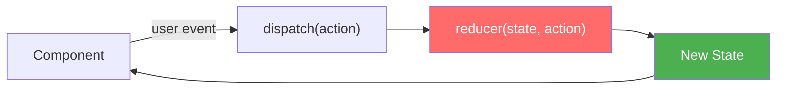

## Syntax

```javascript
const [state, dispatch] = useReducer(reducer, initialState);
```

```jsx
import React, { useReducer } from 'react';

// ── 1. Define reducer (pure function) ────────────────────────
const initialState = {
    count: 0,
    step:  1,
    history: []
};

function counterReducer(state, action) {
    switch (action.type) {
        case 'INCREMENT':
            return {
                ...state,
                count: state.count + state.step,
                history: [...state.history, state.count + state.step]
            };
        case 'DECREMENT':
            return { ...state, count: state.count - state.step };
        case 'RESET':
            return initialState;
        case 'SET_STEP':
            return { ...state, step: action.payload };
        default:
            throw new Error(`Unknown action: ${action.type}`);
    }
}

// ── 2. Use in component ──────────────────────────────────────
function Counter() {
    const [state, dispatch] = useReducer(counterReducer, initialState);

    return (
        <div>
            <h1>Count: {state.count}</h1>
            <p>Step: {state.step} | History: {state.history.join(', ')}</p>
            <button onClick={() => dispatch({ type: 'INCREMENT' })}>+</button>
            <button onClick={() => dispatch({ type: 'DECREMENT' })}>-</button>
            <button onClick={() => dispatch({ type: 'RESET' })}>Reset</button>
            <input
                type="number"
                value={state.step}
                onChange={e => dispatch({ type: 'SET_STEP', payload: +e.target.value })}
            />
        </div>
    );
}

// ── Real-world: Form reducer ─────────────────────────────────
const formReducer = (state, action) => {
    switch (action.type) {
        case 'FIELD':   return { ...state, [action.field]: action.value };
        case 'SUBMIT':  return { ...state, submitting: true, error: null };
        case 'SUCCESS': return { ...state, submitting: false, submitted: true };
        case 'ERROR':   return { ...state, submitting: false, error: action.payload };
        case 'RESET':   return { name: '', email: '', submitting: false, error: null };
        default:        return state;
    }
};

function SignupForm() {
    const [state, dispatch] = useReducer(formReducer, {
        name: '', email: '', submitting: false, error: null
    });

    const handleSubmit = async (e) => {
        e.preventDefault();
        dispatch({ type: 'SUBMIT' });
        try {
            await api.signup({ name: state.name, email: state.email });
            dispatch({ type: 'SUCCESS' });
        } catch (err) {
            dispatch({ type: 'ERROR', payload: err.message });
        }
    };

    return (
        <form onSubmit={handleSubmit}>
            <input
                value={state.name}
                onChange={e => dispatch({ type: 'FIELD', field: 'name', value: e.target.value })}
            />
            <input
                value={state.email}
                onChange={e => dispatch({ type: 'FIELD', field: 'email', value: e.target.value })}
            />
            {state.error && <p style={{ color: 'red' }}>{state.error}</p>}
            <button disabled={state.submitting}>
                {state.submitting ? 'Submitting...' : 'Sign Up'}
            </button>
        </form>
    );
}
```

## useState vs useReducer

| Scenario | useState | useReducer |
|---|---|---|
| Simple value | ✅ Ideal | Overkill |
| Multiple related fields | Gets messy | ✅ Clean |
| Next state depends on previous | Possible | ✅ Natural |
| Complex transitions/logic | Hard | ✅ Clear |
| Testability | Moderate | ✅ Reducer is pure — easy to test |
| Redux-like patterns locally | ❌ | ✅ |

---

# 21. Custom Hooks

> A **Custom Hook** is a JavaScript function whose name starts with **`use`** that calls other hooks internally. Custom hooks let you **extract and reuse stateful logic** across multiple components without changing component hierarchy (no HOC or render props needed).

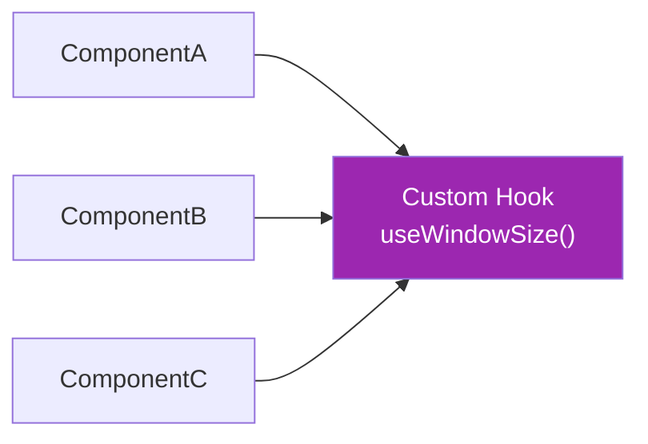

```jsx
// ── Custom Hook 1: useFetch ──────────────────────────────────
function useFetch(url) {
    const [data,    setData]    = useState(null);
    const [loading, setLoading] = useState(true);
    const [error,   setError]   = useState(null);

    useEffect(() => {
        let cancelled = false;
        setLoading(true);
        setError(null);

        fetch(url)
            .then(res => { if (!res.ok) throw new Error(res.statusText); return res.json(); })
            .then(d  => { if (!cancelled) { setData(d); setLoading(false); } })
            .catch(e => { if (!cancelled) { setError(e.message); setLoading(false); } });

        return () => { cancelled = true; };
    }, [url]);

    return { data, loading, error };
}

// Usage — no fetch logic in the component!
function UserProfile({ userId }) {
    const { data: user, loading, error } = useFetch(`/api/users/${userId}`);
    if (loading) return <p>Loading...</p>;
    if (error)   return <p>Error: {error}</p>;
    return <div>{user.name}</div>;
}

// ── Custom Hook 2: useLocalStorage ───────────────────────────
function useLocalStorage(key, initialValue) {
    const [storedValue, setStoredValue] = useState(() => {
        try {
            const item = localStorage.getItem(key);
            return item ? JSON.parse(item) : initialValue;
        } catch { return initialValue; }
    });

    const setValue = useCallback((value) => {
        try {
            const toStore = value instanceof Function ? value(storedValue) : value;
            setStoredValue(toStore);
            localStorage.setItem(key, JSON.stringify(toStore));
        } catch (e) { console.error(e); }
    }, [key, storedValue]);

    return [storedValue, setValue];
}

// Usage
function Settings() {
    const [theme, setTheme] = useLocalStorage('theme', 'light');
    return <button onClick={() => setTheme(t => t === 'light' ? 'dark' : 'light')}>
        Current theme: {theme}
    </button>;
}

// ── Custom Hook 3: useDebounce ────────────────────────────────
function useDebounce(value, delay = 300) {
    const [debouncedValue, setDebouncedValue] = useState(value);

    useEffect(() => {
        const timer = setTimeout(() => setDebouncedValue(value), delay);
        return () => clearTimeout(timer);
    }, [value, delay]);

    return debouncedValue;
}

// Usage — search fires API only 300ms after user stops typing
function SearchBar() {
    const [query, setQuery] = useState('');
    const debouncedQuery    = useDebounce(query, 300);

    const { data } = useFetch(`/api/search?q=${debouncedQuery}`);

    return (
        <div>
            <input value={query} onChange={e => setQuery(e.target.value)} />
            {data?.results.map(r => <div key={r.id}>{r.title}</div>)}
        </div>
    );
}

// ── Custom Hook 4: useWindowSize ─────────────────────────────
function useWindowSize() {
    const [size, setSize] = useState({
        width:  window.innerWidth,
        height: window.innerHeight
    });

    useEffect(() => {
        const handleResize = () => setSize({ width: window.innerWidth, height: window.innerHeight });
        window.addEventListener('resize', handleResize);
        return () => window.removeEventListener('resize', handleResize);
    }, []);

    return size;
}

// ── Custom Hook 5: usePrevious ───────────────────────────────
function usePrevious(value) {
    const ref = useRef();
    useEffect(() => { ref.current = value; }); // runs after render
    return ref.current; // returns previous render's value
}
```

---

# 22. Error Boundaries

> **Error Boundaries** are React class components that **catch JavaScript errors** anywhere in their child component tree, log those errors, and display a **fallback UI** instead of a crashed component tree. They catch errors during rendering, in lifecycle methods, and in constructors.

> ⚠️ Error Boundaries are **class components only** — there is no Hook equivalent yet (as of React 18). Use a library like `react-error-boundary` for function-component friendly APIs.

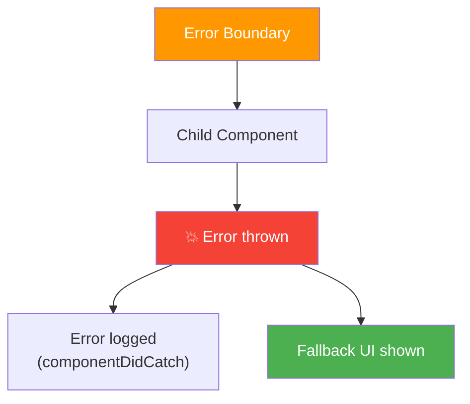

```jsx
import React, { Component } from 'react';

// ── Class-based Error Boundary ───────────────────────────────
class ErrorBoundary extends Component {
    constructor(props) {
        super(props);
        this.state = { hasError: false, error: null, errorInfo: null };
    }

    // Called when a child throws — update state to show fallback
    static getDerivedStateFromError(error) {
        return { hasError: true, error };
    }

    // Called with full error details — ideal for logging
    componentDidCatch(error, errorInfo) {
        console.error('ErrorBoundary caught:', error, errorInfo);
        // Send to error monitoring service
        // Sentry.captureException(error, { extra: errorInfo });
    }

    render() {
        if (this.state.hasError) {
            return this.props.fallback || (
                <div style={{ padding: '2rem', border: '1px solid red' }}>
                    <h2>Something went wrong.</h2>
                    <p>{this.state.error?.message}</p>
                    <button onClick={() => this.setState({ hasError: false })}>
                        Try Again
                    </button>
                </div>
            );
        }
        return this.props.children;
    }
}

// ── Usage ────────────────────────────────────────────────────
function App() {
    return (
        <ErrorBoundary fallback={<h2>Dashboard failed to load.</h2>}>
            <Dashboard />
        </ErrorBoundary>
    );
}

// ── Using react-error-boundary library (recommended) ─────────
import { ErrorBoundary, useErrorBoundary } from 'react-error-boundary';

function FallbackComponent({ error, resetErrorBoundary }) {
    return (
        <div>
            <h2>Oops! {error.message}</h2>
            <button onClick={resetErrorBoundary}>Retry</button>
        </div>
    );
}

function App() {
    return (
        <ErrorBoundary
            FallbackComponent={FallbackComponent}
            onError={(error, info) => console.error(error, info)}
            onReset={() => { /* reset state that caused the error */ }}
        >
            <ProductList />
        </ErrorBoundary>
    );
}

// Inside a component — throw to nearest error boundary
function BuggyButton() {
    const { showBoundary } = useErrorBoundary();

    const handleClick = async () => {
        try {
            await riskyOperation();
        } catch (error) {
            showBoundary(error); // triggers the nearest ErrorBoundary
        }
    };
    return <button onClick={handleClick}>Do Risky Thing</button>;
}
```

## What Error Boundaries Do NOT Catch

| Scenario | Caught? | Alternative |
|---|---|---|
| Errors in render / lifecycle | ✅ Yes | — |
| Errors in event handlers | ❌ No | try/catch inside handler |
| Errors in async code | ❌ No | try/catch + `showBoundary()` |
| Errors in SSR | ❌ No | Server-side error handling |
| Errors in Error Boundary itself | ❌ No | Parent ErrorBoundary |

---

# 23. Suspense & React.lazy

> **`React.lazy`** lets you load a component **lazily** — it's only downloaded when first needed, splitting your JavaScript bundle into smaller chunks. **`Suspense`** lets you specify a **loading fallback** while lazy components or async data are loading.

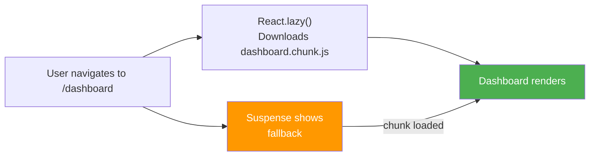

```jsx
import React, { lazy, Suspense, useState } from 'react';

// ── Route-level code splitting ────────────────────────────────
const Dashboard = lazy(() => import('./pages/Dashboard'));
const Profile   = lazy(() => import('./pages/Profile'));
const Analytics = lazy(() => import('./pages/Analytics'));

// Preload on hover (better UX)
const preloadDashboard = () => import('./pages/Dashboard');

function App() {
    return (
        <BrowserRouter>
            {/* Single Suspense wrapping all routes */}
            <Suspense fallback={<PageSpinner />}>
                <Routes>
                    <Route path="/dashboard" element={<Dashboard />} />
                    <Route path="/profile"   element={<Profile />} />
                    <Route path="/analytics" element={<Analytics />} />
                </Routes>
            </Suspense>
        </BrowserRouter>
    );
}

// ── Component-level lazy loading ─────────────────────────────
const HeavyChart    = lazy(() => import('./HeavyChart'));
const RichTextEditor = lazy(() => import('./RichTextEditor'));

function ReportPage() {
    const [showChart, setShowChart] = useState(false);

    return (
        <div>
            <button
                onMouseEnter={() => import('./HeavyChart')} // preload on hover
                onClick={() => setShowChart(true)}
            >
                Show Chart
            </button>

            {showChart && (
                // Suspense closest to where the lazy component is used
                <Suspense fallback={<div>Loading chart...</div>}>
                    <HeavyChart data={chartData} />
                </Suspense>
            )}

            <Suspense fallback={<div>Loading editor...</div>}>
                <RichTextEditor />
            </Suspense>
        </div>
    );
}

// ── Named exports with lazy (workaround) ─────────────────────
// lazy() only works with default exports — wrap named exports
const MyModal = lazy(() =>
    import('./components').then(module => ({ default: module.MyModal }))
);
```

---

# 24. React 18 — Concurrent Features

> **React 18** introduced **Concurrent Rendering** — React can now prepare multiple versions of the UI simultaneously, prioritize urgent updates, and interrupt, pause, or resume rendering. This enables smoother UX without blocking the main thread.

## Key New Features

### useTransition

> Marks a state update as **non-urgent** — React can interrupt it to handle urgent updates (like typing) first.

```jsx
import { useState, useTransition } from 'react';

function FilterableList({ items }) {
    const [filter,  setFilter]  = useState('');
    const [filtered, setFiltered] = useState(items);
    const [isPending, startTransition] = useTransition();

    const handleFilter = (value) => {
        setFilter(value); // urgent — input responds immediately

        startTransition(() => {
            // non-urgent — can be deferred; React may interrupt this
            const result = items.filter(i => i.name.includes(value));
            setFiltered(result);
        });
    };

    return (
        <div>
            <input value={filter} onChange={e => handleFilter(e.target.value)} />
            {isPending && <span>⏳ Filtering...</span>}
            <ul style={{ opacity: isPending ? 0.5 : 1 }}>
                {filtered.map(i => <li key={i.id}>{i.name}</li>)}
            </ul>
        </div>
    );
}
```

### useDeferredValue

> Like `useTransition` but for values you **don't control** (e.g., props from a parent).

```jsx
import { useState, useDeferredValue, memo } from 'react';

const SlowList = memo(({ query }) => {
    // Simulate slow render
    const items = Array.from({ length: 10000 }, (_, i) => ({
        id: i,
        matches: `item ${i}`.includes(query)
    }));
    return <ul>{items.filter(i => i.matches).map(i => <li key={i.id}>item {i.id}</li>)}</ul>;
});

function SearchPage() {
    const [query, setQuery] = useState('');
    const deferredQuery = useDeferredValue(query); // lags behind query intentionally

    return (
        <div>
            <input value={query} onChange={e => setQuery(e.target.value)} />
            {/* Input responds instantly; list renders with deferred (older) query */}
            <SlowList query={deferredQuery} />
        </div>
    );
}
```

### Automatic Batching

> React 18 automatically **batches multiple state updates** into a single re-render — even inside `setTimeout`, Promises, and native event handlers (previously only batched inside React event handlers).

```jsx
// React 17 — NO batching in async contexts (3 re-renders)
setTimeout(() => {
    setCount(c => c + 1);  // re-render 1
    setName('Hitesh');      // re-render 2
    setLoading(false);      // re-render 3
}, 1000);

// React 18 — Automatic batching everywhere (1 re-render)
setTimeout(() => {
    setCount(c => c + 1);  // batched
    setName('Hitesh');      // batched
    setLoading(false);      // batched ← only ONE re-render
}, 1000);

// Opt out of batching when needed
import { flushSync } from 'react-dom';
flushSync(() => setCount(c => c + 1)); // forces immediate re-render
flushSync(() => setName('Hitesh'));     // another immediate re-render
```

---

# 25. Forms — Best Practices & React Hook Form

> Handling forms in React can get verbose. **React Hook Form** is the most popular library for performant, flexible forms with minimal re-renders.

```bash
npm install react-hook-form
```

```jsx
import { useForm, useFieldArray, Controller } from 'react-hook-form';

function RegistrationForm() {
    const {
        register,        // connects input to the form
        handleSubmit,    // wraps your submit handler
        formState: { errors, isSubmitting, isDirty, isValid },
        watch,           // watch live values
        reset,           // reset form
        setValue,        // programmatically set a field
        getValues,       // read values without re-rendering
    } = useForm({
        mode: 'onBlur',  // validate on blur (options: onChange, onSubmit, all)
        defaultValues: { name: '', email: '', age: 18, role: 'user' }
    });

    const watchedName = watch('name'); // re-renders when 'name' changes

    const onSubmit = async (data) => {
        await api.register(data);
        reset(); // clear form after submit
    };

    return (
        <form onSubmit={handleSubmit(onSubmit)}>
            {/* name field with validation */}
            <input
                {...register('name', {
                    required: 'Name is required',
                    minLength: { value: 2, message: 'Min 2 characters' },
                    maxLength: { value: 50, message: 'Max 50 characters' }
                })}
                placeholder="Full Name"
            />
            {errors.name && <span style={{ color: 'red' }}>{errors.name.message}</span>}

            {/* email field */}
            <input
                {...register('email', {
                    required: 'Email is required',
                    pattern: { value: /^\S+@\S+$/i, message: 'Invalid email' }
                })}
                placeholder="Email"
            />
            {errors.email && <span>{errors.email.message}</span>}

            {/* age with numeric validation */}
            <input
                type="number"
                {...register('age', {
                    required: true,
                    min: { value: 18, message: 'Must be 18+' },
                    max: { value: 120, message: 'Max age is 120' },
                    valueAsNumber: true
                })}
            />
            {errors.age && <span>{errors.age.message}</span>}

            {/* select */}
            <select {...register('role', { required: 'Select a role' })}>
                <option value="">Select role...</option>
                <option value="user">User</option>
                <option value="admin">Admin</option>
            </select>

            <p>Hello, {watchedName}!</p>

            <button type="submit" disabled={isSubmitting || !isValid}>
                {isSubmitting ? 'Submitting...' : 'Register'}
            </button>
            <button type="button" onClick={() => reset()}>Clear</button>
        </form>
    );
}
```

---

# 26. Component Patterns — Compound Components & Render Props

## Compound Components

> **Compound Components** are a pattern where multiple components work together as a **single cohesive unit**, sharing implicit state through Context. Think of how `<select>` and `<option>` work natively.

```jsx
import React, { createContext, useContext, useState } from 'react';

// ── Accordion — Compound Component Pattern ───────────────────
const AccordionContext = createContext(null);

function Accordion({ children, defaultOpen = null }) {
    const [openItem, setOpenItem] = useState(defaultOpen);

    const toggle = (id) => setOpenItem(prev => prev === id ? null : id);

    return (
        <AccordionContext.Provider value={{ openItem, toggle }}>
            <div className="accordion">{children}</div>
        </AccordionContext.Provider>
    );
}

function AccordionItem({ id, children }) {
    return <div className="accordion-item" data-id={id}>{children}</div>;
}

function AccordionHeader({ id, children }) {
    const { openItem, toggle } = useContext(AccordionContext);
    const isOpen = openItem === id;
    return (
        <button className="accordion-header" onClick={() => toggle(id)}>
            {children} <span>{isOpen ? '▲' : '▼'}</span>
        </button>
    );
}

function AccordionPanel({ id, children }) {
    const { openItem } = useContext(AccordionContext);
    if (openItem !== id) return null;
    return <div className="accordion-panel">{children}</div>;
}

// Attach sub-components
Accordion.Item   = AccordionItem;
Accordion.Header = AccordionHeader;
Accordion.Panel  = AccordionPanel;

// ── Usage — clean, readable API ──────────────────────────────
function FAQ() {
    return (
        <Accordion defaultOpen="q1">
            <Accordion.Item id="q1">
                <Accordion.Header id="q1">What is React?</Accordion.Header>
                <Accordion.Panel id="q1">React is a UI library by Meta.</Accordion.Panel>
            </Accordion.Item>
            <Accordion.Item id="q2">
                <Accordion.Header id="q2">What are hooks?</Accordion.Header>
                <Accordion.Panel id="q2">Functions that let you use React features.</Accordion.Panel>
            </Accordion.Item>
        </Accordion>
    );
}
```

## Render Props

> A **Render Prop** is a pattern where a component receives a **function as a prop** that it calls to render its output. The component manages state/logic; the consumer controls the UI.

```jsx
// MouseTracker — provides mouse position via render prop
function MouseTracker({ render }) {
    const [position, setPosition] = useState({ x: 0, y: 0 });

    const handleMouseMove = (e) => setPosition({ x: e.clientX, y: e.clientY });

    return (
        <div onMouseMove={handleMouseMove} style={{ height: '100vh' }}>
            {render(position)} {/* caller decides what to render */}
        </div>
    );
}

// Usage — consumer controls the UI
function App() {
    return (
        <MouseTracker
            render={({ x, y }) => (
                <div>
                    <h1>Mouse: {x}, {y}</h1>
                    <div style={{ position: 'fixed', left: x, top: y }}>🎯</div>
                </div>
            )}
        />
    );
}

// Also works as children prop (more common)
function App2() {
    return (
        <MouseTracker>
            {({ x, y }) => <p>Position: {x}, {y}</p>}
        </MouseTracker>
    );
}
```

> 💡 **Today**: Both HOC and Render Props patterns have been largely replaced by **Custom Hooks** for logic reuse. However, **Compound Components** remain a valuable UI composition pattern.

---

# 27. Accessibility (a11y) in React

> Building accessible React apps ensures everyone — including people using screen readers, keyboard navigation, or assistive technology — can use your UI.

```jsx
// ── 1. Semantic HTML ─────────────────────────────────────────
// ❌ div soup
<div onClick={handleClick}>Click me</div>
// ✅ semantic
<button onClick={handleClick}>Click me</button>

// ── 2. ARIA attributes ───────────────────────────────────────
function Modal({ isOpen, title, children, onClose }) {
    return (
        <div
            role="dialog"
            aria-modal="true"
            aria-labelledby="modal-title"
            aria-describedby="modal-body"
        >
            <h2 id="modal-title">{title}</h2>
            <div id="modal-body">{children}</div>
            <button aria-label="Close modal" onClick={onClose}>✕</button>
        </div>
    );
}

// ── 3. Focus management ──────────────────────────────────────
function AccessibleModal({ isOpen, onClose, children }) {
    const modalRef = useRef(null);

    useEffect(() => {
        if (isOpen) {
            modalRef.current?.focus(); // move focus into modal when it opens
        }
    }, [isOpen]);

    return isOpen ? (
        <div
            ref={modalRef}
            tabIndex={-1}   // makes div focusable programmatically
            onKeyDown={e => e.key === 'Escape' && onClose()} // Escape to close
        >
            {children}
        </div>
    ) : null;
}

// ── 4. Live regions — announce dynamic content to screen readers
function StatusAnnouncer({ message }) {
    return (
        <div
            aria-live="polite"    // "assertive" for urgent messages
            aria-atomic="true"
            style={{ position: 'absolute', left: '-9999px' }} // visually hidden
        >
            {message}
        </div>
    );
}

// ── 5. Skip to main content link ─────────────────────────────
function SkipLink() {
    return (
        <a href="#main-content" className="skip-link">
            Skip to main content
        </a>
    );
}

// ── 6. Form labels ───────────────────────────────────────────
// ❌ No label
<input type="email" placeholder="Email" />
// ✅ Associated label
<label htmlFor="email">Email</label>
<input id="email" type="email" aria-required="true" />
```

---

# 28. Testing React Components

> Testing ensures your components behave correctly. The standard stack is **Jest** (test runner) + **React Testing Library (RTL)** (encourages testing from the user's perspective).

```bash
npm install --save-dev @testing-library/react @testing-library/jest-dom @testing-library/user-event
```

```jsx
// ── Component to test ────────────────────────────────────────
function Counter({ initialCount = 0 }) {
    const [count, setCount] = useState(initialCount);
    return (
        <div>
            <p data-testid="count-display">Count: {count}</p>
            <button onClick={() => setCount(c => c + 1)}>Increment</button>
            <button onClick={() => setCount(c => c - 1)} disabled={count <= 0}>Decrement</button>
        </div>
    );
}

// ── Tests ─────────────────────────────────────────────────────
import { render, screen, fireEvent } from '@testing-library/react';
import userEvent from '@testing-library/user-event';

describe('Counter', () => {
    test('renders initial count', () => {
        render(<Counter initialCount={5} />);
        expect(screen.getByTestId('count-display')).toHaveTextContent('Count: 5');
    });

    test('increments on button click', async () => {
        const user = userEvent.setup();
        render(<Counter />);
        await user.click(screen.getByRole('button', { name: 'Increment' }));
        expect(screen.getByTestId('count-display')).toHaveTextContent('Count: 1');
    });

    test('decrement button is disabled at 0', () => {
        render(<Counter initialCount={0} />);
        expect(screen.getByRole('button', { name: 'Decrement' })).toBeDisabled();
    });
});

// ── Testing async / API calls ─────────────────────────────────
import { waitFor } from '@testing-library/react';

test('fetches and displays user', async () => {
    // Mock the fetch
    global.fetch = jest.fn().mockResolvedValueOnce({
        ok: true,
        json: async () => ({ id: 1, name: 'Hitesh' }),
    });

    render(<UserProfile userId={1} />);

    expect(screen.getByText('Loading...')).toBeInTheDocument();
    await waitFor(() => expect(screen.getByText('Hitesh')).toBeInTheDocument());
});

// ── Testing with Context ──────────────────────────────────────
function renderWithTheme(ui, { theme = 'light' } = {}) {
    return render(
        <ThemeContext.Provider value={{ theme, toggleTheme: jest.fn() }}>
            {ui}
        </ThemeContext.Provider>
    );
}

test('applies dark theme class', () => {
    renderWithTheme(<Header />, { theme: 'dark' });
    expect(screen.getByRole('banner')).toHaveClass('dark');
});
```

---

*Notes based on official React documentation (react.dev) — covering React 18, Redux Toolkit 2.x, React Router v6, and React Testing Library.*
