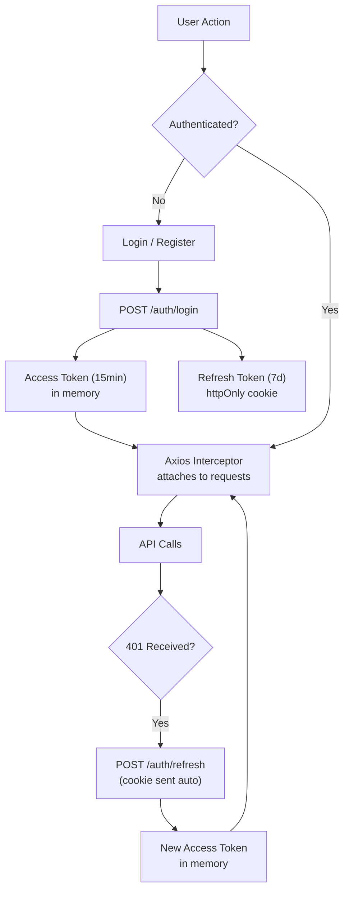
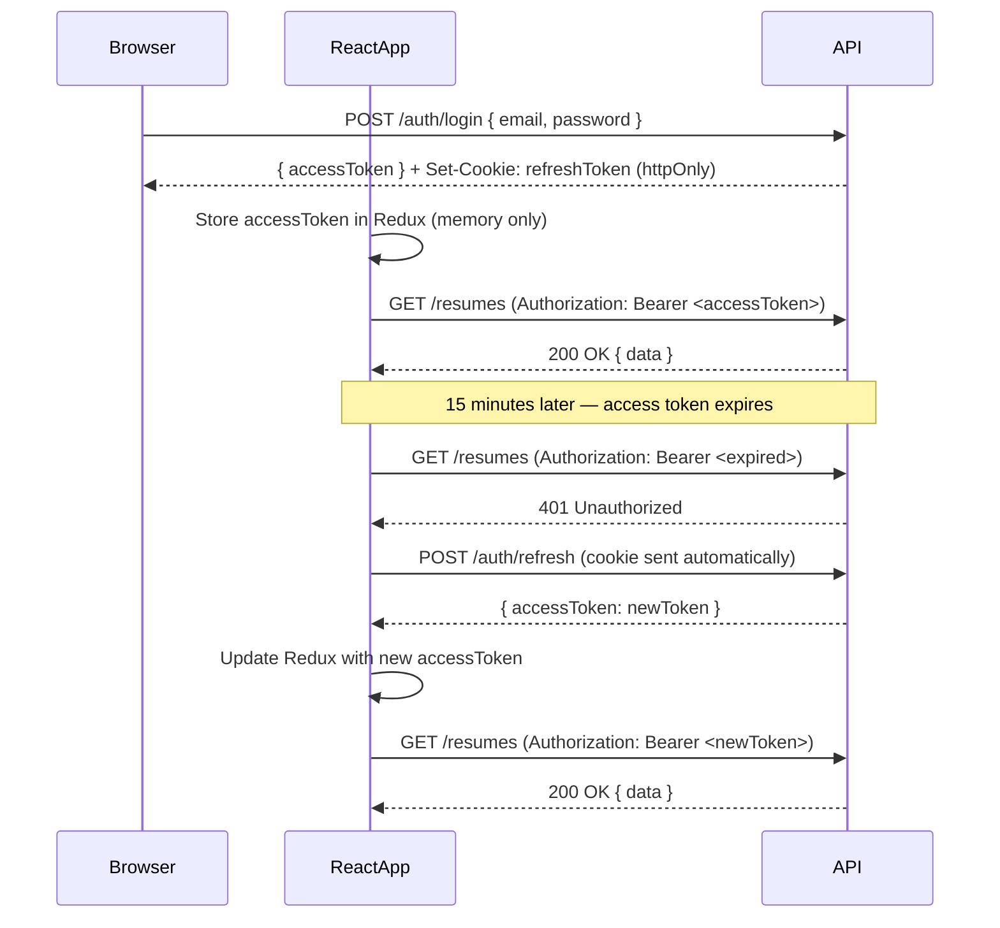

# React Authentication — Production Grade Implementation Guide

> Complete authentication implementation for a React + TypeScript + Redux Toolkit + Axios production app. Covers JWT access/refresh token rotation, Google OAuth, protected routes, persistent sessions, and security best practices.

---

## 📚 Table of Contents

1. [Authentication Architecture Overview](#1-authentication-architecture-overview)
2. [Token Strategy — Access + Refresh Tokens](#2-token-strategy--access--refresh-tokens)
3. [Axios Client Setup with Interceptors](#3-axios-client-setup-with-interceptors)
4. [Auth Slice — Redux Toolkit](#4-auth-slice--redux-toolkit)
5. [Auth Service — API Layer](#5-auth-service--api-layer)
6. [Register & Login Forms](#6-register--login-forms)
7. [Google OAuth Integration](#7-google-oauth-integration)
8. [Protected Routes](#8-protected-routes)
9. [Persistent Auth — Session Restoration](#9-persistent-auth--session-restoration)
10. [Role-Based Access Control (RBAC)](#10-role-based-access-control-rbac)
11. [Auto Token Refresh — Silent Renew](#11-auto-token-refresh--silent-renew)
12. [Logout — Complete Cleanup](#12-logout--complete-cleanup)
13. [Security Best Practices](#13-security-best-practices)
14. [Custom Auth Hooks](#14-custom-auth-hooks)
15. [Senior Interview Q&A](#15-senior-interview-qa)

---



---

# 1. Authentication Architecture Overview

## Folder Structure

```
src/
├── api/
│   └── axiosClient.ts          # Base Axios instance + interceptors
├── features/
│   └── auth/
│       ├── authSlice.ts        # Redux state
│       ├── authService.ts      # API calls
│       ├── authTypes.ts        # TypeScript interfaces
│       ├── LoginPage.tsx
│       ├── RegisterPage.tsx
│       └── hooks/
│           ├── useAuth.ts
│           ├── usePermission.ts
│           └── useGoogleAuth.ts
├── components/
│   └── auth/
│       ├── ProtectedRoute.tsx
│       └── RoleGuard.tsx
└── store/
    └── store.ts
```

## Core Decisions

| Decision | Choice | Reason |
|---|---|---|
| Access token storage | **In-memory** (Redux state) | XSS-proof — JS can't steal what's in React state only |
| Refresh token storage | **httpOnly cookie** | CSRF-protected, not accessible by JS |
| Token refresh | **Axios interceptor** (silent renew) | Transparent to all API callers |
| Auth state | **Redux Toolkit** | Consistent global state, DevTools support |
| Session restore | **`/auth/me` on app mount** | Refresh token cookie auto-sent → get new access token |
| Google OAuth | **`@react-oauth/google`** | ID token exchanged at backend |

---

# 2. Token Strategy — Access + Refresh Tokens

## Why Two Tokens?

```
Access Token:
  - Short-lived: 15 minutes
  - Stored: in memory (Redux state / module variable)
  - Sent: Authorization: Bearer <token> header
  - Risk if stolen: expires in 15 min

Refresh Token:
  - Long-lived: 7 days
  - Stored: httpOnly cookie (server sets it)
  - Sent: automatically by browser on cookie-matching requests
  - Risk if stolen: CSRF protected (sameSite: strict + CSRF token)
```

## Token Flow Diagram



## authTypes.ts

```typescript
// src/features/auth/authTypes.ts

export interface User {
  id: string;
  name: string;
  email: string;
  role: 'admin' | 'member' | 'viewer';
  avatarUrl?: string;
  subscriptionTier: 'free' | 'pro' | 'enterprise';
  isVerified: boolean;
}

export interface AuthState {
  user: User | null;
  accessToken: string | null;
  isAuthenticated: boolean;
  isLoading: boolean;       // For initial session restore
  isRefreshing: boolean;    // For silent token refresh
  error: string | null;
}

export interface LoginCredentials {
  email: string;
  password: string;
  rememberMe?: boolean;
}

export interface RegisterCredentials {
  name: string;
  email: string;
  password: string;
}

export interface AuthResponse {
  user: User;
  accessToken: string;
  // refreshToken comes in httpOnly cookie — not in body
}

export interface TokenRefreshResponse {
  accessToken: string;
}
```

---

# 3. Axios Client Setup with Interceptors

> This is the most critical piece. The Axios interceptor handles 401s silently, retries the original request with a new token, and prevents multiple simultaneous refresh calls.

## axiosClient.ts

```typescript
// src/api/axiosClient.ts
import axios, { AxiosInstance, InternalAxiosRequestConfig, AxiosError } from 'axios';

// ─── In-memory access token store ───────────────────────────────────────────
// NOT in localStorage — XSS safe
let accessToken: string | null = null;

export const setAccessToken = (token: string | null) => {
  accessToken = token;
};

export const getAccessToken = () => accessToken;

// ─── Base Axios instance ─────────────────────────────────────────────────────
export const axiosClient: AxiosInstance = axios.create({
  baseURL: import.meta.env.VITE_API_URL, // e.g., https://api.example.com
  withCredentials: true,                 // CRITICAL: send httpOnly refresh cookie
  headers: {
    'Content-Type': 'application/json',
  },
});

// ─── Request Interceptor — Attach Access Token ───────────────────────────────
axiosClient.interceptors.request.use(
  (config: InternalAxiosRequestConfig) => {
    if (accessToken) {
      config.headers.Authorization = `Bearer ${accessToken}`;
    }
    return config;
  },
  (error) => Promise.reject(error)
);

// ─── Response Interceptor — Handle 401 + Silent Refresh ─────────────────────
let isRefreshing = false;
// Queue of failed requests waiting for token refresh
let failedQueue: Array<{
  resolve: (token: string) => void;
  reject: (error: unknown) => void;
}> = [];

const processQueue = (error: unknown, token: string | null = null) => {
  failedQueue.forEach(({ resolve, reject }) => {
    if (error) reject(error);
    else resolve(token!);
  });
  failedQueue = [];
};

axiosClient.interceptors.response.use(
  (response) => response,
  async (error: AxiosError) => {
    const originalRequest = error.config as InternalAxiosRequestConfig & {
      _retry?: boolean;
    };

    // Only handle 401 errors that haven't been retried yet
    // Skip the refresh endpoint itself to avoid infinite loops
    if (
      error.response?.status === 401 &&
      !originalRequest._retry &&
      originalRequest.url !== '/auth/refresh'
    ) {
      if (isRefreshing) {
        // Queue this request until the ongoing refresh completes
        return new Promise((resolve, reject) => {
          failedQueue.push({ resolve, reject });
        }).then((token) => {
          originalRequest.headers.Authorization = `Bearer ${token}`;
          return axiosClient(originalRequest);
        });
      }

      originalRequest._retry = true;
      isRefreshing = true;

      try {
        // Refresh token is sent automatically via httpOnly cookie
        const { data } = await axios.post<{ accessToken: string }>(
          `${import.meta.env.VITE_API_URL}/auth/refresh`,
          {},
          { withCredentials: true }
        );

        const newToken = data.accessToken;
        setAccessToken(newToken);

        // Update Redux store (import avoids circular deps)
        const { store } = await import('../store/store');
        const { setToken } = await import('../features/auth/authSlice');
        store.dispatch(setToken(newToken));

        // Process all queued requests with the new token
        processQueue(null, newToken);

        // Retry the original failed request
        originalRequest.headers.Authorization = `Bearer ${newToken}`;
        return axiosClient(originalRequest);
      } catch (refreshError) {
        // Refresh failed — session expired, force logout
        processQueue(refreshError, null);
        setAccessToken(null);

        const { store } = await import('../store/store');
        const { logout } = await import('../features/auth/authSlice');
        store.dispatch(logout());

        // Redirect to login
        window.location.href = '/login?session=expired';
        return Promise.reject(refreshError);
      } finally {
        isRefreshing = false;
      }
    }

    return Promise.reject(error);
  }
);

export default axiosClient;
```

---

# 4. Auth Slice — Redux Toolkit

```typescript
// src/features/auth/authSlice.ts
import { createSlice, createAsyncThunk, PayloadAction } from '@reduxjs/toolkit';
import { AuthState, LoginCredentials, RegisterCredentials, User } from './authTypes';
import { authService } from './authService';
import { setAccessToken } from '../../api/axiosClient';

// ─── Initial State ───────────────────────────────────────────────────────────
const initialState: AuthState = {
  user: null,
  accessToken: null,
  isAuthenticated: false,
  isLoading: true,   // true on mount — we'll try to restore session
  isRefreshing: false,
  error: null,
};

// ─── Async Thunks ────────────────────────────────────────────────────────────

export const loginThunk = createAsyncThunk(
  'auth/login',
  async (credentials: LoginCredentials, { rejectWithValue }) => {
    try {
      const data = await authService.login(credentials);
      setAccessToken(data.accessToken); // Sync module-level token
      return data;
    } catch (error: any) {
      return rejectWithValue(error.response?.data?.message ?? 'Login failed');
    }
  }
);

export const registerThunk = createAsyncThunk(
  'auth/register',
  async (credentials: RegisterCredentials, { rejectWithValue }) => {
    try {
      return await authService.register(credentials);
    } catch (error: any) {
      return rejectWithValue(error.response?.data?.message ?? 'Registration failed');
    }
  }
);

export const restoreSessionThunk = createAsyncThunk(
  'auth/restoreSession',
  async (_, { rejectWithValue }) => {
    try {
      // Try to get a new access token using the httpOnly refresh cookie
      const data = await authService.refreshToken();
      setAccessToken(data.accessToken);
      // Then fetch the current user
      const user = await authService.getMe();
      return { accessToken: data.accessToken, user };
    } catch {
      setAccessToken(null);
      return rejectWithValue('No active session');
    }
  }
);

export const logoutThunk = createAsyncThunk(
  'auth/logout',
  async (_, { dispatch }) => {
    try {
      await authService.logout(); // Clears httpOnly cookie on server
    } finally {
      setAccessToken(null);
      dispatch(logout()); // Clear Redux state
    }
  }
);

export const googleLoginThunk = createAsyncThunk(
  'auth/googleLogin',
  async (idToken: string, { rejectWithValue }) => {
    try {
      const data = await authService.googleLogin(idToken);
      setAccessToken(data.accessToken);
      return data;
    } catch (error: any) {
      return rejectWithValue(error.response?.data?.message ?? 'Google login failed');
    }
  }
);

// ─── Auth Slice ──────────────────────────────────────────────────────────────
const authSlice = createSlice({
  name: 'auth',
  initialState,
  reducers: {
    // Called by Axios interceptor when token is refreshed
    setToken(state, action: PayloadAction<string>) {
      state.accessToken = action.payload;
    },
    // Called by Axios interceptor on refresh failure
    logout(state) {
      state.user = null;
      state.accessToken = null;
      state.isAuthenticated = false;
      state.error = null;
    },
    clearError(state) {
      state.error = null;
    },
  },
  extraReducers: (builder) => {
    // Login
    builder
      .addCase(loginThunk.pending, (state) => {
        state.isLoading = true;
        state.error = null;
      })
      .addCase(loginThunk.fulfilled, (state, action) => {
        state.isLoading = false;
        state.user = action.payload.user;
        state.accessToken = action.payload.accessToken;
        state.isAuthenticated = true;
      })
      .addCase(loginThunk.rejected, (state, action) => {
        state.isLoading = false;
        state.error = action.payload as string;
      });

    // Register
    builder
      .addCase(registerThunk.pending, (state) => { state.isLoading = true; })
      .addCase(registerThunk.fulfilled, (state) => { state.isLoading = false; })
      .addCase(registerThunk.rejected, (state, action) => {
        state.isLoading = false;
        state.error = action.payload as string;
      });

    // Session Restore
    builder
      .addCase(restoreSessionThunk.pending, (state) => {
        state.isLoading = true;
      })
      .addCase(restoreSessionThunk.fulfilled, (state, action) => {
        state.isLoading = false;
        state.user = action.payload.user;
        state.accessToken = action.payload.accessToken;
        state.isAuthenticated = true;
      })
      .addCase(restoreSessionThunk.rejected, (state) => {
        state.isLoading = false;
        state.isAuthenticated = false;
        state.user = null;
        state.accessToken = null;
      });

    // Google Login
    builder
      .addCase(googleLoginThunk.fulfilled, (state, action) => {
        state.user = action.payload.user;
        state.accessToken = action.payload.accessToken;
        state.isAuthenticated = true;
      })
      .addCase(googleLoginThunk.rejected, (state, action) => {
        state.error = action.payload as string;
      });

    // Logout
    builder.addCase(logoutThunk.fulfilled, (state) => {
      state.user = null;
      state.accessToken = null;
      state.isAuthenticated = false;
    });
  },
});

export const { setToken, logout, clearError } = authSlice.actions;

// ─── Selectors ───────────────────────────────────────────────────────────────
export const selectUser = (state: { auth: AuthState }) => state.auth.user;
export const selectIsAuthenticated = (state: { auth: AuthState }) => state.auth.isAuthenticated;
export const selectAuthLoading = (state: { auth: AuthState }) => state.auth.isLoading;
export const selectAuthError = (state: { auth: AuthState }) => state.auth.error;
export const selectUserRole = (state: { auth: AuthState }) => state.auth.user?.role;

export default authSlice.reducer;
```

---

# 5. Auth Service — API Layer

```typescript
// src/features/auth/authService.ts
import axiosClient from '../../api/axiosClient';
import { AuthResponse, LoginCredentials, RegisterCredentials, TokenRefreshResponse, User } from './authTypes';

export const authService = {
  async login(credentials: LoginCredentials): Promise<AuthResponse> {
    const { data } = await axiosClient.post<AuthResponse>('/auth/login', credentials);
    return data;
  },

  async register(credentials: RegisterCredentials): Promise<{ message: string }> {
    const { data } = await axiosClient.post('/auth/register', credentials);
    return data;
  },

  async refreshToken(): Promise<TokenRefreshResponse> {
    // httpOnly cookie is sent automatically by the browser
    const { data } = await axiosClient.post<TokenRefreshResponse>('/auth/refresh');
    return data;
  },

  async logout(): Promise<void> {
    // Server clears the httpOnly cookie
    await axiosClient.post('/auth/logout');
  },

  async getMe(): Promise<User> {
    const { data } = await axiosClient.get<User>('/users/me');
    return data;
  },

  async googleLogin(idToken: string): Promise<AuthResponse> {
    const { data } = await axiosClient.post<AuthResponse>('/auth/google', { idToken });
    return data;
  },

  async forgotPassword(email: string): Promise<void> {
    await axiosClient.post('/auth/forgot-password', { email });
  },

  async resetPassword(token: string, password: string): Promise<void> {
    await axiosClient.post(`/auth/reset-password/${token}`, { password });
  },

  async verifyEmail(token: string): Promise<void> {
    await axiosClient.get(`/auth/verify-email/${token}`);
  },
};
```

---

# 6. Register & Login Forms

## LoginPage.tsx

```tsx
// src/features/auth/LoginPage.tsx
import { useEffect } from 'react';
import { useForm } from 'react-hook-form';
import { zodResolver } from '@hookform/resolvers/zod';
import { z } from 'zod';
import { useDispatch, useSelector } from 'react-redux';
import { useNavigate, useLocation, Link } from 'react-router-dom';
import { loginThunk, clearError, selectAuthError, selectAuthLoading, selectIsAuthenticated } from './authSlice';
import { AppDispatch } from '../../store/store';
import { GoogleLoginButton } from './components/GoogleLoginButton';

const loginSchema = z.object({
  email: z.string().email('Invalid email address'),
  password: z.string().min(6, 'Password must be at least 6 characters'),
  rememberMe: z.boolean().optional(),
});

type LoginFormData = z.infer<typeof loginSchema>;

export default function LoginPage() {
  const dispatch = useDispatch<AppDispatch>();
  const navigate = useNavigate();
  const location = useLocation();
  const isAuthenticated = useSelector(selectIsAuthenticated);
  const isLoading = useSelector(selectAuthLoading);
  const error = useSelector(selectAuthError);

  // Return URL after login
  const returnUrl = (location.state as { returnUrl?: string })?.returnUrl ?? '/dashboard';

  const { register, handleSubmit, formState: { errors } } = useForm<LoginFormData>({
    resolver: zodResolver(loginSchema),
  });

  // Redirect if already authenticated
  useEffect(() => {
    if (isAuthenticated) navigate(returnUrl, { replace: true });
  }, [isAuthenticated, navigate, returnUrl]);

  // Clear errors on unmount
  useEffect(() => () => { dispatch(clearError()); }, [dispatch]);

  const onSubmit = async (data: LoginFormData) => {
    await dispatch(loginThunk(data));
  };

  return (
    <div className="min-h-screen flex items-center justify-center bg-gray-50">
      <div className="max-w-md w-full space-y-8 p-8 bg-white rounded-xl shadow">
        <h2 className="text-3xl font-bold text-center">Sign In</h2>

        {error && (
          <div className="bg-red-50 border border-red-200 text-red-700 px-4 py-3 rounded" role="alert">
            {error}
          </div>
        )}

        <form onSubmit={handleSubmit(onSubmit)} className="space-y-4" noValidate>
          <div>
            <label htmlFor="email" className="block text-sm font-medium">Email</label>
            <input
              id="email"
              type="email"
              autoComplete="email"
              {...register('email')}
              className="mt-1 w-full border rounded-md px-3 py-2 focus:ring-2 focus:ring-indigo-500"
              aria-invalid={!!errors.email}
              aria-describedby={errors.email ? 'email-error' : undefined}
            />
            {errors.email && (
              <p id="email-error" className="text-red-600 text-sm mt-1">{errors.email.message}</p>
            )}
          </div>

          <div>
            <label htmlFor="password" className="block text-sm font-medium">Password</label>
            <input
              id="password"
              type="password"
              autoComplete="current-password"
              {...register('password')}
              className="mt-1 w-full border rounded-md px-3 py-2 focus:ring-2 focus:ring-indigo-500"
            />
            {errors.password && (
              <p className="text-red-600 text-sm mt-1">{errors.password.message}</p>
            )}
          </div>

          <div className="flex items-center justify-between">
            <label className="flex items-center gap-2 text-sm">
              <input type="checkbox" {...register('rememberMe')} />
              Remember me
            </label>
            <Link to="/forgot-password" className="text-sm text-indigo-600 hover:underline">
              Forgot password?
            </Link>
          </div>

          <button
            type="submit"
            disabled={isLoading}
            className="w-full bg-indigo-600 text-white py-2 rounded-md hover:bg-indigo-700 disabled:opacity-50"
          >
            {isLoading ? 'Signing in...' : 'Sign In'}
          </button>
        </form>

        <div className="relative">
          <div className="absolute inset-0 flex items-center">
            <div className="w-full border-t border-gray-200" />
          </div>
          <div className="relative flex justify-center text-sm">
            <span className="bg-white px-2 text-gray-500">Or continue with</span>
          </div>
        </div>

        <GoogleLoginButton />

        <p className="text-center text-sm">
          Don't have an account?{' '}
          <Link to="/register" className="text-indigo-600 hover:underline">Sign up</Link>
        </p>
      </div>
    </div>
  );
}
```

## RegisterPage.tsx

```tsx
// src/features/auth/RegisterPage.tsx
import { useState } from 'react';
import { useForm } from 'react-hook-form';
import { zodResolver } from '@hookform/resolvers/zod';
import { z } from 'zod';
import { useDispatch } from 'react-redux';
import { Link } from 'react-router-dom';
import { registerThunk } from './authSlice';
import { AppDispatch } from '../../store/store';

const registerSchema = z.object({
  name: z.string().min(2, 'Name must be at least 2 characters').max(50),
  email: z.string().email('Invalid email address'),
  password: z
    .string()
    .min(8, 'Password must be at least 8 characters')
    .regex(/[A-Z]/, 'Must contain at least one uppercase letter')
    .regex(/[0-9]/, 'Must contain at least one number')
    .regex(/[^a-zA-Z0-9]/, 'Must contain at least one special character'),
  confirmPassword: z.string(),
}).refine((data) => data.password === data.confirmPassword, {
  message: 'Passwords do not match',
  path: ['confirmPassword'],
});

type RegisterFormData = z.infer<typeof registerSchema>;

export default function RegisterPage() {
  const dispatch = useDispatch<AppDispatch>();
  const [isSuccess, setIsSuccess] = useState(false);

  const { register, handleSubmit, formState: { errors, isSubmitting } } = useForm<RegisterFormData>({
    resolver: zodResolver(registerSchema),
  });

  const onSubmit = async (data: RegisterFormData) => {
    const result = await dispatch(registerThunk({
      name: data.name,
      email: data.email,
      password: data.password,
    }));
    if (registerThunk.fulfilled.match(result)) {
      setIsSuccess(true);
    }
  };

  if (isSuccess) {
    return (
      <div className="min-h-screen flex items-center justify-center">
        <div className="max-w-md w-full text-center p-8 bg-white rounded-xl shadow">
          <div className="text-5xl mb-4">📧</div>
          <h2 className="text-2xl font-bold mb-2">Check your email</h2>
          <p className="text-gray-600">
            We've sent a verification link to your email address.
            Click it to activate your account.
          </p>
        </div>
      </div>
    );
  }

  return (
    <div className="min-h-screen flex items-center justify-center bg-gray-50">
      <div className="max-w-md w-full space-y-6 p-8 bg-white rounded-xl shadow">
        <h2 className="text-3xl font-bold text-center">Create Account</h2>

        <form onSubmit={handleSubmit(onSubmit)} className="space-y-4" noValidate>
          <div>
            <label className="block text-sm font-medium">Full Name</label>
            <input {...register('name')} className="mt-1 w-full border rounded-md px-3 py-2" />
            {errors.name && <p className="text-red-600 text-sm mt-1">{errors.name.message}</p>}
          </div>

          <div>
            <label className="block text-sm font-medium">Email</label>
            <input type="email" {...register('email')} className="mt-1 w-full border rounded-md px-3 py-2" />
            {errors.email && <p className="text-red-600 text-sm mt-1">{errors.email.message}</p>}
          </div>

          <div>
            <label className="block text-sm font-medium">Password</label>
            <input type="password" {...register('password')} className="mt-1 w-full border rounded-md px-3 py-2" />
            {errors.password && <p className="text-red-600 text-sm mt-1">{errors.password.message}</p>}
          </div>

          <div>
            <label className="block text-sm font-medium">Confirm Password</label>
            <input type="password" {...register('confirmPassword')} className="mt-1 w-full border rounded-md px-3 py-2" />
            {errors.confirmPassword && <p className="text-red-600 text-sm mt-1">{errors.confirmPassword.message}</p>}
          </div>

          <button
            type="submit"
            disabled={isSubmitting}
            className="w-full bg-indigo-600 text-white py-2 rounded-md hover:bg-indigo-700 disabled:opacity-50"
          >
            {isSubmitting ? 'Creating account...' : 'Create Account'}
          </button>
        </form>

        <p className="text-center text-sm">
          Already have an account?{' '}
          <Link to="/login" className="text-indigo-600 hover:underline">Sign in</Link>
        </p>
      </div>
    </div>
  );
}
```

---

# 7. Google OAuth Integration

```tsx
// src/features/auth/components/GoogleLoginButton.tsx
import { GoogleLogin, GoogleOAuthProvider } from '@react-oauth/google';
import { useDispatch } from 'react-redux';
import { googleLoginThunk } from '../authSlice';
import { AppDispatch } from '../../../store/store';

export function GoogleLoginButton() {
  const dispatch = useDispatch<AppDispatch>();

  return (
    <GoogleLogin
      onSuccess={(credentialResponse) => {
        if (credentialResponse.credential) {
          // Send Google ID token to our backend for verification
          dispatch(googleLoginThunk(credentialResponse.credential));
        }
      }}
      onError={() => {
        console.error('Google Login Failed');
      }}
      useOneTap            // Shows Google One Tap prompt
      auto_select={false}
    />
  );
}

// Wrap your app root with the provider:
// src/main.tsx
// <GoogleOAuthProvider clientId={import.meta.env.VITE_GOOGLE_CLIENT_ID}>
//   <App />
// </GoogleOAuthProvider>
```

---

# 8. Protected Routes

## ProtectedRoute.tsx

```tsx
// src/components/auth/ProtectedRoute.tsx
import { Navigate, useLocation, Outlet } from 'react-router-dom';
import { useSelector } from 'react-redux';
import { selectIsAuthenticated, selectAuthLoading } from '../../features/auth/authSlice';

interface ProtectedRouteProps {
  redirectTo?: string;
  children?: React.ReactNode;
}

export function ProtectedRoute({ redirectTo = '/login', children }: ProtectedRouteProps) {
  const isAuthenticated = useSelector(selectIsAuthenticated);
  const isLoading = useSelector(selectAuthLoading);
  const location = useLocation();

  // Still restoring session — show full-screen spinner, not login redirect
  if (isLoading) {
    return (
      <div className="min-h-screen flex items-center justify-center">
        <div className="animate-spin rounded-full h-12 w-12 border-b-2 border-indigo-600" />
      </div>
    );
  }

  if (!isAuthenticated) {
    // Pass current location as returnUrl so login can redirect back
    return (
      <Navigate
        to={redirectTo}
        state={{ returnUrl: location.pathname + location.search }}
        replace
      />
    );
  }

  return children ? <>{children}</> : <Outlet />;
}
```

## RoleGuard.tsx

```tsx
// src/components/auth/RoleGuard.tsx
import { Navigate } from 'react-router-dom';
import { useSelector } from 'react-redux';
import { selectUser } from '../../features/auth/authSlice';
import { User } from '../../features/auth/authTypes';

interface RoleGuardProps {
  allowedRoles: User['role'][];
  children: React.ReactNode;
  fallback?: React.ReactNode; // Show this instead of redirecting
}

export function RoleGuard({ allowedRoles, children, fallback }: RoleGuardProps) {
  const user = useSelector(selectUser);

  if (!user || !allowedRoles.includes(user.role)) {
    if (fallback) return <>{fallback}</>;
    return <Navigate to="/403" replace />;
  }

  return <>{children}</>;
}
```

## Router Setup — React Router v6

```tsx
// src/App.tsx
import { createBrowserRouter, RouterProvider } from 'react-router-dom';
import { lazy, Suspense } from 'react';
import { ProtectedRoute } from './components/auth/ProtectedRoute';
import { RoleGuard } from './components/auth/RoleGuard';

const Dashboard = lazy(() => import('./pages/Dashboard'));
const AdminPanel = lazy(() => import('./pages/AdminPanel'));
const LoginPage = lazy(() => import('./features/auth/LoginPage'));
const RegisterPage = lazy(() => import('./features/auth/RegisterPage'));

const router = createBrowserRouter([
  // Public routes
  { path: '/login', element: <LoginPage /> },
  { path: '/register', element: <RegisterPage /> },
  { path: '/forgot-password', element: <ForgotPasswordPage /> },
  { path: '/reset-password/:token', element: <ResetPasswordPage /> },
  { path: '/verify-email/:token', element: <VerifyEmailPage /> },

  // Protected routes — any authenticated user
  {
    element: <ProtectedRoute />, // Outlet-based — wraps nested routes
    children: [
      { path: '/dashboard', element: <Suspense fallback={<PageSkeleton />}><Dashboard /></Suspense> },
      { path: '/profile', element: <ProfilePage /> },
      { path: '/settings', element: <SettingsPage /> },
    ],
  },

  // Protected + role-restricted routes
  {
    element: (
      <ProtectedRoute>
        <RoleGuard allowedRoles={['admin']}>
          <Outlet />
        </RoleGuard>
      </ProtectedRoute>
    ),
    children: [
      { path: '/admin', element: <AdminPanel /> },
    ],
  },

  { path: '/403', element: <ForbiddenPage /> },
  { path: '*', element: <NotFoundPage /> },
]);

export default function App() {
  return <RouterProvider router={router} />;
}
```

---

# 9. Persistent Auth — Session Restoration

> On every app load, we try to restore the user's session silently using the `httpOnly` refresh token cookie. If it exists and is valid, the user stays logged in without re-entering credentials.

## SessionRestorer.tsx

```tsx
// src/components/auth/SessionRestorer.tsx
// Render this ONCE at the top of the app tree (inside Provider, outside Router)

import { useEffect } from 'react';
import { useDispatch } from 'react-redux';
import { restoreSessionThunk } from '../../features/auth/authSlice';
import { AppDispatch } from '../../store/store';

export function SessionRestorer({ children }: { children: React.ReactNode }) {
  const dispatch = useDispatch<AppDispatch>();

  useEffect(() => {
    // On app mount: try to restore session from httpOnly cookie
    // This is silent — user doesn't see anything if it succeeds
    dispatch(restoreSessionThunk());
  }, []); // eslint-disable-line react-hooks/exhaustive-deps

  return <>{children}</>;
}

// Usage in main.tsx:
// <Provider store={store}>
//   <SessionRestorer>
//     <GoogleOAuthProvider clientId={...}>
//       <App />
//     </GoogleOAuthProvider>
//   </SessionRestorer>
// </Provider>
```

## Why `isLoading: true` Initially Matters

```tsx
// Without session restore handling:
// App loads → isAuthenticated: false → ProtectedRoute redirects to /login
// Session restore completes → isAuthenticated: true → but user is already on /login (bad UX)

// With isLoading: true initially:
// App loads → ProtectedRoute sees isLoading: true → shows spinner
// Session restore completes → isAuthenticated: true → user stays on dashboard ✅
// Session restore fails → isLoading: false, isAuthenticated: false → redirect to /login ✅
```

---

# 10. Role-Based Access Control (RBAC)

## usePermission Hook

```typescript
// src/features/auth/hooks/usePermission.ts
import { useSelector } from 'react-redux';
import { selectUser } from '../authSlice';
import { User } from '../authTypes';

type Action =
  | 'create:task'
  | 'edit:task'
  | 'delete:task'
  | 'manage:members'
  | 'view:admin'
  | 'manage:billing'
  | 'edit:project';

// Permission matrix — what each role can do
const PERMISSIONS: Record<User['role'], Action[]> = {
  admin: [
    'create:task', 'edit:task', 'delete:task',
    'manage:members', 'view:admin', 'manage:billing', 'edit:project'
  ],
  member: ['create:task', 'edit:task', 'edit:project'],
  viewer: [], // Read-only
};

export function usePermission(action: Action): boolean {
  const user = useSelector(selectUser);
  if (!user) return false;
  return PERMISSIONS[user.role]?.includes(action) ?? false;
}

// Usage in component:
// const canDelete = usePermission('delete:task');
// <button disabled={!canDelete}>Delete</button>
```

## Subscription Tier Guard

```tsx
// src/components/auth/TierGuard.tsx
import { useSelector } from 'react-redux';
import { selectUser } from '../../features/auth/authSlice';

type Tier = 'free' | 'pro' | 'enterprise';

const TIER_RANK: Record<Tier, number> = {
  free: 0,
  pro: 1,
  enterprise: 2,
};

interface TierGuardProps {
  requiredTier: Tier;
  children: React.ReactNode;
  fallback?: React.ReactNode; // e.g., upgrade CTA
}

export function TierGuard({ requiredTier, children, fallback }: TierGuardProps) {
  const user = useSelector(selectUser);
  const hasAccess = user && TIER_RANK[user.subscriptionTier] >= TIER_RANK[requiredTier];

  if (!hasAccess) {
    return fallback ? <>{fallback}</> : null;
  }

  return <>{children}</>;
}

// Usage:
// <TierGuard requiredTier="pro" fallback={<UpgradeBanner />}>
//   <AdvancedFeature />
// </TierGuard>
```

---

# 11. Auto Token Refresh — Silent Renew

> The Axios interceptor handles silent refresh automatically (see Section 3). But there's also a proactive approach: refresh the token before it expires to avoid any 401 errors.

## Proactive Token Refresh (Optional)

```typescript
// src/features/auth/hooks/useTokenRefresh.ts
import { useEffect, useCallback, useRef } from 'react';
import { useDispatch, useSelector } from 'react-redux';
import { jwtDecode } from 'jwt-decode'; // npm install jwt-decode
import { restoreSessionThunk } from '../authSlice';
import { AppDispatch, RootState } from '../../../store/store';

const REFRESH_BUFFER_MS = 60 * 1000; // Refresh 1 minute before expiry

export function useTokenRefresh() {
  const dispatch = useDispatch<AppDispatch>();
  const accessToken = useSelector((state: RootState) => state.auth.accessToken);
  const timerRef = useRef<ReturnType<typeof setTimeout> | null>(null);

  const scheduleRefresh = useCallback((token: string) => {
    if (timerRef.current) clearTimeout(timerRef.current);

    try {
      const decoded = jwtDecode<{ exp: number }>(token);
      const expiresAt = decoded.exp * 1000; // Convert to ms
      const refreshAt = expiresAt - Date.now() - REFRESH_BUFFER_MS;

      if (refreshAt > 0) {
        timerRef.current = setTimeout(() => {
          dispatch(restoreSessionThunk());
        }, refreshAt);
      }
    } catch {
      // Invalid token — let interceptor handle 401
    }
  }, [dispatch]);

  useEffect(() => {
    if (accessToken) scheduleRefresh(accessToken);
    return () => {
      if (timerRef.current) clearTimeout(timerRef.current);
    };
  }, [accessToken, scheduleRefresh]);
}

// Use in App.tsx or a high-level component:
// function App() {
//   useTokenRefresh(); // Sets up proactive refresh timer
//   return <RouterProvider router={router} />;
// }
```

---

# 12. Logout — Complete Cleanup

```typescript
// src/features/auth/hooks/useLogout.ts
import { useCallback } from 'react';
import { useDispatch } from 'react-redux';
import { useNavigate } from 'react-router-dom';
import { logoutThunk } from '../authSlice';
import { AppDispatch } from '../../../store/store';

export function useLogout() {
  const dispatch = useDispatch<AppDispatch>();
  const navigate = useNavigate();

  const logout = useCallback(async () => {
    // 1. Call backend to clear httpOnly refresh cookie
    // 2. Clear Redux state (accessToken, user)
    // 3. Clear module-level accessToken variable
    await dispatch(logoutThunk());

    // 4. Navigate to login — everything else is handled by the thunk
    navigate('/login', { replace: true });
  }, [dispatch, navigate]);

  return { logout };
}

// Usage:
// const { logout } = useLogout();
// <button onClick={logout}>Sign Out</button>
```

---

# 13. Security Best Practices

## Storage Security Comparison

| Storage | XSS Risk | CSRF Risk | Survives Refresh | Notes |
|---|---|---|---|---|
| `localStorage` | 🔴 High | 🟢 None | ✅ Yes | Never store JWTs here |
| `sessionStorage` | 🔴 High | 🟢 None | ❌ No | Still readable by JS |
| `httpOnly cookie` | 🟢 None | 🔴 Medium | ✅ Yes | Use `sameSite: strict` to mitigate CSRF |
| **In-memory (Redux)** | 🟢 None | 🟢 None | ❌ No tab reload | Best for access tokens |
| **httpOnly + in-memory** | 🟢 None | 🟢 Mitigated | ✅ Via refresh | ✅ **Production pattern** |

## Security Checklist

```tsx
// 1. NEVER store access tokens in localStorage or sessionStorage
// ❌ localStorage.setItem('token', accessToken);
// ✅ Keep in Redux state (in-memory module variable as backup)

// 2. ALWAYS use withCredentials for refresh endpoint
axiosClient.post('/auth/refresh', {}, { withCredentials: true });

// 3. CSRF protection — send CSRF token in header for mutation requests
// Backend should set a non-httpOnly XSRF-TOKEN cookie
// Frontend reads and sends as X-XSRF-TOKEN header
axiosClient.interceptors.request.use((config) => {
  const csrfToken = document.cookie
    .split('; ')
    .find(row => row.startsWith('XSRF-TOKEN='))
    ?.split('=')[1];
  if (csrfToken) {
    config.headers['X-XSRF-TOKEN'] = csrfToken;
  }
  return config;
});

// 4. Validate JWT on every API call SERVER-SIDE — never trust client-side checks

// 5. Implement account lockout (backend: 5 failed attempts → lock 15 min)
// Show remaining attempts in the UI error message

// 6. Use HTTPS everywhere — httpOnly cookies are useless over HTTP

// 7. Set short access token expiry — 15 minutes max

// 8. Content Security Policy (CSP) — reduces XSS attack surface
// <meta http-equiv="Content-Security-Policy" content="default-src 'self'">
```

## Input Sanitization

```tsx
// Use Zod to validate all user inputs BEFORE sending to API
// This catches obvious injection attempts client-side
// Backend must ALWAYS re-validate — never trust client

const emailSchema = z
  .string()
  .email()
  .max(254) // RFC 5321 max email length
  .transform(v => v.toLowerCase().trim()); // Normalize
```

---

# 14. Custom Auth Hooks

```typescript
// src/features/auth/hooks/useAuth.ts
// One-stop hook for auth state

import { useSelector } from 'react-redux';
import {
  selectUser,
  selectIsAuthenticated,
  selectAuthLoading,
  selectAuthError,
  selectUserRole,
} from '../authSlice';

export function useAuth() {
  const user = useSelector(selectUser);
  const isAuthenticated = useSelector(selectIsAuthenticated);
  const isLoading = useSelector(selectAuthLoading);
  const error = useSelector(selectAuthError);
  const role = useSelector(selectUserRole);

  return {
    user,
    isAuthenticated,
    isLoading,
    error,
    role,
    isAdmin: role === 'admin',
    isMember: role === 'member',
    isViewer: role === 'viewer',
    isPro: user?.subscriptionTier === 'pro' || user?.subscriptionTier === 'enterprise',
  };
}

// Usage anywhere:
// const { user, isAdmin, isPro } = useAuth();
```

---

# 15. Senior Interview Q&A

---

**Q: Why store the access token in memory (Redux) instead of localStorage?**

> `localStorage` is accessible to any JavaScript on the page. If your app has an XSS vulnerability — even in a third-party library — an attacker can run `localStorage.getItem('token')` and steal the token permanently. In-memory storage (Redux state or a module-level variable) is destroyed when the tab closes and is not accessible to injected scripts from other origins. The tradeoff is that the access token is lost on page refresh — which is why we pair it with an `httpOnly` refresh token cookie. On refresh, we silently call `/auth/refresh` to get a new access token.

---

**Q: How do you prevent CSRF attacks on the refresh token cookie?**

> Three layers: (1) The backend sets `sameSite: 'strict'` on the refresh cookie — this prevents the browser from sending it on cross-origin requests. (2) We implement the double-submit cookie pattern — the backend also sets a readable `XSRF-TOKEN` cookie and requires the `X-XSRF-TOKEN` header to match on state-changing requests. (3) The backend validates the `Origin` or `Referer` header on the refresh endpoint to ensure requests only come from the expected frontend domain.

---

**Q: How do you handle multiple simultaneous requests when the access token expires?**

> The Axios interceptor uses a `failedQueue` pattern. When the first 401 triggers a refresh, we set `isRefreshing = true` and push all subsequent failed requests into a queue. When the refresh completes, we call `processQueue(null, newToken)` which resolves all queued promises with the new token — each original request then retries automatically. If the refresh itself fails, we call `processQueue(error)` which rejects all queued promises and forces logout.

---

**Q: How does session persistence work after a page reload?**

> On app mount, `SessionRestorer` dispatches `restoreSessionThunk`. This calls `POST /auth/refresh` — the browser automatically includes the `httpOnly` refresh cookie. If valid, the server returns a new access token. We store this in Redux and then call `GET /users/me` to get the user object. The Redux state starts with `isLoading: true` so `ProtectedRoute` shows a spinner instead of redirecting to login during this silent restore. If the refresh fails (cookie expired/revoked), `isLoading` becomes `false` with `isAuthenticated: false` — then the redirect to login happens.

---

**Q: How do you implement Google OAuth in a React app with a backend?**

> We use the "backend exchange" pattern: (1) Frontend uses `@react-oauth/google` to get a Google `id_token` from Google's servers. (2) We send this `id_token` to our own backend (`POST /auth/google`). (3) The backend uses the Google OAuth2 library to verify the `id_token`'s signature and extract the user's profile (email, name, picture). (4) The backend then does a "find or create" — finds existing user by `googleId` or `email`, or creates a new one. (5) The backend issues our own JWT pair and responds just like a normal login. This way, Google credentials never live in our system — only our own JWTs are used after the initial exchange.

---

**Q: What happens if the user opens the app in multiple tabs?**

> Each tab has its own in-memory access token (they don't share Redux state). When one tab's token expires, that tab's Axios interceptor silently refreshes it — the new token is only in that tab's memory. This means tabs refresh independently. A concern is token rotation: if Tab A and Tab B both get 401s at the same time, they might both try to refresh. The backend should implement refresh token rotation where a used refresh token is immediately invalidated — meaning only the first refresh succeeds. The second gets a 401 on the refresh call, triggers logout in that tab, and the user re-authenticates. Some apps use a broadcast channel to sync the new token across tabs.

---

## Quick Revision Checklist

| Concern | Solution |
|---|---|
| Access token storage | In-memory (Redux + module variable) |
| Refresh token storage | httpOnly cookie (server-set) |
| Token refresh on 401 | Axios response interceptor with request queue |
| Session restore on reload | `restoreSessionThunk` on app mount |
| Proactive refresh | `useTokenRefresh` hook with `setTimeout` |
| Google OAuth | Backend exchange pattern (id_token → JWT) |
| Protected routes | `ProtectedRoute` component with `isLoading` guard |
| Role-based UI | `usePermission` hook + `RoleGuard` component |
| Feature tier gating | `TierGuard` component with tier rank |
| CSRF protection | sameSite cookie + double-submit pattern |
| XSS protection | In-memory token + CSP headers |
| Logout | Backend clears cookie + Redux state cleared |

---

*Production authentication patterns for React + TypeScript + Redux Toolkit + Axios applications.*
