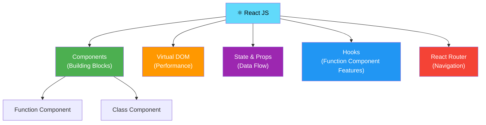
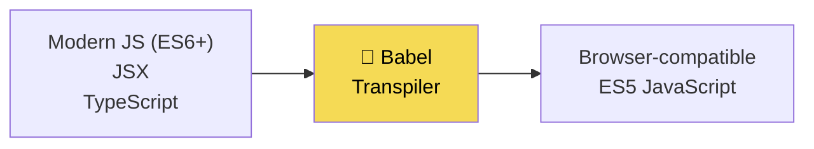
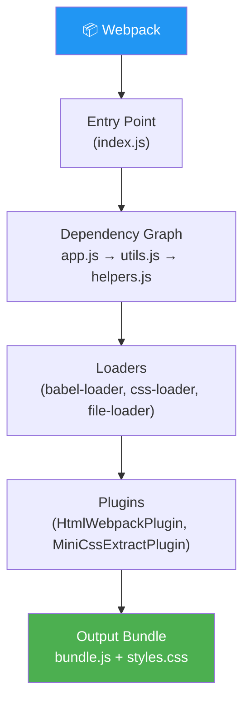
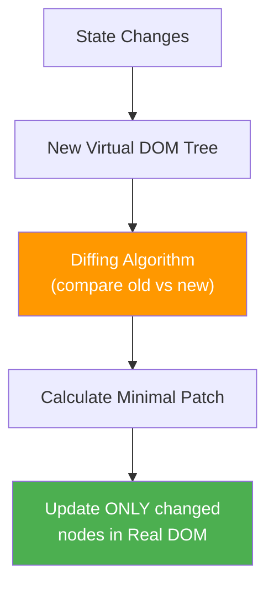
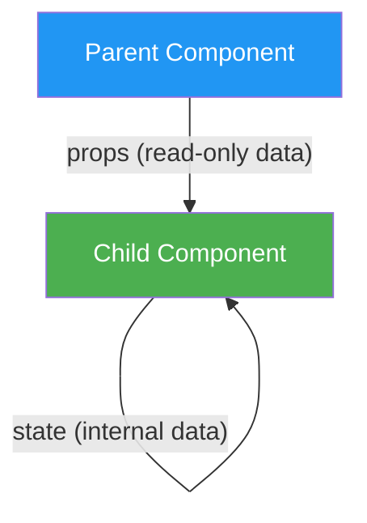
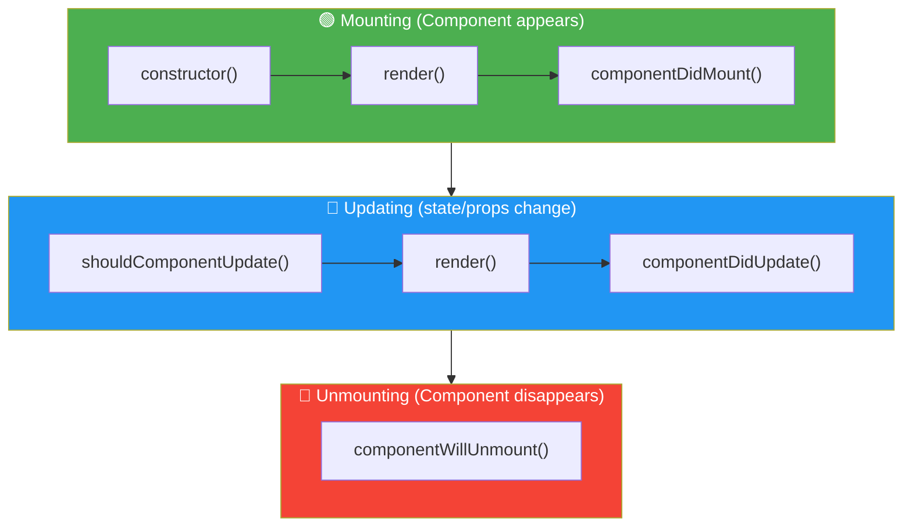

# React JS — Beginner's Complete Guide

---

## 📚 Table of Contents

1. [What is React JS?](#1-what-is-react-js)
2. [JSX — JavaScript XML](#2-jsx--javascript-xml)
3. [Babel & Webpack](#3-babel--webpack)
4. [Virtual DOM vs Real DOM](#4-virtual-dom-vs-real-dom)
5. [Class vs Function Components](#5-class-vs-function-components)
6. [Constructor, super() & render()](#6-constructor-super--render)
7. [State vs Props](#7-state-vs-props)
8. [Lifecycle Methods](#8-lifecycle-methods)
9. [Hooks — Introduction](#9-hooks--introduction)
10. [useState Hook](#10-usestate-hook)
11. [useEffect Hook](#11-useeffect-hook)
12. [Fragments](#12-fragments)
13. [React Router](#13-react-router)
14. [export vs export default](#14-export-vs-export-default)
15. [node_modules & package.json](#15-node_modules--packagejson)
16. [Default Port & Changing It](#16-default-port--changing-it)

---



---

# 1. What is React JS?

> **React JS** is an open-source **JavaScript library** developed and maintained by **Meta (Facebook)** for building fast, interactive **User Interfaces (UI)**. It was first released in **2013**.
>
> React follows a **component-based architecture** — the UI is broken into small, reusable, independent pieces called **components**. Each component manages its own state and renders its own UI. Components are composed together to build complex UIs.

## Key Characteristics

| Feature | Description |
|---|---|
| **Component-Based** | UI split into reusable, independent pieces |
| **Declarative** | You describe *what* the UI should look like; React handles *how* to update it |
| **Virtual DOM** | React maintains a lightweight copy of the DOM for efficient updates |
| **Unidirectional Data Flow** | Data flows in one direction — parent → child via props |
| **Library, not Framework** | Handles only the View layer; routing, state management are separate |

## React vs Framework

```
JavaScript Framework (Angular)  →  Gives you EVERYTHING (routing, HTTP, forms, DI)
JavaScript Library (React)      →  Gives you the VIEW layer only
                                    You choose your own tools for the rest
```

```jsx
// A minimal React app
import React from 'react';
import ReactDOM from 'react-dom/client';

function App() {
    return <h1>Hello, React! 🚀</h1>;
}

const root = ReactDOM.createRoot(document.getElementById('root'));
root.render(<App />);
```

---

# 2. JSX — JavaScript XML

> **JSX (JavaScript XML)** is a **syntax extension** for JavaScript that lets you write HTML-like code directly inside JavaScript files. It was designed by the React team to make component code more readable and intuitive.
>
> JSX is **not valid JavaScript** — it must be **compiled** (by Babel) into `React.createElement()` calls before the browser can understand it.


## JSX Rules

```jsx
// ── 1. Must return a SINGLE root element ─────────────────────
// ❌ Wrong
function Bad() {
    return (
        <h1>Title</h1>
        <p>Paragraph</p>   // Error — two siblings!
    );
}

// ✅ Correct — wrap in a div or Fragment
function Good() {
    return (
        <div>
            <h1>Title</h1>
            <p>Paragraph</p>
        </div>
    );
}

// ── 2. Use className, not class ──────────────────────────────
const el = <div className="container">...</div>;  // ✅
// <div class="container">   ← ❌ 'class' is reserved in JS

// ── 3. Use camelCase for attributes ─────────────────────────
const btn = <button onClick={handleClick} tabIndex={1}>Click</button>;

// ── 4. Self-close empty elements ────────────────────────────
const img  = ;
const input = <input type="text" />;

// ── 5. JavaScript expressions inside {} ─────────────────────
const name = "Hitesh";
const age  = 30;
const el2  = (
    <div>
        <h1>Hello, {name}!</h1>
        <p>Age: {age}</p>
        <p>Adult: {age >= 18 ? "Yes" : "No"}</p>
        <p>Score: {2 + 2}</p>
    </div>
);

// ── 6. Style as object, not string ───────────────────────────
const style = { color: "red", fontSize: "16px" };
const styled = <p style={style}>Styled text</p>;
// or inline:
const inline = <p style={{ color: "blue", fontWeight: "bold" }}>Text</p>;

// ── What JSX compiles to ─────────────────────────────────────
// This JSX:
const element = <h1 className="title">Hello</h1>;

// Compiles to:
const element2 = React.createElement(
    "h1",
    { className: "title" },
    "Hello"
);
```

---

# 3. Babel & Webpack

## Babel

> **Babel** is a **JavaScript compiler (transpiler)** that converts modern JavaScript (ES6+) and JSX into older JavaScript that all browsers can understand.



```javascript
// Input (Modern JS + JSX)
const greet = (name) => <h1>Hello, {name}!</h1>;

// Output (Babel compiled — ES5 + React.createElement)
var greet = function(name) {
    return React.createElement("h1", null, "Hello, ", name, "!");
};
```

**Babel Presets used in React:**
- `@babel/preset-env` — transpiles ES6+ to ES5
- `@babel/preset-react` — transforms JSX → `React.createElement()`
- `@babel/preset-typescript` — strips TypeScript types

## Webpack

> **Webpack** is a **module bundler** — it takes all your JavaScript files, CSS, images, and other assets, resolves their dependencies, and bundles them into **one or a few optimized output files**.



| Tool | Role | Analogy |
|---|---|---|
| **Babel** | Translates modern code → old code | A language translator |
| **Webpack** | Bundles all files → one file | A packing machine |

> 💡 In modern React projects using **Create React App** or **Vite**, Babel and Webpack (or Vite's own bundler) are pre-configured. You don't need to set them up manually.

---

# 4. Virtual DOM vs Real DOM

## Real DOM

> The **Real DOM (Document Object Model)** is the actual tree structure the browser creates from HTML. Every time data changes, the browser may **re-render the entire DOM tree**, which is slow because it involves:
> - Re-calculating CSS styles
> - Re-doing layout (reflow)
> - Re-painting pixels (repaint)

## Virtual DOM

> The **Virtual DOM** is a **lightweight JavaScript object (a plain JS tree)** that React keeps in memory as a representation of the Real DOM. When state changes, React:
> 1. Creates a new Virtual DOM tree
> 2. **Diffs** it against the previous Virtual DOM (using the **Reconciliation** algorithm)
> 3. Calculates the **minimum set of changes** needed
> 4. Applies **only those changes** to the Real DOM



## Shadow DOM

> The **Shadow DOM** is a **browser-native technology** (NOT React-specific) that encapsulates a component's HTML and CSS into a separate, isolated DOM tree. Used by Web Components (e.g., `<video>`, `<input type="range">` internally use Shadow DOM).

## Comparison Table

| Feature | Real DOM | Virtual DOM | Shadow DOM |
|---|---|---|---|
| **What it is** | Actual browser DOM | JS object copy of DOM | Isolated DOM sub-tree |
| **Who uses it** | Browser | React, Vue | Web Components |
| **Update speed** | Slow (full re-render) | Fast (diff + patch) | Fast (isolated scope) |
| **CSS scope** | Global | Global | **Encapsulated** |
| **Purpose** | Render the page | Performance optimization | Style/DOM encapsulation |

```jsx
// React re-renders only what changed — the Virtual DOM makes this efficient
function Counter() {
    const [count, setCount] = React.useState(0);

    return (
        <div>
            <h1>Count: {count}</h1>         {/* Only this updates */}
            <p>Static paragraph</p>          {/* This does NOT re-render */}
            <button onClick={() => setCount(count + 1)}>+1</button>
        </div>
    );
}
```

---

# 5. Class vs Function Components

## Class Component

> A **Class Component** is an ES6 class that extends `React.Component`. It has access to **lifecycle methods** and manages state via `this.state`.

```jsx
import React, { Component } from 'react';

class Greeting extends Component {
    constructor(props) {
        super(props);
        this.state = {
            count: 0,
            name: "Hitesh"
        };
    }

    increment = () => {
        this.setState({ count: this.state.count + 1 });
    };

    render() {
        return (
            <div>
                <h1>Hello, {this.state.name}!</h1>
                <p>Count: {this.state.count}</p>
                <button onClick={this.increment}>Increment</button>
            </div>
        );
    }
}

export default Greeting;
```

## Function Component

> A **Function Component** is a plain JavaScript function that returns JSX. With **Hooks** (introduced in React 16.8), function components can do everything class components can — and more cleanly.

```jsx
import React, { useState } from 'react';

function Greeting({ name = "Hitesh" }) {
    const [count, setCount] = useState(0);

    return (
        <div>
            <h1>Hello, {name}!</h1>
            <p>Count: {count}</p>
            <button onClick={() => setCount(count + 1)}>Increment</button>
        </div>
    );
}

export default Greeting;
```

## Comparison Table

| Feature | Class Component | Function Component |
|---|---|---|
| **Syntax** | ES6 class | JavaScript function |
| **State** | `this.state` + `this.setState()` | `useState()` hook |
| **Lifecycle** | `componentDidMount`, etc. | `useEffect()` hook |
| **`this` keyword** | Required everywhere | Not needed |
| **Boilerplate** | More verbose | Minimal |
| **Performance** | Slightly heavier | Lighter |
| **Hooks** | ❌ Not supported | ✅ Full support |
| **Recommended** | Legacy code | ✅ Modern standard |

> 💡 **React team recommends Function Components** with Hooks for all new code. Class components are still supported but no longer the preferred pattern.

---

# 6. Constructor, super() & render()

## constructor()

> The **constructor** is a special method in a class component that runs **once** when the component is first created. It is used to:
> 1. Initialize `this.state`
> 2. Bind event handler methods to `this`

## super(props)

> **`super(props)`** must be the **first line** inside the constructor when extending `React.Component`. It calls the parent class (`React.Component`) constructor, which:
> - Sets up internal React machinery on the instance
> - Makes `this.props` available inside the constructor
>
> Without `super(props)`, calling `this.props` inside the constructor would return `undefined`.

## render()

> The **`render()`** method is the **only required method** in a class component. It:
> - Must return JSX, `null`, a string, or a React element
> - Should be a **pure function** — no side effects, no `setState` calls
> - Is called every time state or props change

```jsx
import React, { Component } from 'react';

class UserCard extends Component {
    // 1. Constructor — runs first, once
    constructor(props) {
        super(props);  // MUST be first — sets up React.Component internals

        // Initialize state
        this.state = {
            isExpanded: false,
            likes: 0
        };

        // Bind methods (old pattern — arrow functions avoid this)
        this.handleToggle = this.handleToggle.bind(this);
    }

    // Custom method
    handleToggle() {
        this.setState(prevState => ({
            isExpanded: !prevState.isExpanded
        }));
    }

    // 2. render — runs every time state/props change
    render() {
        const { name, email } = this.props;
        const { isExpanded, likes } = this.state;

        return (
            <div className="card">
                <h2>{name}</h2>
                {isExpanded && <p>{email}</p>}
                <button onClick={this.handleToggle}>
                    {isExpanded ? "Hide" : "Show"} Details
                </button>
                <button onClick={() => this.setState({ likes: likes + 1 })}>
                    ❤️ {likes}
                </button>
            </div>
        );
    }
}

export default UserCard;
```

---

# 7. State vs Props

> **State** and **Props** are both plain JavaScript objects that hold data, but they serve completely different purposes.



## Props (Properties)

> **Props** are **external data** passed from a **parent component to a child component**. They are **read-only** — a child component should never modify its own props.

```jsx
// Parent passes props
function App() {
    return <UserCard name="Hitesh" age={30} role="admin" isActive={true} />;
}

// Child receives and uses props
function UserCard({ name, age, role, isActive }) {
    return (
        <div>
            <h2>{name}</h2>
            <p>Age: {age} | Role: {role}</p>
            <span>{isActive ? "🟢 Online" : "🔴 Offline"}</span>
        </div>
    );
}
```

## State

> **State** is **internal data** managed by the component itself. When state changes, React **re-renders** the component to reflect the new data.

```jsx
function LoginForm() {
    const [email,    setEmail]    = useState("");
    const [password, setPassword] = useState("");
    const [isLoading, setIsLoading] = useState(false);

    const handleSubmit = async (e) => {
        e.preventDefault();
        setIsLoading(true);
        await login(email, password);
        setIsLoading(false);
    };

    return (
        <form onSubmit={handleSubmit}>
            <input value={email}    onChange={e => setEmail(e.target.value)}    type="email" />
            <input value={password} onChange={e => setPassword(e.target.value)} type="password" />
            <button disabled={isLoading}>{isLoading ? "Logging in..." : "Login"}</button>
        </form>
    );
}
```

## Comparison Table

| Feature | Props | State |
|---|---|---|
| **Source** | Passed from parent | Managed internally |
| **Mutable?** | ❌ Read-only | ✅ Can be changed |
| **Who owns it?** | Parent component | The component itself |
| **Triggers re-render?** | Yes (when parent re-renders) | Yes (on change) |
| **Accessible by** | Child (receiver) | Only the component |

---

# 8. Lifecycle Methods

> **Lifecycle Methods** are special methods in Class Components that React calls automatically at specific points in a component's life — **mounting** (appearing), **updating**, and **unmounting** (disappearing).



```jsx
import React, { Component } from 'react';

class DataFetcher extends Component {
    constructor(props) {
        super(props);
        this.state = { data: null, loading: true };
        console.log("1. constructor — component being built");
    }

    // Called AFTER component is inserted into the DOM
    // ✅ Perfect for: API calls, setting up subscriptions, DOM manipulation
    componentDidMount() {
        console.log("3. componentDidMount — component in DOM");
        fetch('/api/data')
            .then(res => res.json())
            .then(data => this.setState({ data, loading: false }));
    }

    // Called AFTER every update (state or props change)
    // ✅ Perfect for: responding to prop changes, additional fetch based on new props
    componentDidUpdate(prevProps, prevState) {
        if (prevProps.userId !== this.props.userId) {
            console.log("componentDidUpdate — userId changed, fetching new data");
            this.fetchUser(this.props.userId);
        }
    }

    // Called just BEFORE component is removed from DOM
    // ✅ Perfect for: clearing timers, cancelling subscriptions, cleanup
    componentWillUnmount() {
        console.log("componentWillUnmount — cleanup time!");
        clearInterval(this.timerId);
        this.subscription?.unsubscribe();
    }

    // Optional: return false to skip re-render (performance optimization)
    shouldComponentUpdate(nextProps, nextState) {
        return nextState.data !== this.state.data;
    }

    render() {
        console.log("2. render — building virtual DOM");
        const { data, loading } = this.state;
        if (loading) return <p>Loading...</p>;
        return <div>{JSON.stringify(data)}</div>;
    }
}
```

## Lifecycle Methods Summary

| Method | Phase | Use Case |
|---|---|---|
| `constructor()` | Mounting | Initialize state, bind methods |
| `render()` | Mounting & Updating | Return JSX |
| `componentDidMount()` | Mounting | API calls, subscriptions, DOM setup |
| `shouldComponentUpdate()` | Updating | Performance — skip unnecessary renders |
| `componentDidUpdate()` | Updating | Side effects based on prop/state changes |
| `componentWillUnmount()` | Unmounting | Cleanup timers, subscriptions, listeners |

---

# 9. Hooks — Introduction

> **Hooks** are special functions introduced in **React 16.8** that let **function components** use state, lifecycle features, and other React capabilities that were previously only available in class components.

## Rules of Hooks

> ⚠️ These are not suggestions — violating them causes bugs.

1. **Only call Hooks at the top level** — never inside loops, conditions, or nested functions
2. **Only call Hooks from React function components** (or custom hooks) — not from regular JS functions

```jsx
// ❌ Wrong — Hook inside a condition
function Bad({ isLoggedIn }) {
    if (isLoggedIn) {
        const [data, setData] = useState(null); // conditional hook!
    }
}

// ✅ Correct — Hook always at top level
function Good({ isLoggedIn }) {
    const [data, setData] = useState(null); // always called, condition used inside
    if (!isLoggedIn) return null;
    return <div>{data}</div>;
}
```

## Built-in Hooks Overview

| Hook | Purpose |
|---|---|
| `useState` | Add state to a function component |
| `useEffect` | Perform side effects (API calls, subscriptions, timers) |
| `useContext` | Access context values without prop drilling |
| `useRef` | Reference DOM elements or persist mutable values |
| `useMemo` | Memoize expensive computed values |
| `useCallback` | Memoize callback functions |
| `useReducer` | Complex state logic (like Redux, locally) |
| `useLayoutEffect` | Like `useEffect` but fires synchronously after DOM mutations |

---

# 10. useState Hook

> **`useState`** is the most fundamental Hook. It lets you add **reactive state** to a function component. When state changes, React re-renders the component.

## Syntax

```javascript
const [state, setState] = useState(initialValue);
//     ↑         ↑                 ↑
//  current    function         starting
//   value     to update it     value
```

```jsx
import React, { useState } from 'react';

function Counter() {
    // State with a number
    const [count, setCount] = useState(0);

    // State with a string
    const [name, setName] = useState("Hitesh");

    // State with an object
    const [user, setUser] = useState({ name: "", email: "" });

    // State with an array
    const [items, setItems] = useState([]);

    // Update primitive state
    const increment = () => setCount(count + 1);
    const decrement = () => setCount(prev => prev - 1); // using prev (safe)

    // Update object state — must spread to keep other properties
    const updateName = (name) => setUser(prev => ({ ...prev, name }));

    // Update array state — never mutate directly!
    const addItem    = (item) => setItems(prev => [...prev, item]);
    const removeItem = (id)   => setItems(prev => prev.filter(i => i.id !== id));

    return (
        <div>
            <h1>Count: {count}</h1>
            <button onClick={increment}>+</button>
            <button onClick={decrement}>-</button>
            <button onClick={() => setCount(0)}>Reset</button>

            <input
                value={name}
                onChange={e => setName(e.target.value)}
            />
            <p>Hello, {name}!</p>
        </div>
    );
}

// Lazy initialization — for expensive initial computation
function ExpensiveComponent() {
    // ✅ Pass a function — runs only once, not on every render
    const [data, setData] = useState(() => {
        return JSON.parse(localStorage.getItem('data')) ?? [];
    });
    return <div>{data.length} items</div>;
}
```

---

# 11. useEffect Hook

> **`useEffect`** lets you perform **side effects** in function components — operations that happen outside React's rendering process: API calls, subscriptions, timers, DOM manipulation, logging.

## Syntax

```javascript
useEffect(() => {
    // side effect code (runs after render)

    return () => {
        // cleanup function (runs before next effect or unmount)
    };
}, [dependencies]); // controls when effect runs
```

## Dependency Array Controls When Effect Runs

```jsx
import React, { useState, useEffect } from 'react';

function Examples() {
    const [count, setCount] = useState(0);
    const [userId, setUserId] = useState(1);

    // ── No dependency array — runs after EVERY render
    useEffect(() => {
        console.log("Runs after every render");
    });

    // ── Empty array [] — runs ONCE after initial mount
    useEffect(() => {
        console.log("Runs once — like componentDidMount");
        // Ideal for: initial data fetch, global subscriptions
    }, []);

    // ── Specific dependencies — runs when those values change
    useEffect(() => {
        console.log(`userId changed to ${userId} — fetching user`);
        fetch(`/api/users/${userId}`)
            .then(res => res.json())
            .then(data => console.log(data));
    }, [userId]); // only re-runs when userId changes

    // ── With cleanup — like componentWillUnmount
    useEffect(() => {
        const timerId = setInterval(() => {
            setCount(prev => prev + 1);
        }, 1000);

        // Cleanup: clears interval when component unmounts or before next effect
        return () => {
            clearInterval(timerId);
            console.log("Cleaned up timer");
        };
    }, []); // only set up once

    return <div>Count: {count}</div>;
}
```

## Real-World Data Fetching

```jsx
function UserProfile({ userId }) {
    const [user, setUser]       = useState(null);
    const [loading, setLoading] = useState(true);
    const [error, setError]     = useState(null);

    useEffect(() => {
        let isCancelled = false; // prevent state update on unmounted component

        setLoading(true);
        setError(null);

        fetch(`/api/users/${userId}`)
            .then(res => {
                if (!res.ok) throw new Error("User not found");
                return res.json();
            })
            .then(data => {
                if (!isCancelled) {
                    setUser(data);
                    setLoading(false);
                }
            })
            .catch(err => {
                if (!isCancelled) {
                    setError(err.message);
                    setLoading(false);
                }
            });

        return () => { isCancelled = true; }; // cleanup on userId change
    }, [userId]); // re-fetch whenever userId changes

    if (loading) return <p>Loading...</p>;
    if (error)   return <p>Error: {error}</p>;
    return <div>{user?.name}</div>;
}
```

---

# 12. Fragments

> **Fragments** let you group multiple JSX elements **without adding an extra DOM node**. React requires a single root element in JSX — Fragments satisfy that requirement without polluting the HTML with unnecessary wrapper `<div>`s.

```jsx
import React, { Fragment } from 'react';

// Problem — unnecessary wrapper div
function BadList() {
    return (
        <div> {/* ← This div adds an unwanted DOM node */}
            <h1>Title</h1>
            <p>Paragraph</p>
        </div>
    );
}

// ✅ Solution 1 — React.Fragment (verbose, but allows key prop)
function GoodList1() {
    return (
        <React.Fragment>
            <h1>Title</h1>
            <p>Paragraph</p>
        </React.Fragment>
    );
}

// ✅ Solution 2 — Short syntax <> </> (most common)
function GoodList2() {
    return (
        <>
            <h1>Title</h1>
            <p>Paragraph</p>
        </>
    );
}

// ✅ Fragment with key prop — needed when rendering lists
function Table({ rows }) {
    return (
        <tbody>
            {rows.map(row => (
                <React.Fragment key={row.id}>  {/* key required → use React.Fragment */}
                    <tr><td>{row.name}</td></tr>
                    <tr><td>{row.email}</td></tr>
                </React.Fragment>
            ))}
        </tbody>
    );
}
```

> 💡 **When to use**: When a component returns sibling elements (table rows, list items, definition list terms), or when adding a wrapper div would break CSS layout (e.g., Flexbox, Grid children).

---

# 13. React Router

> **React Router** is the standard library for implementing **client-side navigation** in React applications. It maps URL paths to components — rendering different components based on the current URL **without full page reloads**.

```bash
npm install react-router-dom
```

```mermaid
flowchart LR
    URL["URL Changes"]
    RR["React Router"]
    URL --> RR
    RR -->|"/"|    H["Home Component"]
    RR -->|"/about"| A["About Component"]
    RR -->|"/users/:id"| U["UserDetail Component"]
    RR -->|"*"| NF["404 Not Found"]
    style RR fill:#CA4245,color:#fff
```

```jsx
import {
    BrowserRouter,
    Routes,
    Route,
    Link,
    NavLink,
    useNavigate,
    useParams,
    useLocation,
    Outlet
} from 'react-router-dom';

// ── App Setup ────────────────────────────────────────────────
function App() {
    return (
        <BrowserRouter>
            <nav>
                <Link to="/">Home</Link>
                <NavLink to="/about" style={({ isActive }) =>
                    isActive ? { color: "red" } : {}
                }>About</NavLink>
                <Link to="/users">Users</Link>
            </nav>

            <Routes>
                <Route path="/"         element={<Home />} />
                <Route path="/about"    element={<About />} />
                <Route path="/users"    element={<Users />} />
                <Route path="/users/:id" element={<UserDetail />} />

                {/* Nested routes */}
                <Route path="/dashboard" element={<Dashboard />}>
                    <Route path="profile"   element={<Profile />} />
                    <Route path="settings"  element={<Settings />} />
                </Route>

                <Route path="*" element={<NotFound />} /> {/* 404 */}
            </Routes>
        </BrowserRouter>
    );
}

// ── URL Parameters ───────────────────────────────────────────
function UserDetail() {
    const { id } = useParams(); // extract :id from URL
    return <h1>User ID: {id}</h1>;
}

// ── Programmatic Navigation ──────────────────────────────────
function LoginPage() {
    const navigate = useNavigate();

    const handleLogin = async () => {
        await login();
        navigate("/dashboard");          // go to /dashboard
        navigate(-1);                    // go back
        navigate("/home", { replace: true }); // replace history entry
    };
    return <button onClick={handleLogin}>Login</button>;
}

// ── Access current location ──────────────────────────────────
function CurrentPage() {
    const location = useLocation();
    console.log(location.pathname); // "/about"
    console.log(location.search);   // "?page=2"
    return <div>{location.pathname}</div>;
}

// ── Nested Routes — Outlet renders child routes ──────────────
function Dashboard() {
    return (
        <div>
            <h1>Dashboard</h1>
            <nav>
                <Link to="profile">Profile</Link>
                <Link to="settings">Settings</Link>
            </nav>
            <Outlet /> {/* Child route renders here */}
        </div>
    );
}
```

---

# 14. export vs export default

> JavaScript modules support two styles of export — **named** and **default** — and React files commonly use both.

```jsx
// ── Named Export ─────────────────────────────────────────────
// File: utils.js
export const PI = 3.14159;
export function add(a, b) { return a + b; }
export function multiply(a, b) { return a * b; }
export class Helper { /* ... */ }

// Importing named exports — braces REQUIRED, name must match exactly
import { PI, add, multiply } from './utils';
import { add as sum }        from './utils'; // rename on import
import * as Utils            from './utils'; // import all as namespace

// ── Default Export ───────────────────────────────────────────
// File: Button.jsx
function Button({ label, onClick }) {
    return <button onClick={onClick}>{label}</button>;
}
export default Button;  // ONE default per file

// Importing default — no braces, can use ANY name
import Button       from './Button';
import MyBtn        from './Button'; // same import, different name
import CoolButton   from './Button'; // still works!

// ── Combined — named + default ───────────────────────────────
// File: UserCard.jsx
export const USER_ROLES = ["admin", "user", "guest"]; // named
export function formatName(n) { return n.trim(); }    // named

function UserCard({ name }) { return <div>{name}</div>; }
export default UserCard;  // default

// Importing both
import UserCard, { USER_ROLES, formatName } from './UserCard';
```

| Feature | Named Export | Default Export |
|---|---|---|
| Quantity per file | Multiple | One |
| Import syntax | `import { name }` | `import anything` |
| Name flexibility | Must match | Any name |
| Tree-shaking | Better | Good |
| Typical use in React | Utilities, constants, hooks | Components |

---

# 15. node_modules & package.json

## node_modules

> **`node_modules/`** is the directory where **npm (Node Package Manager)** installs all your project's **third-party dependencies** (React, Webpack, Babel, etc.) and their own dependencies.

```
my-react-app/
├── node_modules/     ← ALL installed packages live here (can be huge!)
│   ├── react/
│   ├── react-dom/
│   └── ... (thousands of packages)
├── public/
├── src/
├── package.json      ← lists your direct dependencies
└── package-lock.json ← exact versions of every installed package
```

> ⚠️ **Never commit `node_modules/` to Git** — add it to `.gitignore`. Anyone can recreate it with `npm install`.

## package.json

```json
{
    "name": "my-react-app",
    "version": "1.0.0",
    "scripts": {
        "start":  "react-scripts start",
        "build":  "react-scripts build",
        "test":   "react-scripts test"
    },
    "dependencies": {
        "react":      "^18.2.0",
        "react-dom":  "^18.2.0"
    },
    "devDependencies": {
        "@testing-library/react": "^14.0.0"
    }
}
```

```bash
npm install          # install all dependencies from package.json
npm install react    # install a specific package
npm install -D jest  # install as devDependency
npm uninstall react  # remove a package
npm run start        # run the 'start' script
npm run build        # create production build
```

---

# 16. Default Port & Changing It

> React apps created with **Create React App (CRA)** run on **port 3000** by default. **Vite** uses **port 5173** by default.

```bash
# Default URLs
http://localhost:3000   ← Create React App
http://localhost:5173   ← Vite
```

## How to Change the Port

```bash
# ── Method 1: Environment variable in command ────────────────
# Linux / macOS
PORT=4000 npm start

# Windows CMD
set PORT=4000 && npm start

# Windows PowerShell
$env:PORT=4000; npm start
```

```bash
# ── Method 2: .env file (Create React App) ──────────────────
# Create .env file in project root
PORT=4000

# Then just run normally
npm start
# Now runs on http://localhost:4000
```

```javascript
// ── Method 3: Vite config (vite.config.js) ──────────────────
import { defineConfig } from 'vite';
import react from '@vitejs/plugin-react';

export default defineConfig({
    plugins: [react()],
    server: {
        port: 4000,
        open: true,   // auto-open browser
    }
});
```

```javascript
// ── Method 4: Webpack config (if ejected from CRA) ───────────
module.exports = {
    devServer: {
        port: 4000,
    }
};
```

---

*Notes based on official React documentation (react.dev) — covering React 18.*
