# Frontend System Design in 2026 — The AI Era

> A senior-developer field guide to designing modern web frontends when AI agents, LLM-powered UIs, and design-to-code pipelines are first-class citizens of the stack.
>
> Everything below is written for **staff / senior / lead** interviews and real production work. Each concept follows the same shape:
>
> **Definition → Deep dive → Real product example → Diagram (where useful) → When to use / avoid**

---

## 📚 Table of Contents

1. [Frontend Architecture Patterns (Evolution Timeline)](#1-frontend-architecture-patterns-evolution-timeline)
   - 1.1 [Static Page](#11-static-page)
   - 1.2 [MVC (Server-Rendered)](#12-mvc-server-rendered)
   - 1.3 [Single Page Application (SPA)](#13-single-page-application-spa)
   - 1.4 [Backend for Frontend (BFF)](#14-backend-for-frontend-bff)
   - 1.5 [Modular Monolith](#15-modular-monolith)
   - 1.6 [Micro Frontend](#16-micro-frontend)
2. [Frontend System Design for Senior Developers](#2-frontend-system-design-for-senior-developers)
   - 2.1 [Micro-frontends & Microservices](#21-micro-frontends--microservices)
   - 2.2 [API Gateways](#22-api-gateways)
   - 2.3 [Backend for Frontends (BFF) — Deep Dive](#23-backend-for-frontends-bff--deep-dive)
   - 2.4 [Load Balancing](#24-load-balancing)
   - 2.5 [Container Systems (Docker + Kubernetes)](#25-container-systems-docker--kubernetes)
   - 2.6 [Content Delivery Networks (CDN)](#26-content-delivery-networks-cdn)
   - 2.7 [Design Systems](#27-design-systems)
   - 2.8 [Design-to-Code & MCP](#28-design-to-code--mcp)
   - 2.9 [Monorepos](#29-monorepos)
   - 2.10 [MCP UI — Hybrid LLM + Component UIs](#210-mcp-ui--hybrid-llm--component-uis)
   - 2.11 [Core Web Vitals & Performance](#211-core-web-vitals--performance)
   - 2.12 [Code Splitting & Lazy Loading](#212-code-splitting--lazy-loading)
   - 2.13 [Rendering Strategies (CSR / SSG / SSR / ISR / PPR)](#213-rendering-strategies-csr--ssg--ssr--isr--ppr)
   - 2.14 [Data Fetching (Polling / WebSockets / SSE)](#214-data-fetching-polling--websockets--sse)
3. [15 Frontend Concepts Every Senior Dev Has Mastered](#3-15-frontend-concepts-every-senior-dev-has-mastered)
4. [The 3 Frontend Skills for the AI Era](#4-the-3-frontend-skills-for-the-ai-era)
5. [Putting It Together — Reference Architecture for 2026](#5-putting-it-together--reference-architecture-for-2026)

---

## 1. Frontend Architecture Patterns (Evolution Timeline)

The industry did not jump from Static HTML to Micro-Frontends. Each pattern was born to fix the pain of the previous one. Understanding this ladder is the fastest way to answer *"why did you pick architecture X?"* in an interview.

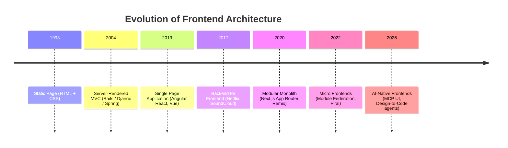

---

### 1.1 Static Page

**Definition**
Pre-built HTML/CSS/JS files served directly from disk or a CDN. No runtime templating, no server-side logic per request.

**How it works**

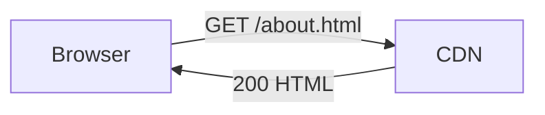

**When to use**
- Marketing sites, documentation, blogs, landing pages.
- Content that changes rarely and is the same for every visitor.

**Real product examples**
- **MDN Web Docs** — pre-rendered pages served from a CDN.
- **Stripe Docs**, **Tailwind CSS Docs** — SSG output published to Cloudflare/Vercel.
- **Personal portfolios** built with Astro or plain HTML.

**Pros / Cons**

| ✅ Pros | ❌ Cons |
|---|---|
| Fastest possible TTFB (edge cache hit) | No personalization per user |
| Cheapest hosting | Rebuild required for every content change |
| Trivially secure (no server code) | Dynamic features need extra services |

---

### 1.2 MVC (Server-Rendered)

**Definition**
The classic **Model – View – Controller** pattern. HTML is generated on the server per request using a templating engine (ERB, Blade, JSP, Razor, EJS).

**Flow**

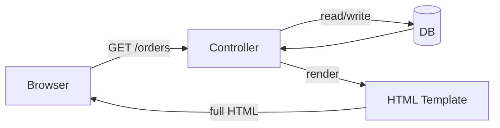

**Real product examples**
- **GitHub** (Rails) — still ships a huge amount of server-rendered HTML.
- **Shopify Admin** (Rails) — hybrid Rails + Hydrogen/React.
- **Basecamp / HEY** — Hotwire + Turbo, pure MVC with sprinkles of JS.
- **Stack Overflow** (ASP.NET MVC).

**Pros / Cons**

| ✅ Pros | ❌ Cons |
|---|---|
| SEO-friendly by default | Full-page reloads → laggy UX |
| Simple mental model | Frontend and backend tightly coupled |
| Great for CRUD apps | Hard to build "app-like" interactions |

---

### 1.3 Single Page Application (SPA)

**Definition**
A **single HTML shell** boots a client-side JavaScript app that handles routing, rendering, and state internally. The server only serves JSON APIs.

**Architecture**

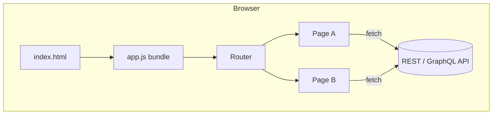

**Real product examples**
- **Gmail**, **Google Maps**, **Google Docs** — the pioneers.
- **Trello**, **Linear**, **Notion (desktop)** — app-like SPAs.
- **Figma** — SPA with WebAssembly rendering.

**Pros / Cons**

| ✅ Pros | ❌ Cons |
|---|---|
| Rich, app-like UX | Poor initial load and SEO without SSR |
| Clear frontend/backend contract | Large JS bundles (hydration cost) |
| Reusable APIs for web + mobile | Client state can drift from server |

---

### 1.4 Backend for Frontend (BFF)

**Definition**
A **dedicated backend per client** (Web BFF, iOS BFF, Android BFF) whose only job is to shape data for that specific UI. It sits between the client and downstream microservices.

**Diagram**

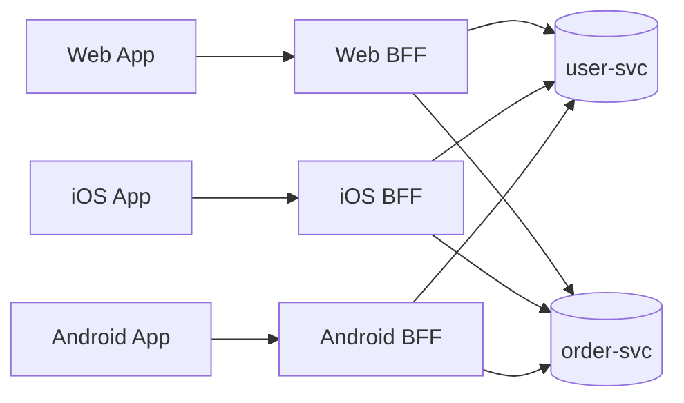

**Real product examples**
- **Netflix** — the pattern was coined here; each device family has its own BFF.
- **SoundCloud** — one of the first published case studies.
- **Spotify Web Player** vs mobile — different BFFs shape the same catalog.
- **Nama Yatra** (your own microservice repo) uses a Node/Express BFF pattern in front of Prisma-based domain services.

**Pros / Cons**

| ✅ Pros | ❌ Cons |
|---|---|
| Client-optimized payloads (mobile bandwidth) | More services to operate |
| Decouples UI teams from platform teams | Risk of duplicated logic across BFFs |
| Great security boundary (auth lives here) | Needs strong observability (traces) |

> ⚠️ Modern take: In Next.js/Remix apps, **route handlers / server actions** effectively behave as an in-process BFF.

---

### 1.5 Modular Monolith

**Definition**
A **single deployable frontend** (one build, one bundle graph) that is **internally divided into independent modules/domains** with strict boundaries (public APIs, no cross-imports of internals).

Think: microservice discipline, monolith deployment.

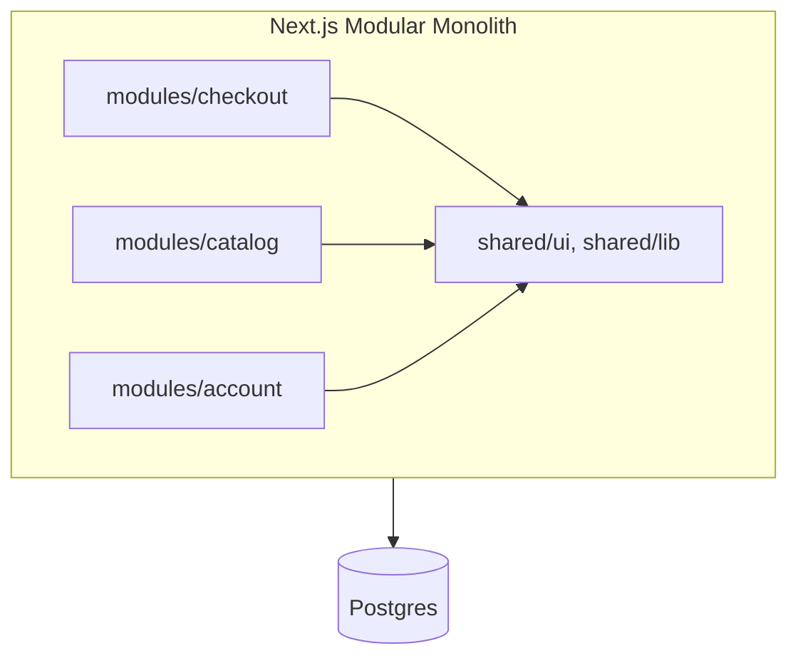

**Real product examples**
- **Vercel Dashboard**, **Linear web app** — one Next.js app, strict feature boundaries.
- **Shopify Hydrogen** storefronts.
- Most **Turborepo + Next.js app router** projects in 2025–2026.

**Pros / Cons**

| ✅ Pros | ❌ Cons |
|---|---|
| 90 % of micro-frontend benefits, 10 % of the ops cost | Requires discipline (lint rules, ESLint boundaries plugin) |
| Single deploy, single auth, single design system | One team can still break another at build time |
| Easy to split into MFEs later | Bundle size can grow if you don't code-split |

---

### 1.6 Micro Frontend

**Definition**
Vertically slice a large product so that **each team owns a full UI slice end-to-end** (UI + BFF + data), builds and deploys independently, and composes at runtime or build time.

**Composition styles**

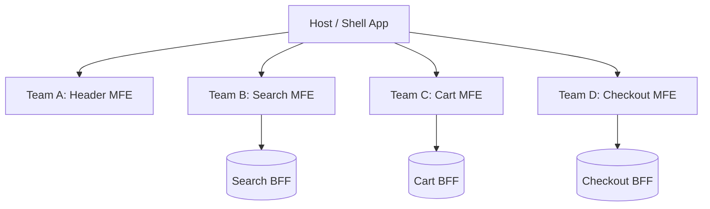

Techniques: **Webpack/Rspack Module Federation**, **iframes**, **Web Components**, **Server-side transclusion** (Podium, Tailor).

**Real product examples**
- **Amazon** product page — dozens of fragments composed server-side.
- **IKEA.com**, **Spotify Web** — Module Federation.
- **Zalando** — Project Mosaic (server-side composition).
- **DAZN**, **HelloFresh** — publicly documented MFE journeys.

**When it pays off**
- 50+ frontend engineers across 4+ autonomous teams.
- Different release cadences per area (checkout must not wait for marketing).
- Legacy + modern coexistence (migrating jQuery → React one slice at a time).

**When it does NOT pay off**
- < 20 devs → the coordination cost (shared design system, auth, routing) eats the win. Use a Modular Monolith instead.

---

## 2. Frontend System Design for Senior Developers

This section is what you draw on the whiteboard when the interviewer says *"design the frontend platform for a Netflix-scale product."*

### 2.1 Micro-frontends & Microservices

**Definition**
Split both the **UI monolith** and the **backend monolith** into **vertical slices** (feature → team → UI + service + DB). Each slice is independently deployable.

**Vertical vs Horizontal split**

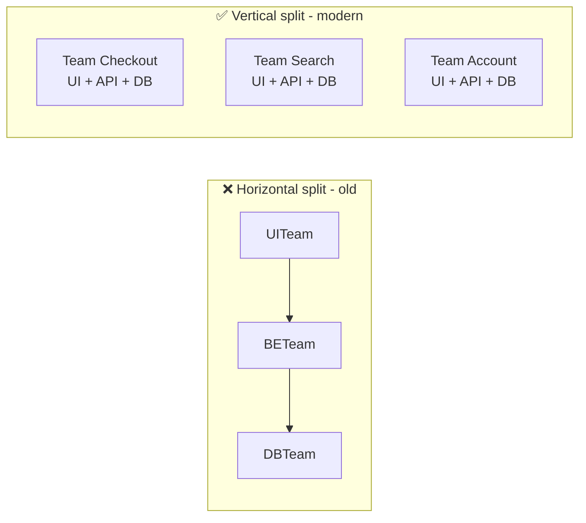

**Real example** — Spotify's "Squad / Tribe" model maps 1:1 onto vertical slices.

---

### 2.2 API Gateways

**Definition**
A single entry point in front of many microservices that centralizes **authN/authZ, rate limiting, request routing, caching, TLS termination, request/response transformation, and observability**.

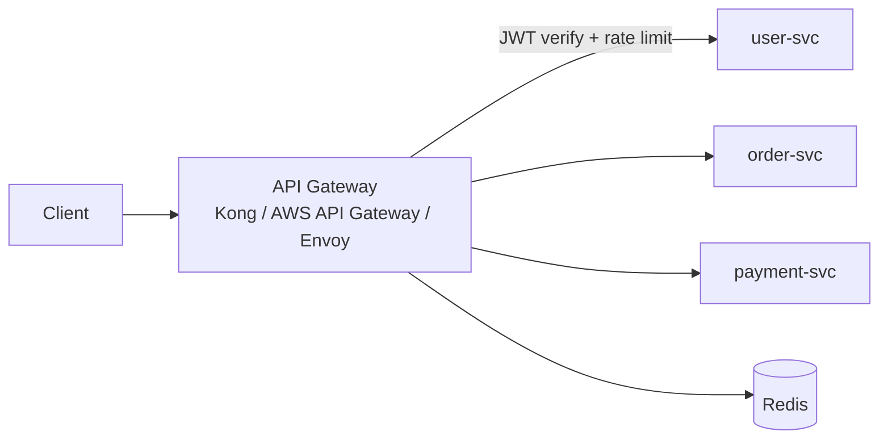

**Responsibilities checklist**

- ✅ Terminate TLS, enforce mTLS to downstream.
- ✅ Verify JWT / OAuth token, inject `x-user-id` header.
- ✅ Rate limit per API key / per IP / per user.
- ✅ Circuit breaker + retry with jitter.
- ✅ Response caching for idempotent GETs.
- ✅ Emit access logs + distributed traces (OpenTelemetry).

**Real products**
- **Kong**, **Amazon API Gateway**, **Envoy + Istio**, **Cloudflare API Shield**.

---

### 2.3 Backend for Frontends (BFF) — Deep Dive

Already introduced in [1.4](#14-backend-for-frontend-bff). Senior-level nuance:

- **BFF vs API Gateway**: Gateway is *generic* infrastructure; BFF is *product-aware* code owned by the UI team.
- **One BFF per experience**, not per team. (Web + iOS + Android + TV = 4 BFFs).
- **Colocate BFF with UI code** in a monorepo so types are shared (`tRPC`, GraphQL Codegen, Next.js Server Actions).
- **Cache aggressively** at the BFF (Redis) — this is where you kill N+1 chatter to microservices.

Example payload shaping — a mobile BFF returns:

```json
{ "hero": { "title": "…", "posterUrl": "…" }, "rows": [ … ] }
```

…while the web BFF returns the same data with extra fields (trailer URL, cast bios) because the web player supports more.

---

### 2.4 Load Balancing

**Definition**
Distribute incoming traffic across N replicas of the same service to increase throughput and availability.

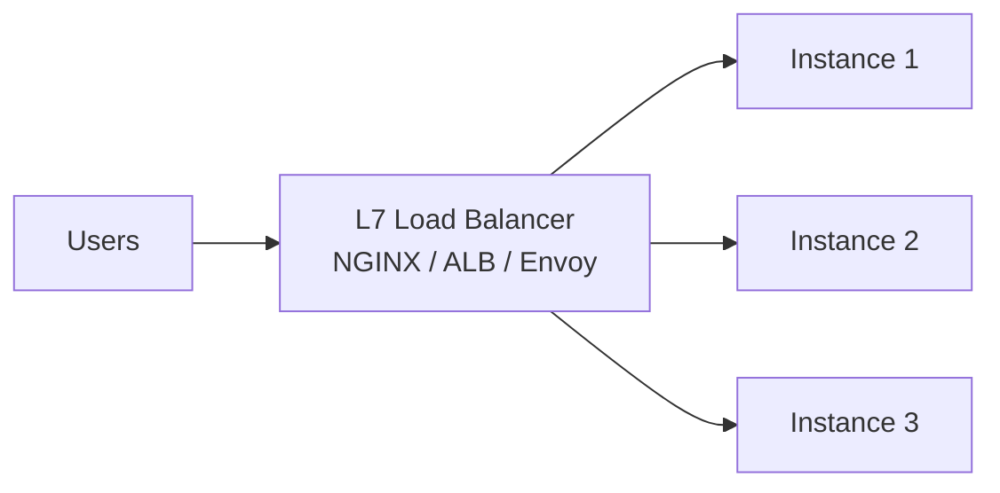

**Algorithms**

| Algorithm | Use case |
|---|---|
| Round-robin | Stateless HTTP servers |
| Least-connections | Long-lived connections (WebSockets, SSE) |
| IP hash / sticky sessions | Legacy stateful apps |
| Weighted | Canary deploys (5 % → new version) |
| Geo / latency-based | Global multi-region (Route 53, Cloudflare) |

**Real products**
- **AWS ALB / NLB**, **GCP Cloud Load Balancing**, **Cloudflare**, **HAProxy**, **Envoy**.

---

### 2.5 Container Systems (Docker + Kubernetes)

**Definition**
- **Docker** — package your app + deps into an immutable image.
- **Kubernetes** — orchestrate hundreds/thousands of those containers (scheduling, healing, rolling updates, autoscaling).

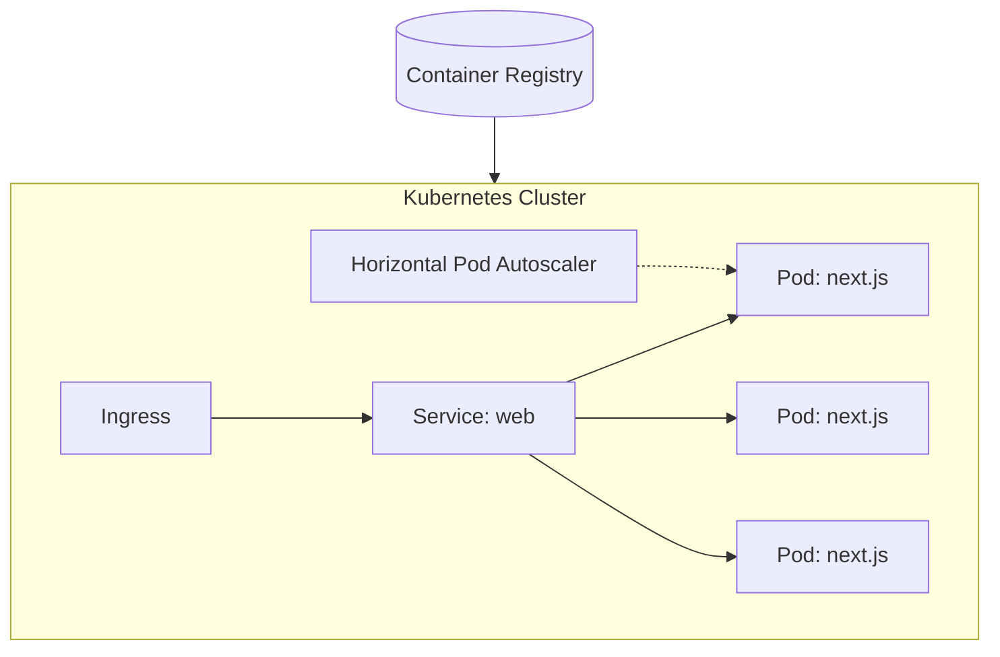

**Frontend-specific tips**
- Multi-stage `Dockerfile` → build with Node, ship with `nginx:alpine` or `node:alpine` running `next start`.
- Use **read-only rootfs** and **non-root user** for the runtime container.
- Configure **liveness / readiness / startup** probes correctly — a Next.js app needs a `/api/health` route.

**Real products**
- **Vercel**, **Netlify**, **Cloudflare Pages** hide K8s from you.
- **Airbnb**, **Shopify**, **Uber** run their SSR frontends on Kubernetes directly.

---

### 2.6 Content Delivery Networks (CDN)

**Definition**
A global network of edge servers that cache your static assets (and increasingly your HTML/JSON) close to users.

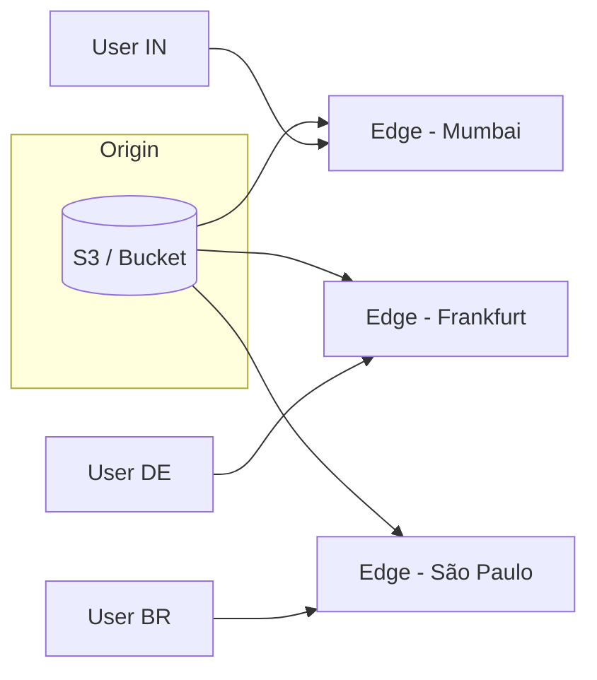

**What to put on the CDN**
- Static JS/CSS/images/fonts (immutable, `Cache-Control: public, max-age=31536000, immutable`).
- Pre-rendered HTML (SSG, ISR).
- API responses that are cacheable (with `stale-while-revalidate`).
- Even SSR HTML in 2026 (Vercel/Cloudflare stream SSR at the edge).

**Real products**
- **Cloudflare**, **Akamai**, **Fastly**, **AWS CloudFront**, **Vercel Edge Network**.

---

### 2.7 Design Systems

**Definition**
A single source of truth for **design tokens + reusable components + usage guidelines** that ships as a package (e.g., `@company/ui`) consumed by every product.

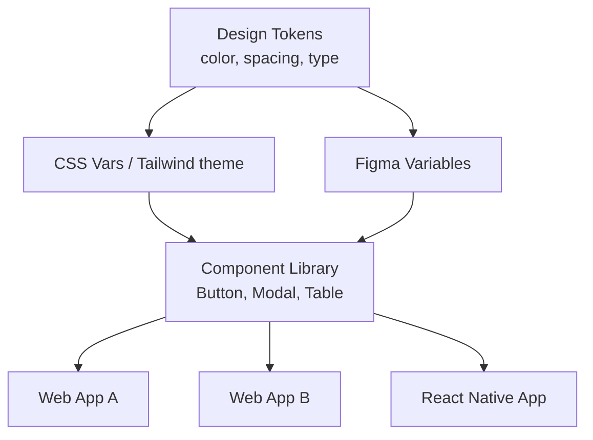

**Real product examples**
- **Material Design 3** (Google), **Fluent 2** (Microsoft), **Polaris** (Shopify), **Primer** (GitHub), **Carbon** (IBM), **Base Web** (Uber), **Atlassian Design System**.

**Senior-level concerns**
- Token pipeline (**Style Dictionary**) → CSS vars + iOS + Android + Figma.
- Headless primitives (**Radix**, **React Aria**) + your own theme layer.
- Versioning strategy — SemVer + a **deprecation policy**.
- Chromatic / Playwright visual regression tests.

---

### 2.8 Design-to-Code & MCP

**Definition**
Using **Model Context Protocol (MCP)** servers to let coding agents (Claude, Copilot, Cursor) read Figma files, design tokens, and component libraries directly — so "convert this frame to production React code" becomes a single agent call.

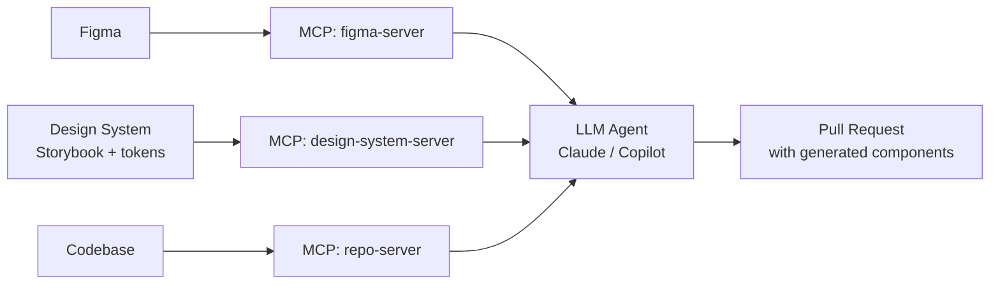

**Real products**
- **Figma Dev Mode MCP Server** (official, 2025).
- **Storybook MCP** — expose components + args to LLMs.
- **v0 by Vercel**, **Builder.io Visual Copilot** — design-to-code pipelines.

**Why it matters for interviews**
Senior candidates in 2026 are expected to design the **feedback loop**: Figma → MCP → Agent → PR → Chromatic diff → human review.

---

### 2.9 Monorepos

**Definition**
Multiple apps and packages in **one Git repository**, sharing tooling (lint, TS config, CI), types, and versioning.

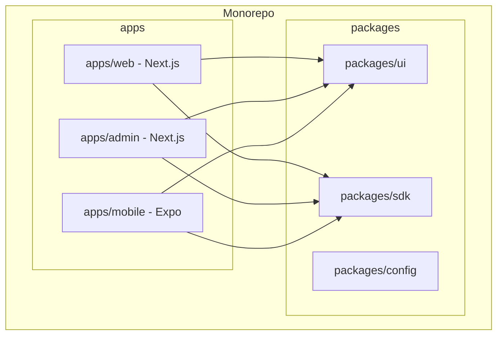

**Tools in 2026**
- **Turborepo** (Vercel) — remote cache, best for JS/TS.
- **Nx** — richer generators + affected graph.
- **pnpm workspaces** — the package manager everyone actually uses.
- **Bazel** / **Buck2** — for Google/Meta scale.

**Real product examples**
- Google, Meta, Microsoft, **Vercel**, **Shopify**, **Airbnb**, **Uber**.

---

### 2.10 MCP UI — Hybrid LLM + Component UIs

**Definition**
Applications where an **LLM chat** and a **traditional component UI** are peers: the model can render, mutate, and read UI state through an MCP-defined tool surface, and the UI can send structured context back to the model.

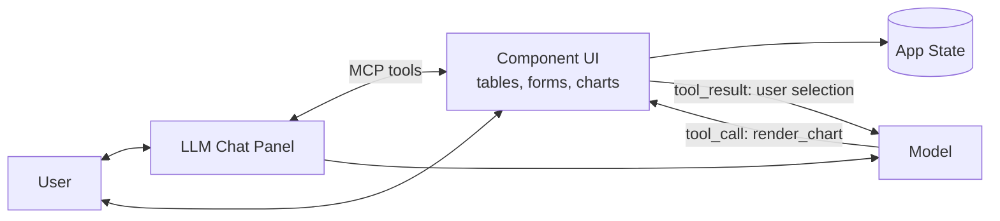

**Real product examples**
- **ChatGPT Canvas / Claude Artifacts** — LLM renders editable UI blocks.
- **Vercel AI SDK "Generative UI"** — model streams React Server Components.
- **Linear AI**, **Notion AI**, **Cursor Composer** — chat lives inside the app.

**Senior design concerns**
- Deterministic tool schema (Zod / JSON Schema) — the model must never hallucinate props.
- Streaming UI (RSC + Suspense).
- Guardrails: rate limits, PII redaction, output moderation.
- Undo/redo — every agent action must be reversible.

---

### 2.11 Core Web Vitals & Performance

**Definition — the three metrics Google actually ranks on**

| Metric | Measures | Good | Needs Improvement | Poor |
|---|---|---|---|---|
| **LCP** — Largest Contentful Paint | Loading | ≤ 2.5 s | ≤ 4.0 s | > 4.0 s |
| **INP** — Interaction to Next Paint (replaced FID in 2024) | Interactivity | ≤ 200 ms | ≤ 500 ms | > 500 ms |
| **CLS** — Cumulative Layout Shift | Visual stability | ≤ 0.1 | ≤ 0.25 | > 0.25 |

**The Critical Rendering Path**

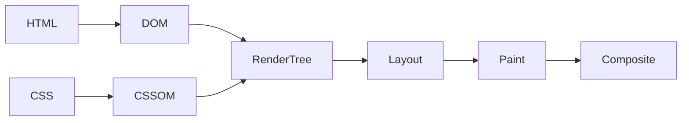

Optimization levers per metric:

- **LCP** — preload hero image, use `next/image`, avoid render-blocking JS, use SSR/SSG.
- **INP** — break up long tasks (`scheduler.yield()`), avoid heavy hydration, use `useDeferredValue`, React 19 transitions.
- **CLS** — always reserve space for images/ads (width/height, `aspect-ratio`), avoid injecting content above existing content.

**Real product example** — Shopify publicly documented cutting LCP by 40 % on merchant storefronts by moving to Hydrogen + Oxygen (edge SSR).

---

### 2.12 Code Splitting & Lazy Loading

**Definition**
Break the bundle into smaller chunks so users download only what they need for the current route/interaction.

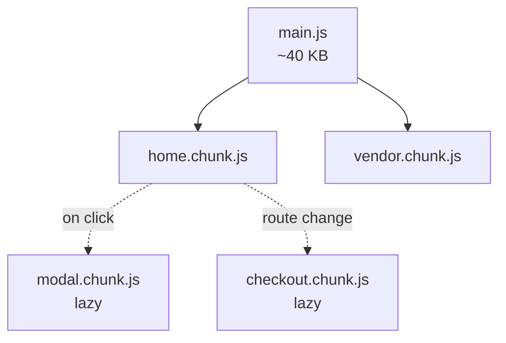

**Techniques**
- Route-level: `next/dynamic`, `React.lazy` + `<Suspense>`, `loadable-components`.
- Component-level: lazy-load modals, editors (Monaco), charts (Recharts).
- Data-level: `React.lazy` + streaming SSR + `Suspense` boundaries.
- Import maps + ES modules for micro-frontends.

**Rule of thumb** — anything > 30 KB gzip that isn't needed above-the-fold should be lazy.

---

### 2.13 Rendering Strategies (CSR / SSG / SSR / ISR / PPR)

**Comparison**

| Strategy | When HTML is built | Personalized? | TTFB | SEO | Cost |
|---|---|---|---|---|---|
| **CSR** | In the browser | Yes (after JS) | Fast (empty shell) | Poor | Low |
| **SSG** | At build time | No | Fastest (CDN) | Excellent | Lowest |
| **SSR** | Per request on server | Yes | Slower | Excellent | Higher CPU |
| **ISR** | At build + re-gen on demand | Semi | Fastest | Excellent | Low |
| **PPR** — Partial Pre-rendering | Static shell + streamed dynamic holes | Yes | Fastest | Excellent | Medium |

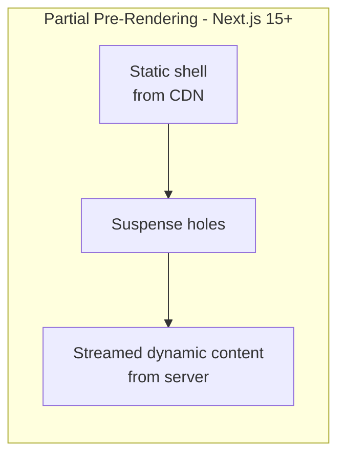

**Real product examples**
- **CSR** — Figma, Linear, Gmail.
- **SSG** — Stripe Docs, Tailwind Docs, most marketing sites.
- **SSR** — Airbnb, Twitter/X, LinkedIn.
- **ISR** — Vercel Marketplace, e-commerce PDPs.
- **PPR** — Vercel storefront starter, Shopify Hydrogen (2026).

---

### 2.14 Data Fetching (Polling / WebSockets / SSE)

```mermaid
flowchart TB
    subgraph Polling
        C1[Client] -->|GET every 5s| S1[Server]
        S1 --> C1
    end
    subgraph WebSocket
        C2[Client] <-->|full-duplex| S2[Server]
    end
    subgraph SSE
        C3[Client] <--|one-way stream| S3[Server]
    end
```

| Technique | Direction | Use case | Real example |
|---|---|---|---|
| **Short polling** | Client → Server | Simple status updates | Job status pages |
| **Long polling** | Client → Server (held open) | Legacy chat | Old Facebook chat |
| **WebSockets** | Bi-directional | Chat, multiplayer, collaboration | Figma, Slack, Google Docs |
| **Server-Sent Events** | Server → Client | Notifications, LLM token streaming | ChatGPT streaming responses |
| **HTTP/2 + streaming JSON** | Server → Client | RSC streaming, Suspense | Next.js App Router |
| **WebTransport** | Bi-directional over QUIC | Cloud gaming, low-latency | Emerging in 2026 |

**Senior tip** — for LLM UIs in 2026, **SSE + `fetch` streaming** wins over WebSockets 90 % of the time (simpler, HTTP semantics, works through proxies).

---

## 3. 15 Frontend Concepts Every Senior Dev Has Mastered

Compact, interview-ready one-liners. Each one is *"say this in 30 seconds, then draw one diagram."*

### 3.1 Critical Rendering Path
Ordered pipeline the browser follows: **HTML → DOM, CSS → CSSOM, JS execution, Render Tree, Layout, Paint, Composite**. Blocking any step delays first paint. Optimize by inlining critical CSS, deferring JS, and streaming HTML.

### 3.2 Bundle Splitting
Split the app into multiple chunks (`vendor`, `runtime`, per-route, per-component). Enables long-term HTTP caching (vendor rarely changes) and parallel downloads. Tools: Webpack SplitChunks, Rspack, Turbopack.

### 3.3 Server Side Rendering (SSR)
HTML is generated per request on the server, then hydrated on the client. Improves SEO and LCP, but costs server CPU. Modern flavor: **React Server Components + streaming SSR** (Next.js App Router, Remix).

### 3.4 Core Web Vitals
The three Google metrics: **LCP (loading), INP (interactivity), CLS (stability)**. Since 2024, INP replaced FID. Measured in the field via the `web-vitals` library and Chrome UX Report (CrUX).

### 3.5 Critical CSS
Inline the CSS needed for **above-the-fold** content in the `<head>` and lazy-load the rest. Killer for LCP. Tools: `critters`, `beasties`, Next.js automatic critical CSS.

### 3.6 HTTP Caching
Master these headers: `Cache-Control` (`public`, `max-age`, `immutable`, `stale-while-revalidate`, `s-maxage`), `ETag`, `Last-Modified`, `Vary`. Pattern for SPAs: **hash the filename → cache forever**; **HTML → no-cache**.

```mermaid
flowchart LR
    Browser -->|If-None-Match: etag| Server
    Server -->|304 Not Modified| Browser
```

### 3.7 Essential State Model
Classify state before choosing a library:

| Kind | Example | Tool |
|---|---|---|
| **Server** state | User, products | React Query / SWR / RSC |
| **URL** state | Filters, page | Router search params |
| **Form** state | Draft input | React Hook Form |
| **UI** state | Modal open? | `useState` |
| **Global** shared | Theme, auth | Zustand / Redux Toolkit |

Senior tip: **most bugs come from putting server state in Redux.**

### 3.8 Content Negotiation
Server picks the best representation based on `Accept`, `Accept-Encoding`, `Accept-Language`, `Sec-CH-*` client hints. Powers image format negotiation (AVIF → WebP → JPEG), i18n, and API versioning.

### 3.9 Lazy Loading
Defer non-critical work: `loading="lazy"` on ``/`<iframe>`, dynamic `import()`, `React.lazy`, IntersectionObserver, `content-visibility: auto`. The default for everything below the fold.

### 3.10 TT Reducer Pattern (Type-Tagged Reducer / Discriminated Unions)
Model state transitions with tagged unions instead of booleans.

```ts
type FetchState<T> =
  | { tag: 'idle' }
  | { tag: 'loading' }
  | { tag: 'success'; data: T }
  | { tag: 'error'; error: Error };
```

Kills the classic `isLoading && !error && data` bug. Combine with `useReducer` or XState.

### 3.11 Partial Pre-rendering (PPR)
Ship a **static shell** from the CDN instantly, then **stream in dynamic holes** (user greeting, cart count) from the server via Suspense. Introduced in Next.js 14/15 and now the default for Vercel apps in 2026.

### 3.12 Rehydration
Server sends HTML; client boots React and **attaches event listeners** to the existing DOM. Costs CPU on low-end phones. Cures: **selective / progressive / island / RSC** hydration (Astro islands, Qwik resumability, React 19 use client boundaries).

### 3.13 Server-Side Components (RSC)
React components that run **only on the server**, ship no JS, and can `await` data directly. Reduce bundle size and coupling. Marked implicitly server; client components require `"use client"`. Real usage: Next.js App Router, Remix v3.

### 3.14 Windowing (a.k.a. Virtualization)
Render only the rows visible in the viewport, recycle DOM nodes as the user scrolls. Handle 100k-row tables at 60 fps. Tools: **TanStack Virtual**, `react-window`, `react-virtuoso`. Used by Gmail, Slack, Notion databases.

### 3.15 Micro-frontends
Already covered in [1.6](#16-micro-frontend) and [2.1](#21-micro-frontends--microservices). Senior takeaway: **only reach for MFEs when org scale (not tech) forces it.**

---

## 4. The 3 Frontend Skills for the AI Era

In 2026, the bar for "senior frontend" has shifted. Framework knowledge is table stakes; the differentiators are below.

### Skill 1 — Frontend System Design
Everything in Sections 1–3 of this doc. You must be able to whiteboard:
- MFE vs Modular Monolith tradeoffs.
- BFF vs API Gateway vs Server Actions.
- Rendering strategy per page (SSG/SSR/PPR).
- Caching layers (browser → CDN → BFF → service).

### Skill 2 — Code Quality
- **Type-safety end-to-end**: DB → API → UI (Prisma → tRPC/GraphQL Codegen → React).
- **Automated review**: ESLint with `eslint-plugin-boundaries`, TypeScript strict, Knip (dead code), dependency-cruiser.
- **Prompt-driven code review**: AI PR reviewers (GitHub Copilot, CodeRabbit, Graphite) that read your `AGENTS.md` / `CLAUDE.md`.
- **Test pyramid**: unit (Vitest) → component (Playwright CT / Testing Library) → e2e (Playwright) → visual (Chromatic).

### Skill 3 — State and Data
- Choose the right store per state kind (see [3.7](#37-essential-state-model)).
- Prefer **server state libraries** (React Query, SWR, RSC) over global stores.
- Master **cache invalidation** — tag-based (`revalidateTag` in Next.js), event-driven (WebSockets bumping cache keys), or time-based (`stale-while-revalidate`).
- Handle **optimistic updates** and **conflict resolution** (CRDTs for collaborative apps — Liveblocks, Yjs).

### Skill 4 — Design to Code
- Read Figma programmatically via the **Figma MCP Server**.
- Map Figma variables → design tokens → CSS vars.
- Generate first-draft components with **v0 / Builder.io / Copilot** and refactor into design-system primitives.
- Enforce visual parity via Chromatic + Percy.

### Skill 5 — Web Performance & Automated Testing
- Own Core Web Vitals dashboards (Vercel Speed Insights, SpeedCurve, Sentry).
- Set a **performance budget** in CI (`bundlesize`, `size-limit`, Lighthouse CI).
- Automated a11y and perf checks on every PR (Playwright + axe-core, Lighthouse CI).
- **Synthetic + RUM** monitoring together — synthetic catches regressions before ship, RUM catches real-user variance.

### Skill 6 — Accessibility
- WCAG 2.2 AA as a **non-negotiable baseline**, not an afterthought.
- Semantic HTML first, ARIA only when the platform can't express it.
- Keyboard and screen-reader flows tested in CI (`@axe-core/playwright`, NVDA/VoiceOver spot checks).
- Prefer headless a11y-first libraries: **React Aria (Adobe)**, **Radix Primitives**, **Base UI**.
- Motion, contrast, and reduced-data preferences (`prefers-reduced-motion`, `prefers-contrast`).

---

## 5. Putting It Together — Reference Architecture for 2026

The system you should be able to draw when asked *"design the frontend for a Netflix-scale product with an AI copilot."*

```mermaid
flowchart TB
    subgraph Edge[Edge / CDN]
        CDN[Cloudflare / Vercel Edge]
        EdgeFn[Edge Functions<br/>PPR, A/B, auth check]
    end

    subgraph Clients
        Web[Web - Next.js 15 App Router]
        iOS[iOS App]
        Android[Android App]
        TV[Smart TV App]
    end

    subgraph Shell[Web Shell - Modular Monolith or MFE Host]
        Host[Host / Router]
        Catalog[Catalog Module]
        Player[Player Module]
        Account[Account Module]
        AICopilot[AI Copilot - MCP UI]
    end

    subgraph BFFs[BFF Layer]
        WebBFF[Web BFF - tRPC / Server Actions]
        MobileBFF[Mobile BFF - GraphQL]
        TVBFF[TV BFF - REST]
    end

    subgraph Platform[Platform Services]
        GW[API Gateway<br/>Envoy + OIDC]
        UserSvc[user-svc]
        CatalogSvc[catalog-svc]
        PlaySvc[playback-svc]
        RecSvc[recommendation-svc]
        LLMGW[LLM Gateway<br/>rate limit + guardrails]
    end

    subgraph Data
        PG[(Postgres)]
        Redis[(Redis)]
        Search[(OpenSearch)]
        Vector[(pgvector / Pinecone)]
    end

    Web --> CDN
    iOS --> CDN
    Android --> CDN
    TV --> CDN
    CDN --> EdgeFn
    EdgeFn --> Host
    Host --> Catalog
    Host --> Player
    Host --> Account
    Host --> AICopilot

    Catalog --> WebBFF
    Player --> WebBFF
    Account --> WebBFF
    AICopilot --> LLMGW

    iOS --> MobileBFF
    Android --> MobileBFF
    TV --> TVBFF

    WebBFF --> GW
    MobileBFF --> GW
    TVBFF --> GW
    LLMGW --> GW

    GW --> UserSvc --> PG
    GW --> CatalogSvc --> PG
    GW --> CatalogSvc --> Search
    GW --> PlaySvc --> PG
    GW --> RecSvc --> Vector
    GW --> Redis
```

**Checklist you can defend, line by line, in the interview**

- ✅ **Edge**: PPR shell + auth cookie check + A/B assignment.
- ✅ **Host app**: Next.js 15 App Router, modular monolith today, ready to split into MFEs via Module Federation when team count > 4.
- ✅ **BFFs**: one per experience family, colocated with UI code, tRPC for internal type safety.
- ✅ **API Gateway**: Envoy + Istio, mTLS, JWT verify, per-tenant rate limits.
- ✅ **AI Copilot**: MCP UI pattern — model streams generative UI via RSC, tools are typed with Zod.
- ✅ **Design system**: `@company/ui` in Turborepo, tokens generated by Style Dictionary from Figma variables.
- ✅ **Perf**: LCP < 2.5 s p75, INP < 200 ms p75, CLS < 0.1; enforced in CI via Lighthouse CI.
- ✅ **Testing**: Vitest + Playwright + axe + Chromatic on every PR.
- ✅ **Observability**: OpenTelemetry from browser (Sentry / Vercel) to services.

---

### 📌 One-Line Summary

> In 2026, senior frontend design is **not about picking React vs Vue** — it's about composing **rendering strategy + BFF + design system + AI/MCP surface + performance budget** into a system that a team of 50+ engineers and one LLM copilot can safely ship every day.
