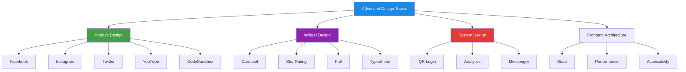
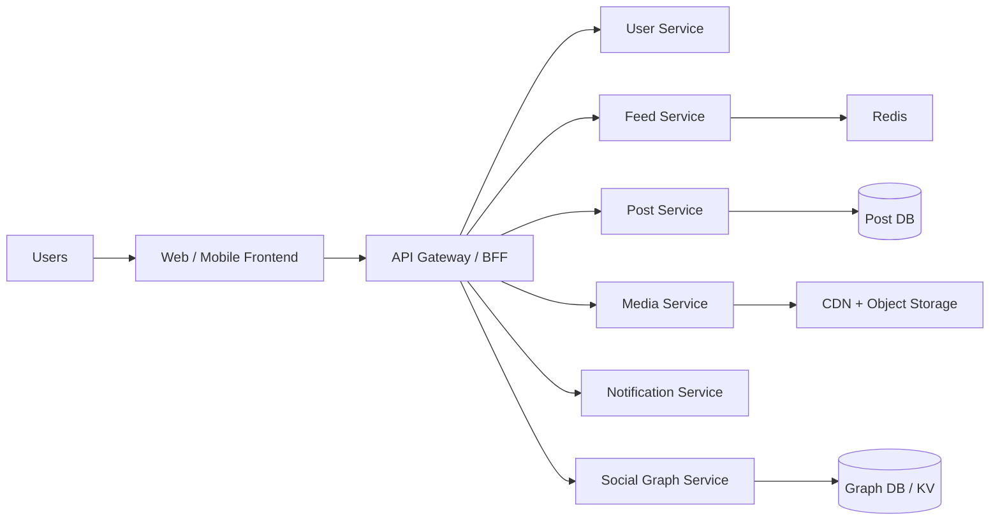
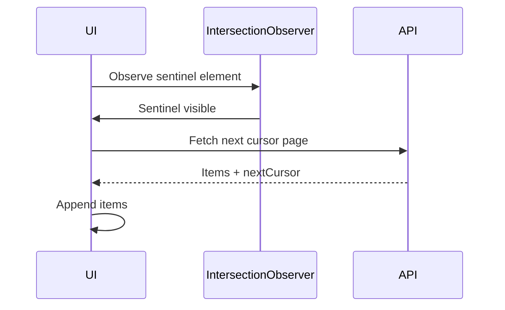
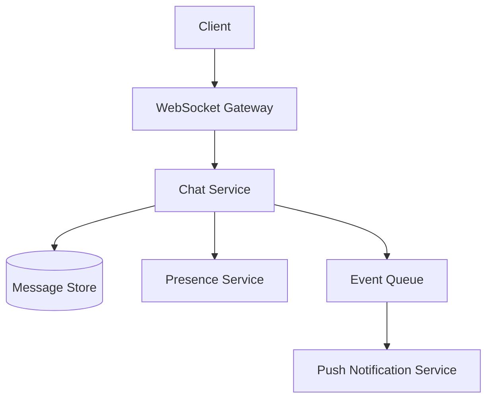
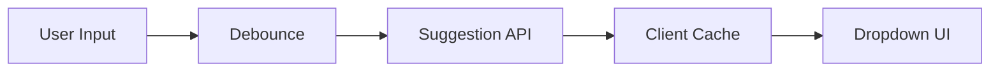
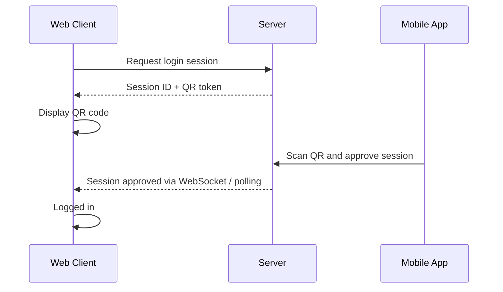
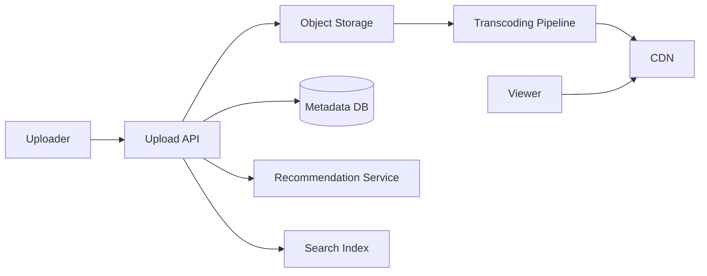
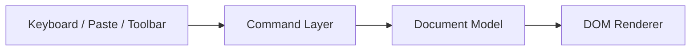
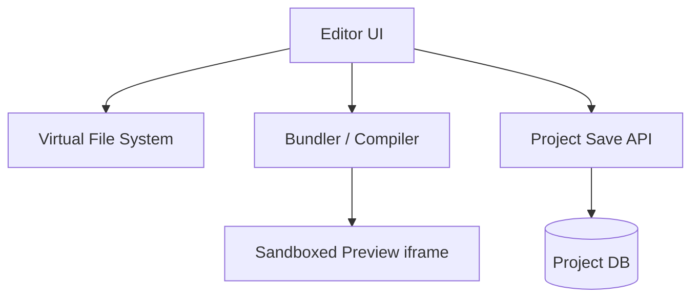
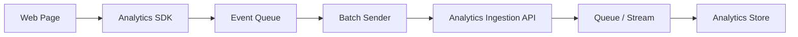

# System Design — Advanced Concepts for Senior Web Developer

> This guide covers advanced **System Design** and **Product Design** topics commonly asked in senior frontend and full-stack web interviews. It focuses on architecture, UI state, APIs, scalability, trade-offs, and implementation strategy.

---

## 📚 Table of Contents

1. [Design facebook.com](#1-design-facebookcom)
2. [Design Instagram](#2-design-instagram)
3. [Design an Infinite Scroller](#3-design-an-infinite-scroller)
4. [Design a Messenger Web App](#4-design-a-messenger-web-app)
5. [Design an API Progress Bar](#5-design-an-api-progress-bar)
6. [Design a Typeahead Widget](#6-design-a-typeahead-widget)
7. [Design a Perfect TODO App](#7-design-a-perfect-todo-app)
8. [Create a Star Widget](#8-create-a-star-widget)
9. [Design a Poll Widget](#9-design-a-poll-widget)
10. [Design a Carousel Widget](#10-design-a-carousel-widget)
11. [Design Twitter Web App](#11-design-twitter-web-app)
12. [Design a QR Code Based Login System](#12-design-a-qr-code-based-login-system)
13. [Design BFE.dev](#13-design-bfedev)
14. [Design youtube.com](#14-design-youtubecom)
15. [Create a WYSIWYG Editor](#15-create-a-wysiwyg-editor)
16. [Design CodeSandbox](#16-design-codesandbox)
17. [Design a Slider Component](#17-design-a-slider-component)
18. [How Would You Create Google Analytics Script?](#18-how-would-you-create-google-analytics-script)
19. [Design a Tic-Tac-Toe Game](#19-design-a-tic-tac-toe-game)
20. [Implement Nested Checkboxes](#20-implement-nested-checkboxes)
21. [Common Senior-Level Discussion Points](#21-common-senior-level-discussion-points)
22. [Quick Revision Sheet](#22-quick-revision-sheet)

---



---

# 1. Design facebook.com

**Type:** Product Design

## Core features

- User profiles
- Friend graph
- Posts, comments, likes, shares
- News feed
- Notifications
- Messaging
- Media upload

## High-level architecture



## Key interview points

- Feed generation: **fan-out on write** vs **fan-out on read**
- Media served through CDN
- Notification delivery async via queue
- Social graph optimized for friend/follower lookup
- Abuse moderation and privacy settings

## APIs

```http
GET /api/feed?cursor=abc
POST /api/posts
POST /api/posts/:id/like
GET /api/users/:id/profile
```

## Data model

```sql
User(id, name, avatar_url)
Post(id, author_id, content, visibility, created_at)
Like(id, user_id, post_id)
Comment(id, user_id, post_id, content, created_at)
Friendship(user_id, friend_id, status)
```

---

# 2. Design Instagram

**Type:** Product Design

## Core features

- Photo/video posts
- Follow system
- Stories / reels
- Feed and explore page
- Likes, comments, saves
- Direct messages

## System focus

- Heavy media upload pipeline
- Image/video compression
- CDN distribution
- Personalized ranking for feed/explore

## Architecture highlights

- Upload to object storage with signed URLs
- Async processing for thumbnail generation
- Recommendation service for ranking
- Cache hot feeds and profiles

## Important trade-offs

- Precompute home feed vs compute on request
- Story expiration cleanup strategy
- Real-time like count vs eventual consistency

---

# 3. Design an Infinite Scroller

**Type:** System Design

## Goal

Load content progressively as the user scrolls instead of fetching everything at once.

## Core requirements

- Smooth scrolling
- Paginated or cursor-based API
- No duplicate items
- Loading indicator
- Error retry

## Recommended API

```http
GET /api/posts?cursor=eyJpZCI6MTIzfQ&limit=20
```

## Why cursor pagination?

- Better than offset for large data sets
- More stable when new items are inserted
- Avoids duplicate/skipped items on dynamic lists

## Frontend flow



## Example logic

```javascript
let isLoading = false;
let nextCursor = null;

async function loadMore() {
  if (isLoading) return;
  isLoading = true;

  const res = await fetch(`/api/posts?cursor=${nextCursor ?? ''}`);
  const data = await res.json();

  renderItems(data.items);
  nextCursor = data.nextCursor;
  isLoading = false;
}
```

## Senior discussion points

- Use `IntersectionObserver` over scroll listeners where possible
- Virtualize long lists for memory/performance
- Handle race conditions on rapid fetches

---

# 4. Design a Messenger Web App

**Type:** Product Design

## Features

- Real-time chat
- 1:1 and group conversations
- Online status
- Read receipts
- File and emoji support

## Core architecture



## Important design decisions

- WebSocket for low latency messaging
- Persist message before confirming delivery
- Use queue for fan-out to multiple devices
- Handle reconnect and message sync

## Frontend concerns

- Optimistic rendering of new messages
- Scroll position management
- Unread count state
- Retry unsent messages

---

# 5. Design an API Progress Bar

**Type:** System Design

## Goal

Display progress of multiple async API calls or background operations.

## Use cases

- Multi-file upload
- Dashboard bootstrapping
- Parallel API loading
- Long-running import jobs

## Basic formula

If there are $n$ APIs and each has equal weight:

$$
progress = \frac{completed}{total} \times 100
$$

## Weighted progress

```javascript
const tasks = [
  { name: 'user', weight: 20, done: true },
  { name: 'posts', weight: 30, done: true },
  { name: 'media', weight: 50, done: false }
];

const progress = tasks
  .filter(task => task.done)
  .reduce((sum, task) => sum + task.weight, 0);
```

## UI states

- Idle
- Loading
- Partial success
- Failed
- Completed

## Design notes

- Smooth progress animation improves UX
- Avoid jumping from 0% to 100% abruptly
- Use server push/WebSocket for backend job progress

---

# 6. Design a Typeahead Widget

**Type:** System Design

## Requirements

- Suggestions while typing
- Keyboard navigation
- Highlight matched text
- Loading and empty states
- Debounced API calls

## Architecture



## Important frontend logic

- Debounce requests: 200–300ms
- Cancel stale requests
- Cache previous results
- Support arrows, Enter, Escape

## Example API

```http
GET /api/search/suggest?q=rea
```

## Example response

```json
{
  "items": ["react", "redux", "reasonml"]
}
```

## Senior-level concerns

- Prevent race conditions with request IDs or `AbortController`
- Accessibility: `role="combobox"`, `aria-expanded`, `aria-activedescendant`

---

# 7. Design a Perfect TODO App

**Type:** Product Design

## Functional requirements

- Add / edit / delete todo
- Mark complete
- Filter by status
- Reorder tasks
- Offline support
- Sync across devices

## Product quality features

- Local-first persistence
- Undo/redo
- Keyboard shortcuts
- Tags and due dates
- Optimistic sync

## Architecture options

- Local-only: `localStorage` / IndexedDB
- Synced: backend + offline queue

## Suggested state shape

```javascript
{
  todos: {
    byId: {
      "1": { id: "1", text: "Learn design", completed: false }
    },
    allIds: ["1"]
  },
  filters: {
    status: "all",
    search: ""
  }
}
```

## Senior discussion points

- Conflict resolution for multi-device updates
- Offline-first with background sync
- Use IndexedDB for large structured local data

---

# 8. Create a Star Widget

**Type:** System Design

## Features

- Hover preview
- Click to select rating
- Keyboard accessible
- Half-star support (optional)
- Controlled/uncontrolled modes

## Data model

```javascript
{
  max: 5,
  value: 3,
  hoverValue: 4,
  readOnly: false
}
```

## Component logic

```javascript
function getStarState(index, value, hoverValue) {
  const activeValue = hoverValue ?? value;
  return index <= activeValue;
}
```

## Accessibility

- Use radio-group semantics or buttons
- Support arrow keys
- Announce selected rating

---

# 9. Design a Poll Widget

**Type:** System Design

## Features

- Question + options
- Single or multiple selection
- Vote submission
- Real-time result updates
- Prevent duplicate votes

## API

```http
POST /api/polls/:id/vote
GET /api/polls/:id/results
```

## Frontend states

- Before vote
- Voting in progress
- After vote with percentages
- Poll closed

## Design notes

- Keep option IDs stable
- Use optimistic update cautiously
- Prevent double submit with idempotent backend

---

# 10. Design a Carousel Widget

**Type:** System Design

## Features

- Next/prev navigation
- Auto-play
- Infinite looping
- Swipe support
- Indicators/dots
- Pause on hover/focus

## State model

```javascript
{
  currentIndex: 0,
  total: 5,
  autoPlay: true,
  intervalMs: 3000,
  isPaused: false
}
```

## Core logic

```javascript
function getNextIndex(current, total) {
  return (current + 1) % total;
}
```

## Design concerns

- Avoid layout shift
- Use CSS transforms for smooth animation
- Pause on interaction for accessibility
- Support reduced motion preference

---

# 11. Design Twitter Web App

**Type:** Product Design

## Core features

- Tweet creation
- Home timeline
- Follow system
- Likes/retweets/replies
- Hashtags and search
- Trending topics

## Important design questions

- Timeline generation strategy
- Search indexing
- Handling celebrities with millions of followers
- Real-time engagement updates

## Architecture highlights

- Tweet service
- Timeline service
- Follow graph service
- Search/indexing service
- Notification service

## Senior discussion points

- Hybrid feed generation
- Event-driven trending calculation
- Rate limiting and anti-spam controls

---

# 12. Design a QR Code Based Login System

**Type:** System Design

## Use case

Login on desktop by scanning QR code from mobile app.

## Flow



## Key components

- Temporary login session store
- QR token generator
- Mobile approval endpoint
- Desktop polling or WebSocket update

## Security concerns

- Short-lived QR tokens
- Bind session to device/browser fingerprint if needed
- Require mobile app authentication before approval
- One-time use token only

---

# 13. Design BFE.dev

**Type:** Product Design

## Assumption

A coding/interview platform with frontend challenges, solutions, execution, and discussion.

## Core features

- Problem listing
- Code editor
- Test case runner
- Submission history
- Discussion forum
- User progress tracking

## Services

- Problem service
- Code execution sandbox
- Submission service
- Discussion service
- Auth service

## Big challenge

Secure code execution.

## Solution ideas

- Isolated execution containers
- CPU/memory/time limits
- No network access inside sandbox
- Store submission metadata separately

---

# 14. Design youtube.com

**Type:** Product Design

## Core features

- Upload video
- Stream video
- Like/comment/subscribe
- Search and recommendation
- Live streaming (optional)

## Architecture



## Senior discussion points

- Chunked uploads
- Multiple bitrates and HLS/DASH streaming
- CDN edge caching
- Watch history and recommendation system

---

# 15. Create a WYSIWYG Editor

**Type:** System Design

## Features

- Rich text editing
- Bold, italic, underline, headings
- Lists, links, images
- Undo/redo
- Paste handling
- Sanitization

## Core design options

1. `contenteditable`
2. Model-driven document editor

## Better architecture

- Separate **document model** from DOM rendering
- Normalize operations into commands
- Keep history stack for undo/redo
- Sanitize pasted HTML

## Editor pipeline



## Important senior topics

- Selection/range handling
- Cross-browser behavior
- Security via sanitization
- Plugin architecture

---

# 16. Design CodeSandbox

**Type:** Product Design

## Features

- In-browser code editor
- Multi-file project system
- Live preview
- Dependency install
- Save/share projects
- Collaboration (optional)

## High-level architecture



## Challenges

- Secure code execution in browser/worker/iframe
- Fast incremental bundling
- Dependency resolution and caching
- Preview isolation

## Design notes

- Use web workers for heavy compilation
- Run preview in isolated iframe
- Persist files as project tree JSON

---

# 17. Design a Slider Component

**Type:** System Design

## Features

- Single value or range slider
- Drag support
- Keyboard control
- Min/max/step
- Tooltip display

## Value formula

$$
value = min + \frac{position}{trackWidth} \times (max - min)
$$

## Core logic

```javascript
function clamp(value, min, max) {
  return Math.min(max, Math.max(min, value));
}

function snapToStep(value, step) {
  return Math.round(value / step) * step;
}
```

## Accessibility

- `role="slider"`
- `aria-valuemin`, `aria-valuemax`, `aria-valuenow`
- Keyboard support with arrows, Home, End

---

# 18. How Would You Create Google Analytics Script?

**Type:** System Design

## Goal

Track page views, events, sessions, and user behavior with a lightweight client script.

## Requirements

- Small script payload
- Async loading
- Queue events before full load
- Respect consent/privacy rules
- Retry on network failure

## Basic client architecture



## Core ideas

- Load script asynchronously
- Initialize a global queue stub before script loads
- Batch events
- Use `navigator.sendBeacon()` on unload when possible

## Example bootstrap pattern

```javascript
window.gaQueue = window.gaQueue || [];
window.track = function(eventName, payload) {
  window.gaQueue.push({ eventName, payload, ts: Date.now() });
};
```

## Backend pipeline

- Ingestion API validates events
- Queue/stream buffers writes
- Stream processor enriches events
- Warehouse/OLAP store used for reports

---

# 19. Design a Tic-Tac-Toe Game

**Type:** System Design

## Features

- 3x3 board
- Two-player turn-based logic
- Win/draw detection
- Restart game
- Optional online multiplayer

## State model

```javascript
{
  board: [null, null, null, null, null, null, null, null, null],
  currentPlayer: 'X',
  winner: null,
  status: 'playing'
}
```

## Win check logic

```javascript
const lines = [
  [0,1,2],[3,4,5],[6,7,8],
  [0,3,6],[1,4,7],[2,5,8],
  [0,4,8],[2,4,6]
];
```

## If asked as online system

- Add room service
- WebSocket for turn sync
- Server-authoritative move validation

---

# 20. Implement Nested Checkboxes

**Type:** System Design

## Problem

A parent checkbox controls children, and child selections affect parent state.

## States to support

- Checked
- Unchecked
- Indeterminate

## Example tree

```text
Fruits
 ├── Apple
 ├── Mango
 └── Citrus
      ├── Orange
      └── Lemon
```

## Rules

- If parent is checked, all descendants become checked
- If parent is unchecked, all descendants become unchecked
- If some children are checked, parent becomes indeterminate

## State calculation

```javascript
function getNodeState(children) {
  const allChecked = children.every(child => child.checked);
  const noneChecked = children.every(child => !child.checked && !child.indeterminate);

  if (allChecked) return { checked: true, indeterminate: false };
  if (noneChecked) return { checked: false, indeterminate: false };
  return { checked: false, indeterminate: true };
}
```

## Data model

```javascript
{
  id: 'fruits',
  label: 'Fruits',
  checked: false,
  indeterminate: true,
  children: [
    { id: 'apple', checked: true, children: [] },
    { id: 'mango', checked: false, children: [] }
  ]
}
```

## Senior discussion points

- Recursive tree updates
- Large tree performance
- Controlled vs uncontrolled component design
- Accessibility with tree roles if needed

---

# 21. Common Senior-Level Discussion Points

For almost every design above, mention these:

## Frontend architecture

- State normalization
- Derived state vs source state
- Component composition
- Accessibility
- Error boundaries / fallback UI

## Performance

- Code splitting
- Memoization only where needed
- Virtualization for long lists
- Debounce/throttle
- Caching strategy

## Reliability

- Retry logic
- Idempotent APIs
- Optimistic UI rollback
- Offline handling if needed

## Security

- Input sanitization
- XSS prevention
- CSRF/auth token handling
- Signed URLs for uploads
- Rate limiting

---

# 22. Quick Revision Sheet

| Topic | Key Point to Mention |
|---|---|
| Facebook | feed generation, social graph, media CDN |
| Instagram | media pipeline, ranking, stories |
| Infinite Scroller | cursor pagination, observer, virtualization |
| Messenger | WebSocket, delivery, unread sync |
| API Progress Bar | weighted progress, partial failures |
| Typeahead | debounce, cancel stale requests, a11y |
| TODO App | local-first, sync, undo/redo |
| Star Widget | hover, click, keyboard support |
| Poll Widget | vote state, result sync, idempotency |
| Carousel | swipe, autoplay, reduced motion |
| Twitter | timeline trade-offs, trending, spam control |
| QR Login | short-lived token, mobile approval |
| BFE.dev | secure code execution sandbox |
| YouTube | transcoding, CDN, recommendation |
| WYSIWYG | document model, sanitization, selection |
| CodeSandbox | worker bundling, isolated preview |
| Slider | drag math, snapping, aria slider |
| Analytics Script | queue, batch, beacon, pipeline |
| Tic-Tac-Toe | state machine, win logic, realtime option |
| Nested Checkboxes | recursive updates, indeterminate state |

---

## Final Tip

> In senior interviews, do not only describe the UI. Explain:
>
> **state model, APIs, edge cases, accessibility, performance, scaling, and trade-offs.**

---

*Prepared as an advanced companion file for senior frontend/system/product design interview preparation.*
