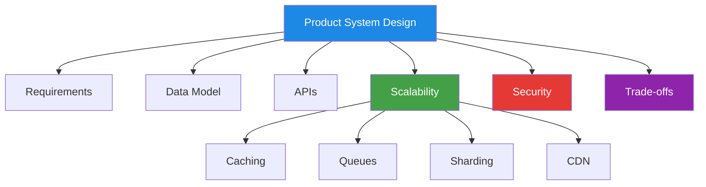
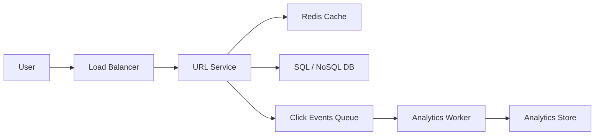
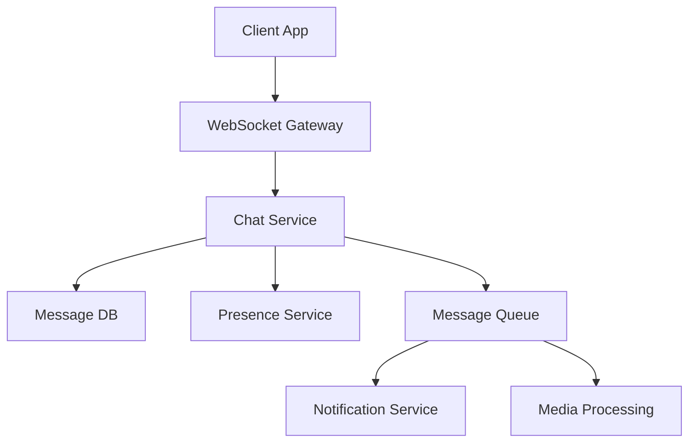
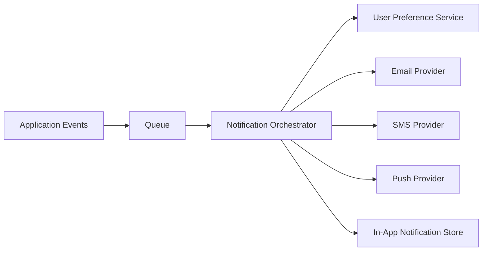
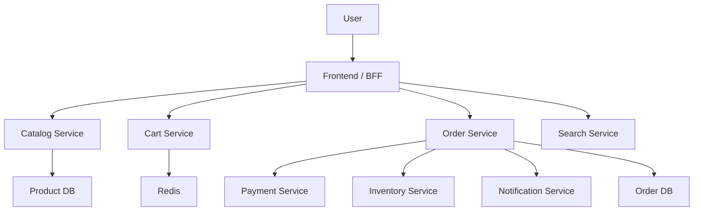
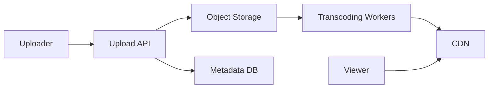
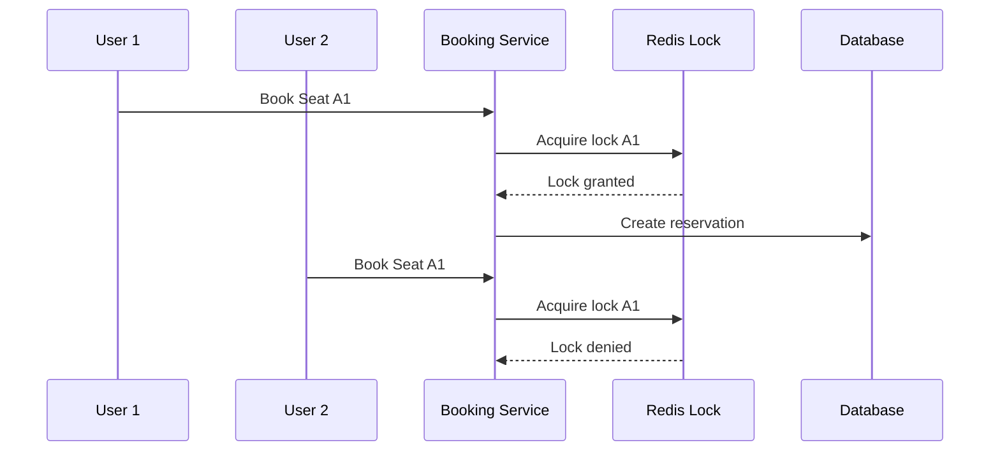
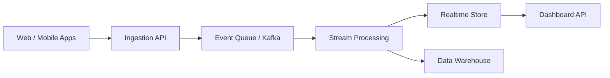

# System Design — Most Asked Products for Senior Web Developer

> This guide covers the **most frequently asked product/system design interview topics** for a **Senior Web Developer**. It focuses on practical web-scale products, trade-offs, APIs, database choices, caching, scaling, security, and real-world architecture discussion.

---

## 📚 Table of Contents

1. [How to Answer Product System Design Questions](#1-how-to-answer-product-system-design-questions)
2. [General Product Design Framework](#2-general-product-design-framework)
3. [URL Shortener](#3-url-shortener)
4. [Chat / Messaging System](#4-chat--messaging-system)
5. [Notification System](#5-notification-system)
6. [E-commerce Platform](#6-e-commerce-platform)
7. [Food Delivery / Order Tracking System](#7-food-delivery--order-tracking-system)
8. [Video Streaming Platform](#8-video-streaming-platform)
9. [File Upload / Drive Storage System](#9-file-upload--drive-storage-system)
10. [Social Media Feed](#10-social-media-feed)
11. [Blog / CMS Platform](#11-blog--cms-platform)
12. [Booking System](#12-booking-system)
13. [Search Autocomplete System](#13-search-autocomplete-system)
14. [Payment System](#14-payment-system)
15. [Analytics / Event Tracking System](#15-analytics--event-tracking-system)
16. [Rate Limiter](#16-rate-limiter)
17. [Interview Trade-offs to Mention](#17-interview-trade-offs-to-mention)
18. [Senior-Level Discussion Points](#18-senior-level-discussion-points)
19. [Quick Revision Cheat Sheet](#19-quick-revision-cheat-sheet)

---



---

# 1. How to Answer Product System Design Questions

> In interviews, the goal is not just the final architecture. The interviewer wants to see **how you think**.

## Recommended flow

1. Clarify functional requirements
2. Clarify non-functional requirements
3. Estimate scale
4. Define APIs
5. Design high-level architecture
6. Design database schema
7. Discuss bottlenecks
8. Add scaling improvements
9. Mention security, monitoring, and failure handling
10. Explain trade-offs clearly

## Good clarifying questions

- Who are the users?
- What is the expected traffic?
- Is it read-heavy or write-heavy?
- Does the system need real-time updates?
- What consistency is required?
- What is the acceptable latency?
- Are there regional/multi-country requirements?

---

# 2. General Product Design Framework

## Functional requirements

These define **what the system should do**.

Examples:
- User can send messages
- User can create orders
- User can search products
- Admin can manage inventory

## Non-functional requirements

These define **how well the system should work**.

Examples:
- Low latency
- High availability
- Fault tolerance
- Horizontal scalability
- Security
- Observability

## Capacity estimation example

Suppose:
- 10 million daily active users
- 100 requests per user per day

Then:
- $10^7 \times 10^2 = 10^9$ requests/day
- Requests per second:

$$
\frac{10^9}{86400} \approx 11{,}574 \text{ requests/second}
$$

This gives a baseline for scaling decisions.

---

# 3. URL Shortener

> Example: Bitly / TinyURL

## Functional requirements

- Convert long URL to short URL
- Redirect short URL to original URL
- Optional custom alias
- Optional analytics (click counts)
- Optional expiration date

## Non-functional requirements

- Fast redirect
- High read throughput
- Unique short codes
- Durable mapping storage

## API design

```http
POST /api/urls
{
  "longUrl": "https://example.com/products/123",
  "customAlias": "shoe-sale"
}
```

```http
GET /:shortCode
```

## High-level design



## Database schema

```sql
ShortUrl(
  id BIGINT PRIMARY KEY,
  short_code VARCHAR(10) UNIQUE,
  long_url TEXT,
  user_id BIGINT,
  created_at TIMESTAMP,
  expires_at TIMESTAMP NULL,
  is_active BOOLEAN
)
```

## Key design choices

- Use **Base62 encoding** for short code generation
- Cache hot URLs in Redis
- Store click analytics asynchronously via queue
- Add rate limiting to prevent abuse

## Bottlenecks

- Redirect traffic spikes
- Hot keys in cache
- Spam URL abuse

---

# 4. Chat / Messaging System

> Example: WhatsApp Web, Slack, Messenger

## Functional requirements

- 1-to-1 chat
- Group chat
- Online/offline status
- Message delivery and read receipts
- Push notifications
- Media attachment support

## Non-functional requirements

- Low latency
- Real-time delivery
- High availability
- Message durability

## Core architecture



## Important design points

- Use **WebSocket** for persistent real-time communication
- Store messages in DB before delivery acknowledgment
- Use queue for fan-out to multiple recipients/devices
- Separate presence service from message storage

## Schema example

```sql
Message(
  id BIGINT PRIMARY KEY,
  conversation_id BIGINT,
  sender_id BIGINT,
  message_type VARCHAR(20),
  content TEXT,
  created_at TIMESTAMP,
  status VARCHAR(20)
)
```

## Senior-level trade-offs

- Ordering guarantees per conversation vs global ordering
- Delivery guarantee: at-most-once vs at-least-once
- Store unread counters in Redis for speed

---

# 5. Notification System

> Example: email, SMS, push, in-app notifications

## Functional requirements

- Send notifications through multiple channels
- User preferences
- Retry failed notifications
- Template-based messaging
- Scheduling support

## Architecture



## Key points

- Use queue for decoupling
- Store notification preferences per user
- Retry using exponential backoff
- Add dead-letter queue for failures

---

# 6. E-commerce Platform

> Example: Amazon-like store

## Functional requirements

- Browse products
- Search and filter
- Add to cart
- Checkout
- Payment
- Order management
- Inventory updates
- Product reviews

## Core services

- User Service
- Product Catalog Service
- Cart Service
- Order Service
- Payment Service
- Inventory Service
- Search Service
- Recommendation Service

## Architecture



## Data model (simplified)

```sql
Product(id, name, price, stock, category_id)
Cart(id, user_id, created_at)
CartItem(id, cart_id, product_id, quantity)
Order(id, user_id, total_amount, status, created_at)
OrderItem(id, order_id, product_id, price, quantity)
```

## Interview discussion points

- Inventory consistency during flash sales
- Cart in Redis vs DB
- Search via Elasticsearch/OpenSearch
- CDN for product images
- Event-driven order pipeline

---

# 7. Food Delivery / Order Tracking System

> Example: Swiggy / Zomato / Uber Eats

## Functional requirements

- Browse restaurants
- Place order
- Live order tracking
- Delivery partner assignment
- ETA updates

## Core services

- Restaurant Service
- Menu Service
- Order Service
- Delivery Assignment Service
- GPS/Location Service
- Notification Service

## Interesting challenges

- Real-time location updates
- Matching nearest delivery agent
- Accurate ETA calculation
- Handling cancellations and refunds

---

# 8. Video Streaming Platform

> Example: YouTube / Netflix basics

## Functional requirements

- Upload videos
- Process videos into multiple resolutions
- Stream video
- Show recommendations
- Likes/comments

## High-level architecture



## Key design choices

- Store raw video in object storage
- Use async transcoding pipeline
- Serve via CDN
- Store metadata separately from blobs

---

# 9. File Upload / Drive Storage System

> Example: Google Drive / Dropbox basics

## Functional requirements

- Upload/download files
- Folder hierarchy
- File sharing
- Version history
- Permission control

## Important topics

- Chunked uploads for large files
- Signed URLs for secure downloads/uploads
- Object storage for files
- Metadata DB for folder/file tree
- Virus scanning pipeline

## Schema

```sql
File(
  id BIGINT,
  owner_id BIGINT,
  file_name VARCHAR(255),
  mime_type VARCHAR(100),
  size_bytes BIGINT,
  storage_key VARCHAR(500),
  created_at TIMESTAMP
)
```

---

# 10. Social Media Feed

> Example: Facebook / LinkedIn feed basics

## Functional requirements

- Create post
- Follow users
- See personalized feed
- Like/comment/share

## Two common feed models

### Fan-out on write

- Push new post to followers' feed at write time
- Faster reads
- Expensive writes for celebrities

### Fan-out on read

- Build feed at request time
- Cheaper writes
- Slower reads

## Discussion point

A hybrid model is often best:
- Fan-out on write for normal users
- Fan-out on read for celebrity/high-follower accounts

---

# 11. Blog / CMS Platform

> Example: Medium / admin-managed content platform

## Functional requirements

- Create/edit/publish article
- Rich text editor
- Drafts
- Slug-based URLs
- SEO metadata
- Comments
- Role-based access

## Senior discussion points

- Content versioning
- Draft/publish workflow
- CDN for assets
- Search indexing
- Preview mode for unpublished content

---

# 12. Booking System

> Example: movie tickets, hotel room, flight seat booking

## Functional requirements

- Search availability
- Reserve slot/seat/room
- Prevent double booking
- Payment flow
- Cancellation/refund

## Key problem: concurrency

Two users may try to book the same seat at the same time.

## Solutions

- DB transactions
- Optimistic locking
- Pessimistic locking
- Temporary reservation lock with timeout in Redis



---

# 13. Search Autocomplete System

> Example: search bar suggestions on e-commerce or content site

## Functional requirements

- Return suggestions as user types
- Support typo tolerance (optional)
- Rank popular queries higher

## Design choices

- Trie for prefix-based search
- Elasticsearch/OpenSearch for full-text ranking
- Cache top popular prefixes in Redis
- Debounce requests from frontend

## API

```http
GET /api/search/suggest?q=iph
```

---

# 14. Payment System

> Example: checkout payment integration for commerce apps

## Functional requirements

- Initiate payment
- Confirm status
- Handle webhook callbacks
- Refund payments
- Record audit trail

## Critical requirements

- Idempotency
- Security
- Auditability
- Failure recovery

## Design points

- Use payment gateway provider
- Generate idempotency key for each payment attempt
- Verify provider webhook signatures
- Use ledger/audit table for money movement history

---

# 15. Analytics / Event Tracking System

> Example: tracking page views, clicks, custom events

## Functional requirements

- Capture frontend/backend events
- Aggregate reports
- Real-time dashboard or batch reports

## Architecture



## Discussion points

- High write throughput
- Event schema versioning
- Deduplication
- Late-arriving events

---

# 16. Rate Limiter

> Often asked as a design subproblem in APIs.

## Goal

Prevent abuse and protect services.

## Strategies

- Fixed window counter
- Sliding window log
- Sliding window counter
- Token bucket
- Leaky bucket

## Common implementation

- Redis + TTL
- Key format: `rate_limit:userId:endpoint`

## Example

Allow 100 requests per minute:

```text
INCR rate_limit:123:/login
EXPIRE rate_limit:123:/login 60
```

---

# 17. Interview Trade-offs to Mention

## SQL vs NoSQL

| SQL | NoSQL |
|---|---|
| Strong consistency | High horizontal scaling |
| Good for transactions | Flexible schema |
| Good for relational data | Good for massive-scale simple reads/writes |

## Cache aside pattern

- Read from cache first
- On miss, read DB and populate cache

## Sync vs Async

- Sync for immediate user-facing operations
- Async for emails, analytics, notifications, media processing

## Monolith vs Microservices

- Monolith: simpler to build and deploy early
- Microservices: better team scaling and service isolation later

---

# 18. Senior-Level Discussion Points

A senior candidate should mention more than endpoints and tables.

## Reliability

- Retries with backoff
- Circuit breakers
- Dead-letter queues
- Graceful degradation

## Observability

- Centralized logs
- Metrics (latency, throughput, error rate)
- Tracing across services
- Alerting and dashboards

## Security

- Authentication and authorization
- Rate limiting
- Input validation
- Encryption at rest and in transit
- Secrets management
- Audit logs

## Data lifecycle

- Backups
- Archival policies
- Retention policies
- GDPR/delete user data support

## Deployment

- Blue-green deployment
- Canary rollout
- Feature flags
- Rollback plan

---

# 19. Quick Revision Cheat Sheet

| Product | Key Topic to Highlight |
|---|---|
| URL Shortener | Base62, redirect cache, analytics queue |
| Chat System | WebSocket, delivery guarantees, presence |
| Notification System | Queue, retry, preferences |
| E-commerce | inventory consistency, cart cache, search |
| Food Delivery | tracking, ETA, delivery assignment |
| Video Streaming | object storage, transcoding, CDN |
| File Storage | chunk upload, metadata DB, signed URLs |
| Social Feed | fan-out on write/read trade-off |
| Booking System | double-booking prevention, locking |
| Search Autocomplete | trie, ranking, Redis cache |
| Payment System | idempotency, webhooks, audit trail |
| Analytics | event pipeline, Kafka, stream processing |
| Rate Limiter | token bucket / sliding window |

---

## Final Interview Tip

> For senior web developer interviews, always structure your answer like this:
>
> **Requirements → APIs → Data Model → High-Level Design → Scale → Bottlenecks → Trade-offs → Security → Monitoring**

---

*Notes prepared for senior web developer system design interviews, focused on commonly asked web products and practical architecture discussion.*
