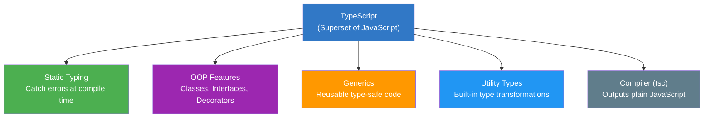
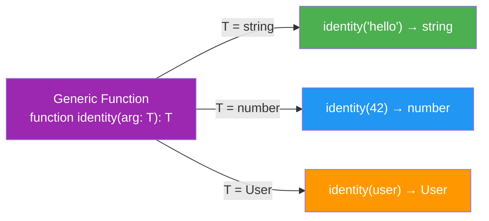
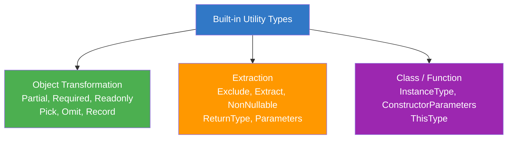

# TypeScript — Complete Study Guide

---

## 📚 Table of Contents

1. [What is TypeScript?](#1-what-is-typescript)
2. [Types — Primitives & Special](#2-types--primitives--special)
3. [Type Inference & Annotations](#3-type-inference--annotations)
4. [Union & Intersection Types](#4-union--intersection-types)
5. [Literal Types & Type Narrowing](#5-literal-types--type-narrowing)
6. [Arrays, Tuples & Enums](#6-arrays-tuples--enums)
7. [Functions in TypeScript](#7-functions-in-typescript)
8. [Interfaces](#8-interfaces)
9. [Type Aliases vs Interfaces](#9-type-aliases-vs-interfaces)
10. [Classes in TypeScript](#10-classes-in-typescript)
11. [Generics](#11-generics)
12. [Utility Types](#12-utility-types)
13. [Mapped Types](#13-mapped-types)
14. [Conditional Types](#14-conditional-types)
15. [Template Literal Types](#15-template-literal-types)
16. [Decorators](#16-decorators)
17. [Modules & Namespaces](#17-modules--namespaces)
18. [Declaration Files (.d.ts)](#18-declaration-files-dts)
19. [Type Guards & Assertion](#19-type-guards--assertion)
20. [Advanced Patterns](#20-advanced-patterns)
21. [tsconfig.json — Compiler Options](#21-tsconfigjson--compiler-options)

---



---

# 1. What is TypeScript?

> **TypeScript** is a **statically typed, compiled superset of JavaScript** developed and maintained by Microsoft. Every valid JavaScript file is a valid TypeScript file — TypeScript simply adds an optional, powerful **type system** on top.
>
> TypeScript code is **never executed directly**. The TypeScript compiler (`tsc`) **transpiles** it to plain JavaScript that runs in any browser or Node.js environment.

## Why TypeScript?

| Problem in JavaScript | TypeScript Solution |
|---|---|
| Bugs found only at runtime | Errors caught **at compile time** |
| No IDE autocompletion for custom types | Full **IntelliSense** support |
| Refactoring is risky and slow | Safe, confident **large-scale refactoring** |
| No documentation in code | Types **are the documentation** |
| `undefined is not a function` at 3am | Type system **prevents it** |

```bash
# Install TypeScript globally
npm install -g typescript

# Check version
tsc --version

# Compile a single file
tsc app.ts

# Initialize a project (creates tsconfig.json)
tsc --init

# Watch mode — recompile on save
tsc --watch
```

```typescript
// hello.ts
function greet(name: string): string {
    return `Hello, ${name}!`;
}

console.log(greet("Hitesh"));  // ✅ Hello, Hitesh!
// console.log(greet(42));     // ❌ Argument of type 'number' is not assignable to type 'string'
```

---

# 2. Types — Primitives & Special

## Primitive Types

```typescript
// Boolean
let isLoggedIn: boolean = true;
let isDarkMode: boolean = false;

// Number — all numbers (int, float, hex, binary, octal)
let age:      number = 30;
let price:    number = 99.99;
let hex:      number = 0xFF;
let binary:   number = 0b1010;

// String
let firstName:   string = "Hitesh";
let lastName:    string = 'Choudhary';
let greeting:    string = `Hello ${firstName}`;

// BigInt
let bigNumber:  bigint = 9007199254740991n;

// Symbol
let uniqueKey:  symbol = Symbol("id");
```

## Special Types

```typescript
// any — opts OUT of type checking (use sparingly — defeats the purpose)
let data: any = "hello";
data = 42;       // ✅ no error
data = { x: 1 }; // ✅ no error
data.foo.bar.baz; // ✅ no error at compile time — but will crash at runtime!

// unknown — type-safe counterpart to any (PREFER over any)
let input: unknown = "hello";
// input.toUpperCase(); // ❌ Error — must check type first

if (typeof input === "string") {
    console.log(input.toUpperCase()); // ✅ safe after narrowing
}

// void — function returns nothing (or undefined)
function logMessage(msg: string): void {
    console.log(msg);
    // no return statement
}

// never — function never returns (throws or infinite loop)
function throwError(message: string): never {
    throw new Error(message);
}

function infiniteLoop(): never {
    while (true) {}
}

// null and undefined
let nothing:   null      = null;
let notSet:    undefined = undefined;

// With strictNullChecks ON (recommended), null/undefined are separate types
let name: string = "Hitesh";
// name = null; // ❌ Error with strictNullChecks

// Explicitly allow null
let nullable: string | null = null;
nullable = "Hitesh"; // ✅
```

## Type Comparison Table

| Type | Accepts | Use Case |
|---|---|---|
| `any` | Everything | Migrating JS to TS (avoid in new code) |
| `unknown` | Everything | Safe alternative to `any` — forces type check before use |
| `void` | `undefined` | Return type of functions with no return value |
| `never` | Nothing | Functions that always throw or never finish |
| `null` | `null` only | Intentional absence |
| `undefined` | `undefined` only | Uninitialized variable |

---

# 3. Type Inference & Annotations

> TypeScript can **automatically infer** the type from a value. Explicit **annotations** (`: type`) are only needed when inference is insufficient or you want to be explicit for documentation purposes.

```typescript
// ── Type Inference — TypeScript figures it out ───────────────
let score = 100;         // inferred as: number
let name  = "Hitesh";    // inferred as: string
let items = [1, 2, 3];   // inferred as: number[]
let user  = { id: 1, name: "Hitesh" }; // inferred as: { id: number; name: string }

// score = "hello"; // ❌ Type 'string' is not assignable to type 'number'

// ── Explicit Annotations — you declare the type ──────────────
let userId:    number = 101;
let isAdmin:   boolean = false;
let tags:      string[] = ["ts", "js"];

// When inference is not enough — function parameters
function add(a: number, b: number): number {
    return a + b;
}
// Without annotations: a and b would be 'any'

// ── Contextual Typing ────────────────────────────────────────
// TypeScript infers from context (e.g., event listeners)
document.addEventListener("click", (event) => {
    // event is inferred as MouseEvent — full IntelliSense!
    console.log(event.clientX, event.clientY);
});

// ── Type widening vs narrowing ───────────────────────────────
let x = 3;          // widened to 'number' (not literal '3')
const y = 3;        // narrowed to literal type '3' (const can't change)
```

---

# 4. Union & Intersection Types

## Union Types `|`

> A union type means a value can be **one of several types**. Think of it as "OR".

```typescript
// Basic union
let id: string | number;
id = "abc-123"; // ✅
id = 101;       // ✅
// id = true;   // ❌

// Function accepting multiple types
function formatId(id: string | number): string {
    // Must handle both cases
    if (typeof id === "string") {
        return id.toUpperCase();
    }
    return id.toString().padStart(6, "0");
}

console.log(formatId("abc"));  // "ABC"
console.log(formatId(42));     // "000042"

// Union with null (very common pattern)
function getUser(id: number): User | null {
    return users.find(u => u.id === id) ?? null;
}

// Union of object types
type Cat = { species: "cat"; purrs: boolean };
type Dog = { species: "dog"; barks: boolean };
type Pet = Cat | Dog;

function makeSound(pet: Pet) {
    if (pet.species === "cat") {
        console.log(pet.purrs ? "Purr..." : "Silent"); // TS knows it's Cat
    } else {
        console.log(pet.barks ? "Woof!" : "Silent");   // TS knows it's Dog
    }
}
```

## Intersection Types `&`

> An intersection type combines **multiple types into one**. The resulting type has **all** properties of all combined types. Think of it as "AND".

```typescript
type HasName = { name: string };
type HasAge  = { age: number };
type HasRole = { role: "admin" | "user" };

// Intersection — must have ALL properties from all types
type FullUser = HasName & HasAge & HasRole;

const user: FullUser = {
    name: "Hitesh",  // required by HasName
    age: 30,         // required by HasAge
    role: "admin"    // required by HasRole
};

// Common pattern: extend third-party types
type ApiResponse<T> = {
    data: T;
    status: number;
};

type PaginatedResponse<T> = ApiResponse<T> & {
    page:       number;
    totalPages: number;
    total:      number;
};

const response: PaginatedResponse<User[]> = {
    data:       [],
    status:     200,
    page:       1,
    totalPages: 10,
    total:      95
};
```

---

# 5. Literal Types & Type Narrowing

## Literal Types

> **Literal types** restrict a variable to an exact value (or set of values) rather than any value of that type.

```typescript
// String literal
type Direction = "north" | "south" | "east" | "west";
let move: Direction = "north"; // ✅
// move = "up";                // ❌ not in the union

// Numeric literal
type DiceRoll = 1 | 2 | 3 | 4 | 5 | 6;
let roll: DiceRoll = 4; // ✅
// let bad: DiceRoll = 7; // ❌

// Boolean literal (useful for discriminated unions)
type LoadingState  = { status: "loading" };
type SuccessState  = { status: "success"; data: string };
type ErrorState    = { status: "error";   error: Error };
type RequestState  = LoadingState | SuccessState | ErrorState;

function render(state: RequestState) {
    switch (state.status) {
        case "loading": return "Loading...";
        case "success": return state.data;   // TS knows data exists here
        case "error":   return state.error.message; // TS knows error exists
    }
}
```

## Type Narrowing

> **Narrowing** is the process of refining a broader type to a more specific one inside a conditional block. TypeScript tracks which type a value can be at each point in code.

```typescript
// typeof narrowing
function process(input: string | number | boolean) {
    if (typeof input === "string") {
        return input.toUpperCase();  // string methods available
    } else if (typeof input === "number") {
        return input.toFixed(2);     // number methods available
    }
    return String(input);
}

// instanceof narrowing
function handleError(err: unknown) {
    if (err instanceof Error) {
        console.log(err.message);  // TS knows it's Error
    } else if (typeof err === "string") {
        console.log(err);
    }
}

// in operator narrowing
type Fish = { swim: () => void };
type Bird = { fly:  () => void };

function move(animal: Fish | Bird) {
    if ("swim" in animal) {
        animal.swim(); // TS knows it's Fish
    } else {
        animal.fly();  // TS knows it's Bird
    }
}

// Truthiness narrowing
function printLength(str: string | null | undefined) {
    if (str) {
        console.log(str.length); // str is string here (null/undefined filtered)
    }
}
```

---

# 6. Arrays, Tuples & Enums

## Arrays

```typescript
// Two equivalent syntaxes for typed arrays
let numbers:  number[]      = [1, 2, 3];
let strings:  Array<string> = ["a", "b", "c"];

// Multi-type array
let mixed: (string | number)[] = ["hello", 42, "world"];

// Readonly array — cannot be mutated
const config: readonly string[] = ["dev", "prod"];
// config.push("test"); // ❌ Property 'push' does not exist on type 'readonly string[]'
```

## Tuples

> **Tuples** are fixed-length arrays where each position has a **specific, known type**. Unlike regular arrays, position matters.

```typescript
// Basic tuple
let coordinate: [number, number] = [10, 20];
let user:       [string, number, boolean] = ["Hitesh", 30, true];

// Destructuring tuple
const [x, y] = coordinate;
console.log(x, y); // 10 20

// Named tuple elements (TS 4.0+) — better readability
type RGB = [red: number, green: number, blue: number];
const color: RGB = [255, 128, 0];

// Optional tuple elements
type Config = [host: string, port?: number];
const c1: Config = ["localhost"];       // ✅
const c2: Config = ["localhost", 3000]; // ✅

// Rest in tuples
type StringsAndNumber = [...string[], number];
const data: StringsAndNumber = ["a", "b", "c", 42]; // ✅

// Common use case: function returning multiple values
function getMinMax(nums: number[]): [min: number, max: number] {
    return [Math.min(...nums), Math.max(...nums)];
}
const [min, max] = getMinMax([3, 1, 4, 1, 5, 9]);
console.log(min, max); // 1 9
```

## Enums

> **Enums** define a set of **named constants**. They make code more readable by replacing magic strings or numbers with meaningful names.

```typescript
// Numeric Enum (default — auto-increments from 0)
enum Direction {
    Up,    // 0
    Down,  // 1
    Left,  // 2
    Right  // 3
}
let dir: Direction = Direction.Up;
console.log(dir);           // 0
console.log(Direction[0]);  // "Up"  ← reverse mapping

// Custom start value
enum HttpStatus {
    OK          = 200,
    Created     = 201,
    BadRequest  = 400,
    Unauthorized = 401,
    NotFound    = 404,
    ServerError = 500
}
console.log(HttpStatus.NotFound); // 404

// String Enum — no reverse mapping, more readable
enum Role {
    Admin  = "ADMIN",
    User   = "USER",
    Guest  = "GUEST"
}
let userRole: Role = Role.Admin;
console.log(userRole); // "ADMIN"

// Const Enum — inlined at compile time (zero runtime cost)
const enum Size {
    Small  = "SM",
    Medium = "MD",
    Large  = "LG"
}
let shirt: Size = Size.Medium; // compiled to: let shirt = "MD"

// Using enum in a switch
function describe(status: HttpStatus): string {
    switch (status) {
        case HttpStatus.OK:        return "Success";
        case HttpStatus.NotFound:  return "Not Found";
        case HttpStatus.ServerError: return "Server Error";
        default: return "Unknown status";
    }
}
```

---

# 7. Functions in TypeScript

```typescript
// ── Parameter & Return Type Annotations ─────────────────────
function add(a: number, b: number): number {
    return a + b;
}

// Arrow function with types
const multiply = (a: number, b: number): number => a * b;

// ── Optional Parameters ──────────────────────────────────────
function greet(name: string, title?: string): string {
    return title ? `Hello, ${title} ${name}!` : `Hello, ${name}!`;
}
greet("Hitesh");          // ✅ Hello, Hitesh!
greet("Hitesh", "Dr.");   // ✅ Hello, Dr. Hitesh!

// ── Default Parameters ───────────────────────────────────────
function createUser(name: string, role: string = "user", active: boolean = true) {
    return { name, role, active };
}

// ── Rest Parameters ──────────────────────────────────────────
function sum(...nums: number[]): number {
    return nums.reduce((acc, n) => acc + n, 0);
}
console.log(sum(1, 2, 3, 4, 5)); // 15

// ── Function Overloads ───────────────────────────────────────
// Define multiple signatures, implement one
function format(value: string): string;
function format(value: number, decimals: number): string;
function format(value: string | number, decimals?: number): string {
    if (typeof value === "string") return value.trim();
    return value.toFixed(decimals ?? 2);
}
console.log(format("  hello  "));  // "hello"
console.log(format(3.14159, 2));   // "3.14"

// ── Function Types ───────────────────────────────────────────
type MathOperation = (a: number, b: number) => number;

const subtract: MathOperation = (a, b) => a - b;
const divide:   MathOperation = (a, b) => a / b;

// Higher-order function with typed callbacks
function applyOperation(a: number, b: number, op: MathOperation): number {
    return op(a, b);
}
console.log(applyOperation(10, 2, divide)); // 5

// ── Void vs undefined return ─────────────────────────────────
function logOnly(msg: string): void {
    console.log(msg); // does not return anything useful
}

// ── this parameter (explicit context) ───────────────────────
interface Button {
    label: string;
    onClick(this: Button, event: MouseEvent): void;
}
```

---

# 8. Interfaces

> **Interfaces** define the **shape (contract)** of an object — what properties and methods it must have. They are one of TypeScript's core tools for describing the structure of data.

```typescript
// ── Basic Interface ──────────────────────────────────────────
interface User {
    readonly id:    number;     // readonly — cannot be changed after creation
    name:           string;
    email:          string;
    age?:           number;     // optional property
    role:           "admin" | "user" | "guest";
}

const hitesh: User = {
    id:    1,
    name:  "Hitesh",
    email: "hitesh@example.com",
    role:  "admin"
};
// hitesh.id = 2; // ❌ Cannot assign to 'id' because it is a read-only property

// ── Interface with Methods ───────────────────────────────────
interface Vehicle {
    make:    string;
    model:   string;
    year:    number;
    start(): void;
    stop():  void;
    accelerate(speed: number): void;
}

// ── Interface Extension ──────────────────────────────────────
interface ElectricVehicle extends Vehicle {
    batteryCapacity: number;
    chargingTime:    number;
    charge(): void;
}

const tesla: ElectricVehicle = {
    make:            "Tesla",
    model:           "Model 3",
    year:            2024,
    batteryCapacity: 75,
    chargingTime:    30,
    start()               { console.log("Silent start"); },
    stop()                { console.log("Stopped"); },
    accelerate(speed)     { console.log(`Accelerating to ${speed}`); },
    charge()              { console.log("Charging..."); }
};

// ── Declaration Merging ──────────────────────────────────────
// Interfaces with the same name are MERGED (unique to interfaces)
interface Window {
    myCustomProperty: string;
}
interface Window {
    anotherProperty: number;
}
// Window now has BOTH properties — useful for augmenting third-party types

// ── Index Signatures ─────────────────────────────────────────
interface StringMap {
    [key: string]: string; // any string key → string value
}
const translations: StringMap = {
    hello: "नमस्ते",
    bye:   "अलविदा",
    // any other string key is valid
};

// ── Callable Interface ───────────────────────────────────────
interface Formatter {
    (value: string): string;  // callable like a function
    version: string;          // AND has properties
}

// ── Implementing an Interface in a Class ─────────────────────
interface Serializable {
    serialize():             string;
    deserialize(data: string): void;
}

class UserProfile implements Serializable, User {
    readonly id:   number;
    name:          string;
    email:         string;
    role:          "admin" | "user" | "guest" = "user";

    constructor(id: number, name: string, email: string) {
        this.id    = id;
        this.name  = name;
        this.email = email;
    }

    serialize():             string { return JSON.stringify(this); }
    deserialize(data: string): void { Object.assign(this, JSON.parse(data)); }
}
```

---

# 9. Type Aliases vs Interfaces

> Both `type` and `interface` can describe object shapes, but they have key differences.

```typescript
// ── Type Alias ───────────────────────────────────────────────
type Point = {
    x: number;
    y: number;
};

// Types CAN represent primitives, unions, tuples, intersections
type ID        = string | number;
type Coords    = [number, number];
type StringMap = Record<string, string>;

// ── Interface ────────────────────────────────────────────────
interface Point2D {
    x: number;
    y: number;
}

// Extending
type Point3D = Point & { z: number };      // type uses &
interface Point3DI extends Point2D { z: number; } // interface uses extends
```

## Comparison Table

| Feature | `type` | `interface` |
|---|---|---|
| Object shapes | ✅ | ✅ |
| Primitives / unions | ✅ | ❌ |
| Tuples | ✅ | ❌ |
| Declaration merging | ❌ | ✅ |
| `extends` keyword | ❌ (use `&`) | ✅ |
| `implements` in class | ✅ | ✅ |
| Computed properties | ✅ | ❌ |
| Recursive types | ✅ | ✅ |

> 💡 **Rule of Thumb**: Use `interface` for object shapes that will be implemented by classes or extended. Use `type` for everything else — unions, primitives, computed types, utility transformations.

---

# 10. Classes in TypeScript

```typescript
// ── Access Modifiers ─────────────────────────────────────────
class BankAccount {
    // public   — accessible everywhere (default)
    // private  — accessible only within the class
    // protected — accessible within class and subclasses
    // readonly  — can only be set in constructor

    public  readonly id:       number;
    public           owner:    string;
    private          balance:  number;
    protected        currency: string;

    // Parameter shorthand — declares AND initializes in one line
    constructor(
        public    name:     string,
        private   pin:      string,
        protected bank:     string,
        initialBalance = 0
    ) {
        this.id       = Date.now();
        this.owner    = name;
        this.balance  = initialBalance;
        this.currency = "INR";
    }

    // Getter
    get currentBalance(): string {
        return `${this.currency} ${this.balance.toLocaleString("en-IN")}`;
    }

    // Setter with validation
    set depositAmount(amount: number) {
        if (amount <= 0) throw new RangeError("Amount must be positive");
        this.balance += amount;
    }

    // Private method
    private logTransaction(type: string, amount: number): void {
        console.log(`[${type}] ${amount} — Balance: ${this.balance}`);
    }

    deposit(amount: number): this {  // returns 'this' for method chaining
        this.balance += amount;
        this.logTransaction("DEPOSIT", amount);
        return this;
    }
}

const acc = new BankAccount("Hitesh", "1234", "SBI", 1000);
acc.deposit(500).deposit(200); // chaining
console.log(acc.currentBalance); // INR 1,700

// ── Inheritance ──────────────────────────────────────────────
class SavingsAccount extends BankAccount {
    private interestRate: number;

    constructor(name: string, pin: string, rate: number = 0.07) {
        super(name, pin, "SBI"); // must call super first
        this.interestRate = rate;
    }

    applyInterest(): void {
        // Can access protected 'balance' via getter, but not private
        const interest = this.interestRate * 100; // simplified
        console.log(`Interest ${this.interestRate * 100}% applied`);
    }
}

// ── Abstract Classes ─────────────────────────────────────────
// Cannot be instantiated directly — must be subclassed
abstract class Shape {
    abstract area():      number;   // subclass MUST implement
    abstract perimeter(): number;

    // Concrete method — available to all subclasses
    describe(): string {
        return `Area: ${this.area().toFixed(2)}, Perimeter: ${this.perimeter().toFixed(2)}`;
    }
}

class Circle extends Shape {
    constructor(private radius: number) { super(); }
    area():      number { return Math.PI * this.radius ** 2; }
    perimeter(): number { return 2 * Math.PI * this.radius; }
}

class Rectangle extends Shape {
    constructor(private w: number, private h: number) { super(); }
    area():      number { return this.w * this.h; }
    perimeter(): number { return 2 * (this.w + this.h); }
}

const shapes: Shape[] = [new Circle(5), new Rectangle(4, 6)];
shapes.forEach(s => console.log(s.describe()));

// ── Static Members ───────────────────────────────────────────
class MathUtils {
    static readonly PI = 3.14159;
    private static instanceCount = 0;

    static square(n: number): number  { return n * n; }
    static cube(n: number):   number  { return n * n * n; }
    static increment(): void          { MathUtils.instanceCount++; }
    static getCount(): number         { return MathUtils.instanceCount; }
}

console.log(MathUtils.square(4)); // 16
console.log(MathUtils.PI);        // 3.14159
```

---

# 11. Generics

> **Generics** allow you to write **reusable, type-safe code** that works with any data type, specified at the time of use rather than at the time of writing. They are TypeScript's most powerful feature for building flexible abstractions.



## Generic Functions

```typescript
// Without generics — loses type information
function identityAny(arg: any): any { return arg; }
const result1 = identityAny("hello"); // type: any — no IntelliSense

// With generics — type is preserved
function identity<T>(arg: T): T { return arg; }

const str  = identity("hello");       // T = string  → returns string
const num  = identity(42);            // T = number  → returns number
const bool = identity(true);          // T = boolean → returns boolean

// Explicit type argument
const result = identity<string>("hello");

// Generic with arrays
function getFirst<T>(arr: T[]): T | undefined {
    return arr[0];
}
const first = getFirst([1, 2, 3]);     // number | undefined
const word  = getFirst(["a", "b"]);    // string | undefined

// Multiple type parameters
function zip<T, U>(arr1: T[], arr2: U[]): [T, U][] {
    return arr1.map((item, i) => [item, arr2[i]]);
}
const zipped = zip([1, 2, 3], ["a", "b", "c"]);
// [number, string][] = [[1,'a'], [2,'b'], [3,'c']]
```

## Generic Constraints

```typescript
// Constrain T to types that have a 'length' property
function getLength<T extends { length: number }>(arg: T): number {
    return arg.length;
}
getLength("hello");        // ✅ string has length
getLength([1, 2, 3]);      // ✅ array has length
// getLength(42);           // ❌ number has no length

// Constrain to keys of an object
function getProperty<T, K extends keyof T>(obj: T, key: K): T[K] {
    return obj[key];
}
const user = { name: "Hitesh", age: 30, role: "admin" };
const name = getProperty(user, "name");  // string
const age  = getProperty(user, "age");   // number
// getProperty(user, "email"); // ❌ not a key of user
```

## Generic Interfaces & Classes

```typescript
// Generic interface
interface Repository<T> {
    findById(id: number):  T | undefined;
    findAll():             T[];
    save(entity: T):       T;
    delete(id: number):    boolean;
}

// Generic class
class Stack<T> {
    private items: T[] = [];

    push(item: T):       void     { this.items.push(item); }
    pop():               T | undefined { return this.items.pop(); }
    peek():              T | undefined { return this.items[this.items.length - 1]; }
    isEmpty():           boolean  { return this.items.length === 0; }
    get size():          number   { return this.items.length; }
}

const numStack = new Stack<number>();
numStack.push(1);
numStack.push(2);
console.log(numStack.pop());  // 2

const strStack = new Stack<string>();
strStack.push("hello");
// strStack.push(42); // ❌ Argument of type 'number' is not assignable to type 'string'

// Generic utility function — deep clone with type preservation
function clone<T>(obj: T): T {
    return JSON.parse(JSON.stringify(obj));
}
```

## Generic Default Types (TS 2.3+)

```typescript
// Default type parameter
interface ApiResponse<T = unknown> {
    data:    T;
    status:  number;
    message: string;
}

const res1: ApiResponse         = { data: null, status: 200, message: "ok" }; // T = unknown
const res2: ApiResponse<User[]> = { data: [],   status: 200, message: "ok" }; // T = User[]
```

---

# 12. Utility Types

> TypeScript ships with a library of **built-in generic types** that perform common type transformations. They eliminate the need to write repetitive manual type definitions.



```typescript
interface User {
    id:       number;
    name:     string;
    email:    string;
    age:      number;
    role:     "admin" | "user";
    password: string;
}

// ── Partial<T> — all properties optional ─────────────────────
type UserUpdate = Partial<User>;
// { id?: number; name?: string; email?: string; ... }

function updateUser(id: number, changes: Partial<User>): User {
    const user = findUser(id);
    return { ...user, ...changes };
}
updateUser(1, { name: "New Name" }); // ✅ only provide what changes

// ── Required<T> — all properties required ────────────────────
type StrictUser = Required<User>;
// All optional properties become required

// ── Readonly<T> — all properties readonly ────────────────────
type ImmutableUser = Readonly<User>;
const frozen: ImmutableUser = { id: 1, name: "Hitesh", email: "", age: 30, role: "user", password: "" };
// frozen.name = "Chai"; // ❌ Cannot assign to 'name' because it is a read-only property

// ── Pick<T, K> — select specific keys ────────────────────────
type UserPreview = Pick<User, "id" | "name" | "role">;
// { id: number; name: string; role: "admin" | "user" }

// ── Omit<T, K> — exclude specific keys ───────────────────────
type PublicUser = Omit<User, "password" | "email">;
// { id: number; name: string; age: number; role: ... }
// Great for API responses — never expose sensitive fields

// ── Record<K, V> — map keys to values ────────────────────────
type RolePermissions = Record<"admin" | "user" | "guest", string[]>;
const permissions: RolePermissions = {
    admin: ["read", "write", "delete"],
    user:  ["read", "write"],
    guest: ["read"]
};

type UserMap = Record<number, User>;
const users: UserMap = { 1: { ...}, 2: {...} };

// ── Exclude<T, U> — remove types from union ──────────────────
type AllRoles    = "admin" | "user" | "guest" | "moderator";
type NonAdminRoles = Exclude<AllRoles, "admin">;
// "user" | "guest" | "moderator"

// ── Extract<T, U> — keep only matching types ─────────────────
type PrivilegedRoles = Extract<AllRoles, "admin" | "moderator">;
// "admin" | "moderator"

// ── NonNullable<T> — remove null and undefined ────────────────
type MaybeString = string | null | undefined;
type DefiniteString = NonNullable<MaybeString>;
// string

// ── ReturnType<T> — extract return type of a function ─────────
function fetchUser(): Promise<User> { /* ... */ }
type FetchUserReturn = ReturnType<typeof fetchUser>; // Promise<User>

function getCoords(): [number, number] { return [0, 0]; }
type Coords = ReturnType<typeof getCoords>; // [number, number]

// ── Parameters<T> — extract parameter types as tuple ──────────
function createUser(name: string, age: number, role: string): User { /* ... */ }
type CreateUserParams = Parameters<typeof createUser>;
// [name: string, age: number, role: string]

// ── InstanceType<T> — get instance type of a class ────────────
class ApiClient { baseUrl: string = ""; }
type ApiClientInstance = InstanceType<typeof ApiClient>; // ApiClient

// ── Awaited<T> — unwrap Promise type ─────────────────────────
type AsyncUser = Promise<Promise<User>>;
type ResolvedUser = Awaited<AsyncUser>; // User — fully unwrapped
```

---

# 13. Mapped Types

> **Mapped types** allow you to create new types by **iterating over the keys of an existing type** and transforming them. They are the building block behind many utility types.

```typescript
// Basic mapped type — iterate over keys of T
type Stringify<T> = {
    [K in keyof T]: string; // every property becomes string
};

type UserStrings = Stringify<{ id: number; name: string; active: boolean }>;
// { id: string; name: string; active: string }

// ── Add/Remove Modifiers ─────────────────────────────────────
// + adds modifier (default), - removes modifier

type AllOptional<T>  = { [K in keyof T]+?: T[K] };  // same as Partial<T>
type AllRequired<T>  = { [K in keyof T]-?: T[K] };  // same as Required<T>
type AllReadonly<T>  = { +readonly [K in keyof T]: T[K] }; // same as Readonly<T>
type AllMutable<T>   = { -readonly [K in keyof T]: T[K] }; // remove readonly

// ── Conditional value transformation ─────────────────────────
type Nullable<T> = {
    [K in keyof T]: T[K] | null;
};

type NullableUser = Nullable<User>;
// { id: number | null; name: string | null; ... }

// ── Key remapping with 'as' (TS 4.1+) ────────────────────────
type Getters<T> = {
    [K in keyof T as `get${Capitalize<string & K>}`]: () => T[K];
};
// Maps { name: string } → { getName: () => string }

type Setters<T> = {
    [K in keyof T as `set${Capitalize<string & K>}`]: (value: T[K]) => void;
};

// ── Filter keys with 'as' + conditional ──────────────────────
// Keep only keys whose values are strings
type StringKeysOnly<T> = {
    [K in keyof T as T[K] extends string ? K : never]: T[K];
};

type UserStringKeys = StringKeysOnly<User>;
// { name: string; email: string; role: "admin" | "user"; password: string }
// (id: number and age: number are filtered out)

// ── Real-world: Form state type ──────────────────────────────
type FormState<T> = {
    [K in keyof T]: {
        value:    T[K];
        error:    string | null;
        touched:  boolean;
    };
};

type UserForm = FormState<Pick<User, "name" | "email">>;
/*
{
  name:  { value: string; error: string | null; touched: boolean };
  email: { value: string; error: string | null; touched: boolean };
}
*/
```

---

# 14. Conditional Types

> **Conditional types** allow type-level if/else logic: `T extends U ? TrueType : FalseType`. They enable powerful type inference and type filtering.

```typescript
// Basic conditional type
type IsString<T> = T extends string ? "yes" : "no";

type A = IsString<string>;  // "yes"
type B = IsString<number>;  // "no"
type C = IsString<"hello">; // "yes" — literal string extends string

// ── Distributive Conditional Types ────────────────────────────
// When T is a union, conditional type distributes over each member
type Flatten<T> = T extends Array<infer Item> ? Item : T;

type F1 = Flatten<string[]>;    // string
type F2 = Flatten<number[]>;    // number
type F3 = Flatten<string>;      // string (not an array, returns as-is)

// ── infer keyword — extract a type from a pattern ─────────────
// Extract the return type of any function
type GetReturnType<T> = T extends (...args: any[]) => infer R ? R : never;

type R1 = GetReturnType<() => string>;           // string
type R2 = GetReturnType<(n: number) => boolean>; // boolean
type R3 = GetReturnType<string>;                 // never (not a function)

// Extract Promise's resolved value
type Unwrap<T> = T extends Promise<infer U> ? Unwrap<U> : T; // recursive!
type Resolved = Unwrap<Promise<Promise<string>>>; // string

// Extract first element of a tuple
type Head<T extends any[]> = T extends [infer H, ...any[]] ? H : never;
type H1 = Head<[string, number, boolean]>; // string

// Extract rest of tuple
type Tail<T extends any[]> = T extends [any, ...infer R] ? R : never;
type T1 = Tail<[string, number, boolean]>; // [number, boolean]

// ── Practical: Deep Readonly ──────────────────────────────────
type DeepReadonly<T> = T extends object
    ? { readonly [K in keyof T]: DeepReadonly<T[K]> }
    : T;

type Config = { server: { host: string; port: number }; debug: boolean };
type ImmutableConfig = DeepReadonly<Config>;
// Nested objects are also readonly — Readonly<T> only goes one level
```

---

# 15. Template Literal Types

> **Template literal types** (TS 4.1+) let you create new string types by combining and transforming string literal types — the type system equivalent of template literal strings.

```typescript
// Basic template literal type
type EventName = "click" | "focus" | "blur";
type EventHandler = `on${Capitalize<EventName>}`;
// "onClick" | "onFocus" | "onBlur"

// CSS property builder
type Side    = "top" | "right" | "bottom" | "left";
type Spacing = "margin" | "padding";
type SpacingProp = `${Spacing}-${Side}`;
// "margin-top" | "margin-right" | "padding-top" | "padding-left" ...

// API route builder
type HttpMethod = "get" | "post" | "put" | "delete";
type Resource   = "user" | "product" | "order";
type ApiRoute   = `/${Resource}` | `/${Resource}/${string}`;

// ── String manipulation types ─────────────────────────────────
type Name = "hitesh choudhary";

type Upper    = Uppercase<Name>;    // "HITESH CHOUDHARY"
type Lower    = Lowercase<Name>;    // "hitesh choudhary"
type Capped   = Capitalize<Name>;   // "Hitesh choudhary"
type Uncapped = Uncapitalize<"HelloWorld">; // "helloWorld"

// ── Practical: Auto-generate getter/setter names ──────────────
type PropertyKey = "name" | "age" | "email";
type GetterName  = `get${Capitalize<PropertyKey>}`;
// "getName" | "getAge" | "getEmail"
type SetterName  = `set${Capitalize<PropertyKey>}`;
// "setName" | "setAge" | "setEmail"

// ── Watching nested paths (like Vue's watch) ──────────────────
type NestedPaths<T, Prefix extends string = ""> = {
    [K in keyof T & string]:
        T[K] extends object
            ? NestedPaths<T[K], `${Prefix}${K}.`>
            : `${Prefix}${K}`;
}[keyof T & string];

type UserPaths = NestedPaths<{ name: string; address: { city: string; zip: string } }>;
// "name" | "address.city" | "address.zip"
```

---

# 16. Decorators

> **Decorators** are a special syntax (`@expression`) for annotating or modifying **classes, methods, properties, or parameters**. They are widely used in frameworks like Angular, NestJS, and TypeORM.
>
> Enable with `"experimentalDecorators": true` in `tsconfig.json`.

```typescript
// ── Class Decorator ──────────────────────────────────────────
function Singleton<T extends { new(...args: any[]): {} }>(constructor: T) {
    let instance: T;
    return class extends constructor {
        constructor(...args: any[]) {
            if (instance) return instance;
            super(...args);
            instance = this as any;
        }
    };
}

@Singleton
class DatabaseService {
    connect() { console.log("Connected to DB"); }
}

const db1 = new DatabaseService();
const db2 = new DatabaseService();
console.log(db1 === db2); // true — same instance

// ── Method Decorator ─────────────────────────────────────────
function Log(target: any, key: string, descriptor: PropertyDescriptor) {
    const original = descriptor.value;
    descriptor.value = function(...args: any[]) {
        console.log(`[${key}] called with:`, args);
        const result = original.apply(this, args);
        console.log(`[${key}] returned:`, result);
        return result;
    };
    return descriptor;
}

function Measure(target: any, key: string, descriptor: PropertyDescriptor) {
    const original = descriptor.value;
    descriptor.value = function(...args: any[]) {
        const start  = performance.now();
        const result = original.apply(this, args);
        const end    = performance.now();
        console.log(`[${key}] took ${(end - start).toFixed(2)}ms`);
        return result;
    };
    return descriptor;
}

class UserService {
    @Log
    @Measure
    findUser(id: number): string {
        return `User #${id}`;
    }
}

// ── Property Decorator ───────────────────────────────────────
function Required(target: any, key: string) {
    let value: any;
    const getter = () => value;
    const setter = (newVal: any) => {
        if (newVal === null || newVal === undefined) {
            throw new Error(`${key} is required`);
        }
        value = newVal;
    };
    Object.defineProperty(target, key, { get: getter, set: setter });
}

function MinLength(min: number) {
    return function(target: any, key: string) {
        let value: string;
        const setter = (newVal: string) => {
            if (newVal.length < min) {
                throw new Error(`${key} must be at least ${min} characters`);
            }
            value = newVal;
        };
        Object.defineProperty(target, key, {
            get: () => value,
            set: setter
        });
    };
}

class User {
    @Required
    @MinLength(3)
    name: string = "";

    @Required
    email: string = "";
}

// ── Parameter Decorator ──────────────────────────────────────
function Validate(target: any, key: string, index: number) {
    console.log(`Validating parameter ${index} of ${key}`);
}

class AuthService {
    login(@Validate username: string, @Validate password: string) {
        return `${username} logged in`;
    }
}
```

---

# 17. Modules & Namespaces

```typescript
// ── ES Modules (preferred) ───────────────────────────────────

// types.ts
export interface User   { id: number; name: string; }
export type   UserId    = number | string;
export const  MAX_USERS = 100;

// userService.ts
import type { User } from "./types"; // import type — erased at runtime
import { MAX_USERS }  from "./types";

export class UserService {
    private users: User[] = [];

    add(user: User): void {
        if (this.users.length >= MAX_USERS) throw new Error("Limit reached");
        this.users.push(user);
    }
}

// index.ts — barrel file for clean imports
export * from "./types";
export * from "./userService";
export { default as config } from "./config";

// ── Namespaces (for organizing ambient declarations) ──────────
namespace Validation {
    export interface Validator {
        validate(value: string): boolean;
    }

    export class EmailValidator implements Validator {
        validate(email: string): boolean {
            return /^[^\s@]+@[^\s@]+\.[^\s@]+$/.test(email);
        }
    }

    export class PhoneValidator implements Validator {
        validate(phone: string): boolean {
            return /^\d{10}$/.test(phone);
        }
    }
}

const emailValidator = new Validation.EmailValidator();
console.log(emailValidator.validate("hitesh@example.com")); // true
```

---

# 18. Declaration Files (.d.ts)

> **Declaration files** (`.d.ts`) describe the types of existing JavaScript code **without providing implementation**. They give TypeScript type information about JS libraries.

```typescript
// math.js (plain JavaScript)
function add(a, b) { return a + b; }
function multiply(a, b) { return a * b; }
module.exports = { add, multiply };

// math.d.ts (declaration file — describes types for math.js)
export declare function add(a: number, b: number): number;
export declare function multiply(a: number, b: number): number;

// ── Augmenting global types ───────────────────────────────────
// global.d.ts
declare global {
    interface Window {
        analytics: {
            track(event: string, data?: Record<string, unknown>): void;
        };
    }

    // Custom environment variables
    namespace NodeJS {
        interface ProcessEnv {
            NODE_ENV:   "development" | "production" | "test";
            DATABASE_URL: string;
            JWT_SECRET:   string;
        }
    }
}

// Augmenting a third-party module
declare module "express" {
    interface Request {
        user?: {
            id:    number;
            role:  string;
            email: string;
        };
    }
}

// ── Ambient declarations ──────────────────────────────────────
// For libraries loaded via <script> tag (no npm package)
declare const __DEV__: boolean;
declare function trackEvent(name: string): void;

declare namespace MyLib {
    function makeGreeting(s: string): string;
    let numberOfGreetings: number;
}
```

---

# 19. Type Guards & Assertion

## Type Guards

```typescript
// ── typeof guard ─────────────────────────────────────────────
function format(value: string | number): string {
    if (typeof value === "string") return value.trim();
    return value.toFixed(2);
}

// ── instanceof guard ─────────────────────────────────────────
class ApiError extends Error {
    constructor(public statusCode: number, message: string) {
        super(message);
        this.name = "ApiError";
    }
}

function handleError(err: unknown): void {
    if (err instanceof ApiError) {
        console.error(`API Error ${err.statusCode}: ${err.message}`);
    } else if (err instanceof Error) {
        console.error(`Error: ${err.message}`);
    } else {
        console.error("Unknown error:", err);
    }
}

// ── Custom Type Guard — user-defined predicate ────────────────
interface Cat { species: "cat"; purrs: boolean }
interface Dog { species: "dog"; barks: boolean }

// Return type "arg is Cat" tells TypeScript what type arg is in the true branch
function isCat(animal: Cat | Dog): animal is Cat {
    return animal.species === "cat";
}

function makeSound(animal: Cat | Dog): void {
    if (isCat(animal)) {
        console.log(animal.purrs ? "Purr" : "Mew"); // TS knows it's Cat
    } else {
        console.log(animal.barks ? "Woof" : "Growl"); // TS knows it's Dog
    }
}

// ── Assertion Functions ───────────────────────────────────────
function assert(condition: boolean, message: string): asserts condition {
    if (!condition) throw new Error(message);
}

function assertIsString(val: unknown): asserts val is string {
    if (typeof val !== "string") throw new TypeError("Expected string");
}

let value: unknown = "hello";
assertIsString(value);
console.log(value.toUpperCase()); // ✅ TS knows value is string after this point
```

## Type Assertions

```typescript
// ── as assertion ─────────────────────────────────────────────
const input = document.getElementById("username") as HTMLInputElement;
console.log(input.value); // ✅ TS knows it's HTMLInputElement

// ── Double assertion (escape hatch — use carefully) ───────────
const x = "hello" as unknown as number; // force any conversion

// ── Non-null assertion operator ! ────────────────────────────
// Tells TS "I'm sure this is not null/undefined"
const element = document.getElementById("app")!; // could throw if null at runtime
element.innerHTML = "Hello"; // ✅ no null check needed

// ── const assertion — narrow to most specific type ────────────
const config = {
    url:   "https://api.example.com",
    port:  3000,
    env:   "production"
} as const;
// { readonly url: "https://api.example.com"; readonly port: 3000; readonly env: "production" }

type Env = typeof config.env; // "production"  (literal type, not string)
```

---

# 20. Advanced Patterns

## Discriminated Unions

```typescript
// All members share a common 'type' literal field — enables exhaustive checking
type Shape =
    | { kind: "circle";    radius:   number }
    | { kind: "rectangle"; width:    number; height: number }
    | { kind: "triangle";  base:     number; height: number };

function area(shape: Shape): number {
    switch (shape.kind) {
        case "circle":    return Math.PI * shape.radius ** 2;
        case "rectangle": return shape.width * shape.height;
        case "triangle":  return 0.5 * shape.base * shape.height;
        default:
            // Exhaustive check — if Shape gets a new member, TS errors here
            const _exhaustive: never = shape;
            throw new Error(`Unhandled shape: ${_exhaustive}`);
    }
}
```

## Builder Pattern with Method Chaining

```typescript
class QueryBuilder<T> {
    private query: {
        table?:      string;
        conditions:  string[];
        orderBy?:    keyof T;
        limit?:      number;
        offset?:     number;
    } = { conditions: [] };

    from(table: string):                  this { this.query.table = table;            return this; }
    where(condition: string):             this { this.query.conditions.push(condition); return this; }
    order(field: keyof T):                this { this.query.orderBy = field;           return this; }
    take(n: number):                      this { this.query.limit = n;                 return this; }
    skip(n: number):                      this { this.query.offset = n;                return this; }

    build(): string {
        let sql = `SELECT * FROM ${this.query.table}`;
        if (this.query.conditions.length > 0)
            sql += ` WHERE ${this.query.conditions.join(" AND ")}`;
        if (this.query.orderBy)
            sql += ` ORDER BY ${String(this.query.orderBy)}`;
        if (this.query.limit)   sql += ` LIMIT ${this.query.limit}`;
        if (this.query.offset)  sql += ` OFFSET ${this.query.offset}`;
        return sql;
    }
}

const sql = new QueryBuilder<User>()
    .from("users")
    .where("age > 18")
    .where("active = true")
    .order("name")
    .take(10)
    .skip(20)
    .build();
// SELECT * FROM users WHERE age > 18 AND active = true ORDER BY name LIMIT 10 OFFSET 20
```

## Branded / Nominal Types

```typescript
// TypeScript uses structural typing — two types with same shape are compatible
// Branding makes types nominally distinct (like different IDs)
type UserId    = number & { readonly brand: "UserId" };
type ProductId = number & { readonly brand: "ProductId" };

function createUserId(id: number):    UserId    { return id as UserId; }
function createProductId(id: number): ProductId { return id as ProductId; }

function fetchUser(id: UserId):    void { /* ... */ }
function fetchProduct(id: ProductId): void { /* ... */ }

const uid = createUserId(1);
const pid = createProductId(2);

fetchUser(uid);    // ✅
fetchProduct(pid); // ✅
// fetchUser(pid); // ❌ Cannot pass ProductId where UserId expected — prevents bugs!
```

## Dependency Injection with Generics

```typescript
// Interface-based DI — swap implementations without changing consumers
interface Logger {
    log(message: string):   void;
    error(message: string): void;
}

interface Database<T> {
    findById(id: number):   Promise<T | null>;
    findAll():              Promise<T[]>;
    save(entity: T):        Promise<T>;
    delete(id: number):     Promise<boolean>;
}

class UserController {
    constructor(
        private readonly userDb: Database<User>,
        private readonly logger: Logger
    ) {}

    async getUser(id: number): Promise<User | null> {
        this.logger.log(`Fetching user ${id}`);
        const user = await this.userDb.findById(id);
        if (!user) this.logger.error(`User ${id} not found`);
        return user;
    }
}

// Swap implementations freely — controller doesn't care which
const controller = new UserController(
    new InMemoryUserDatabase(),  // or PostgresUserDatabase
    new ConsoleLogger()          // or FileLogger, CloudLogger
);
```

---

# 21. tsconfig.json — Compiler Options

```json
{
    "compilerOptions": {
        // ── Target & Module ───────────────────────────────────
        "target": "ES2022",              // Output JS version
        "module": "NodeNext",            // Module system (CommonJS / ESNext / NodeNext)
        "moduleResolution": "NodeNext",  // How modules are resolved
        "lib": ["ES2022", "DOM"],        // Built-in type libraries to include

        // ── Strictness (ALWAYS enable these) ─────────────────
        "strict": true,                  // Enables ALL strict checks below:
        "strictNullChecks": true,        //   null/undefined are separate types
        "strictFunctionTypes": true,     //   strict checking of function types
        "noImplicitAny": true,           //   error on implicit 'any'
        "noImplicitThis": true,          //   error on implicit 'this: any'
        "strictPropertyInitialization": true, // class properties must be initialized

        // ── Additional Checks ─────────────────────────────────
        "noUnusedLocals": true,          // Error on unused local variables
        "noUnusedParameters": true,      // Error on unused function parameters
        "noImplicitReturns": true,       // All code paths must return a value
        "noFallthroughCasesInSwitch": true, // Prevent fallthrough in switch
        "exactOptionalPropertyTypes": true,  // a?: string ≠ a?: string | undefined

        // ── Output ────────────────────────────────────────────
        "outDir": "./dist",              // Output directory
        "rootDir": "./src",              // Source root
        "declaration": true,             // Generate .d.ts files
        "declarationMap": true,          // Source maps for .d.ts files
        "sourceMap": true,               // Generate .map files for debugging
        "removeComments": false,         // Keep comments in output

        // ── Path Aliases ──────────────────────────────────────
        "baseUrl": ".",
        "paths": {
            "@/*":          ["src/*"],
            "@components/*": ["src/components/*"],
            "@utils/*":     ["src/utils/*"]
        },

        // ── Interoperability ──────────────────────────────────
        "esModuleInterop": true,         // Allow default import from CommonJS
        "allowSyntheticDefaultImports": true,
        "resolveJsonModule": true,       // Import JSON files

        // ── Experimental ──────────────────────────────────────
        "experimentalDecorators": true,  // Enable decorators
        "emitDecoratorMetadata": true,   // Metadata for decorators (NestJS)

        // ── Type Checking ─────────────────────────────────────
        "skipLibCheck": true,            // Skip type checking of .d.ts files
        "forceConsistentCasingInFileNames": true
    },

    "include": ["src/**/*"],
    "exclude": ["node_modules", "dist", "**/*.test.ts"]
}
```

## Most Important Flags Explained

| Flag | Why It Matters |
|---|---|
| `"strict": true` | Enables all strict checks — **always enable this** in new projects |
| `"strictNullChecks": true` | `null` and `undefined` are their own types — prevents the most common bugs |
| `"noImplicitAny": true` | Forces you to annotate parameters — no accidental `any` |
| `"noUnusedLocals": true` | Keeps codebase clean — dead code flagged immediately |
| `"noImplicitReturns": true` | Every function path must return — prevents `undefined` surprises |
| `"exactOptionalPropertyTypes": true` | `{a?: string}` cannot be assigned `undefined` explicitly |
| `"declaration": true` | Generates `.d.ts` — required for publishing libraries |
| `"sourceMap": true` | Debug TypeScript directly in browser DevTools |

---

## 📊 Quick Reference — TypeScript Cheat Sheet

| Concept | Syntax |
|---|---|
| Type annotation | `let x: number = 5` |
| Optional property | `name?: string` |
| Readonly property | `readonly id: number` |
| Union | `string \| number` |
| Intersection | `TypeA & TypeB` |
| Type alias | `type ID = string \| number` |
| Interface | `interface User { name: string }` |
| Generic function | `function fn<T>(arg: T): T` |
| Generic constraint | `<T extends object>` |
| Keyof | `keyof User` → `"name" \| "age" \| ...` |
| Typeof | `typeof myObj` |
| Indexed access | `User["name"]` → `string` |
| Conditional type | `T extends string ? "yes" : "no"` |
| Mapped type | `{ [K in keyof T]: boolean }` |
| Template literal | `` `on${Capitalize<T>}` `` |
| Non-null assertion | `value!.property` |
| Type assertion | `value as string` |
| Const assertion | `{ key: "val" } as const` |
| Partial | `Partial<User>` |
| Required | `Required<User>` |
| Readonly | `Readonly<User>` |
| Pick | `Pick<User, "name" \| "email">` |
| Omit | `Omit<User, "password">` |
| Record | `Record<string, number>` |
| Exclude | `Exclude<"a"\|"b"\|"c", "a">` |
| ReturnType | `ReturnType<typeof fn>` |
| Parameters | `Parameters<typeof fn>` |
| Awaited | `Awaited<Promise<string>>` |
| Infer | `T extends Promise<infer R> ? R : never` |

---

*Notes covering TypeScript fundamentals through advanced patterns — based on official TypeScript documentation (typescriptlang.org).*
